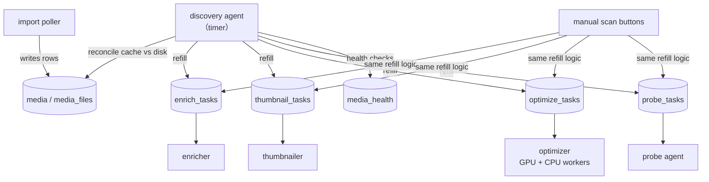
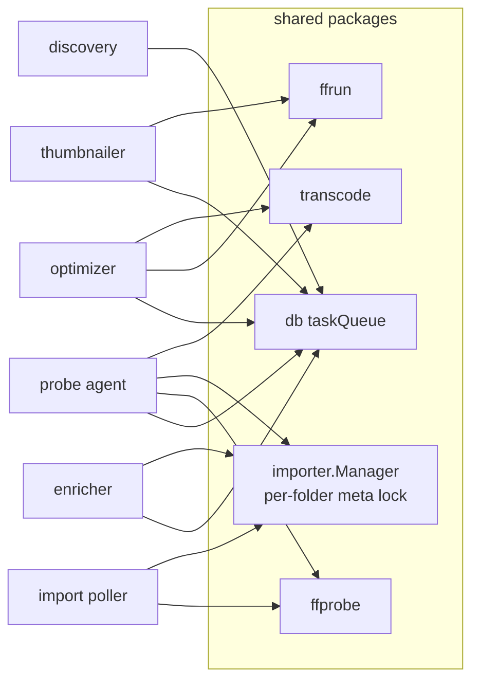

# Agents overview

FileFin does its background work through a small set of **agents**. An *agent* is a
queue-draining background processor: it claims one unit of work at a time and runs for the
process lifetime. A *worker* is a concurrency sub-unit **inside** one agent (only the
optimizer has them - its GPU and elastic CPU workers). This file is the map; each agent has
its own page under `agents/`, and the import poller is documented with the rest of import in
`import.md`.

## The agents

| agent | drains | does | page |
|-------|--------|------|------|
| **import poller** | `imports` (status `import`) | copy a staged source into the library, probe it, write `meta.json` + `media`/`media_files` | `import.md` |
| **enricher** | `enrich_tasks` | fill rich OMDb metadata + poster into an unenriched folder, additively | `agents/enricher.md` |
| **thumbnailer** | `thumbnail_tasks` | build sized WebP poster variants; extract a frame poster for other-media | `agents/thumbnailer.md` |
| **optimizer** | `optimize_tasks` | pre-build a browser-direct-play `.optimized.mp4` copy (GPU + elastic CPU workers) | `agents/optimizer.md` |
| **probe** | `probe_tasks` | refresh each file's true container/codecs onto the cache + `meta.json` | `agents/probe.md` |
| **discovery** | (timer, no queue) | reconcile cache vs disk, refill the four queues, run health checks | `agents/discovery.md` |

## The shared task queue

Every queue except discovery (which has none) and the import poller (which drains the richer
`imports` table) is one instance of a single generic helper, `taskQueue` in
`internal/db/taskqueue.go`. It provides the byte-for-byte identical operations each queue
needs - race-free **claim** (select-oldest-pending then flip to active in one transaction,
made atomic by the single-connection cache), **finish**, **fail** (leave an error row for the
admin), **prune** (drop pending/error tasks for a now-complete item), **reset-to-pending** (at
startup, so a task whose agent died mid-run is retried), and **clear-all** (for a rebuild).
Only the table name and status strings differ per queue. The enrich/thumbnail/probe agents are
near-identical loops over this helper; the optimizer adds its own worker scaling on top.

## Refill vs. health: two kinds of "needs attention"

The work an agent does splits cleanly in two, and discovery is what keeps both current:

- **Refill (auto-fixable).** Needs enrich / thumbnail / optimize / probe work. The fix is
  automatic, so it is never recorded as a health "issue" - the shared scanner just enqueues a
  task and the relevant agent handles it. The same refill logic backs both the manual scan
  buttons and the discovery agent.
- **Health (not auto-fixable).** A missing/unparseable `meta.json`, a folder with no video, a
  listed file gone or zero-byte, a referenced poster gone, an orphaned optimizer copy or sized
  poster. These the agent cannot fix; they are recorded and surfaced to the admin.

A `meta.json` lacking its technical block is **refill** (the probe agent backfills it); a
`meta.json` that is missing or corrupt is **health** (surfaced, never fabricated). See
`agents/probe.md` and `agents/discovery.md`.

## Discovery is the scheduler

Each agent has a manual "scan" button, but pressing buttons is optional: the **discovery
agent** runs on an admin-chosen interval and, every tick, reconciles the cache against the
filesystem and then runs the **same** refill logic for the optimize, enrich, thumbnail, and
probe queues. So discovery is the scheduler that feeds the other queue-draining agents; the
agents themselves just drain whatever the queue holds, whether a button or discovery filled
it.

## Dependencies and responsibilities

The agents share a few packages and a strict ordering of who writes what. Import creates a
folder; the others refine it. The probe agent owns the *format* truth; the enricher owns the
*metadata* truth; the thumbnailer owns *poster variants*; the optimizer owns the *direct-play
copy*. None overwrites another's output.

- **`importer.Manager`** serializes every `meta.json` write (importer, enricher, probe, and
  the playback-state handlers) through one per-folder lock, so no two agents drop a section.
- **`ffprobe`** is the single `-show_format -show_streams` decode used by import, the probe
  agent, and live playback.
- **`ffrun`** is the shared ffmpeg subprocess runner behind the optimizer, thumbnailer, and
  live HLS streamer.
- **`transcode`** holds the `DirectPlayable` / remux rules the probe agent's output feeds and
  the optimizer and playback both consume.
