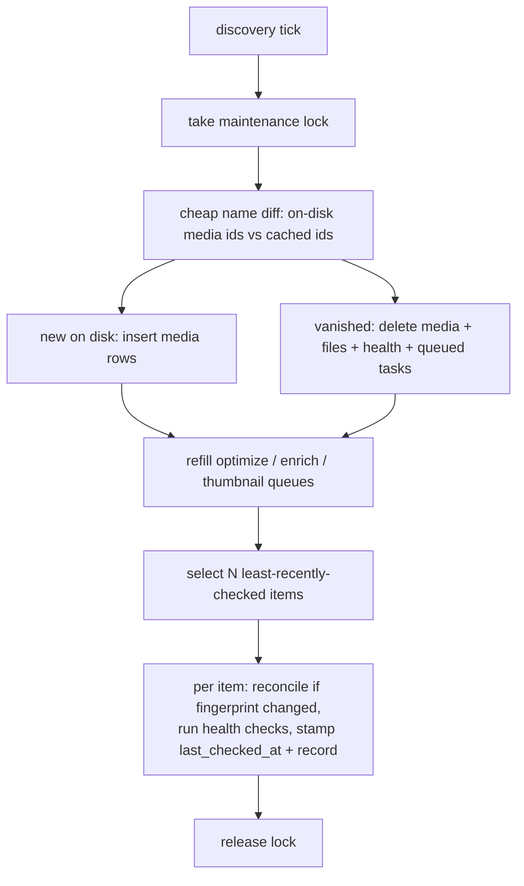

# Discovery agent

How FileFin keeps the cache and the work queues in step with the filesystem on its own, so
the three manual "scan" buttons become optional and the library stays healthy without anyone
pressing anything. A timer-driven **discovery agent** runs on an admin-chosen interval; the
reusable candidacy, reconcile, and health logic it shares with the buttons is the
**scanner**.

## Two jobs, kept distinct

- **Refill (actionable).** "Needs attention" is exactly what the three buttons do: enqueue an
  optimize / enrich / thumbnail task, and the relevant agent handles it. The fix is
  automatic, so it is never recorded as a health "issue". The shared refill logic lives in
  the scanner and is used verbatim by the buttons and the agent (see `optimizer.md`,
  `enricher.md`, `thumbnailer.md`).
- **Health (not auto-fixable).** Conditions the agent cannot fix: a missing or unparseable
  `meta.json`, a media folder with no video file, a listed video file gone or zero-byte, a
  referenced poster gone, an orphaned optimizer copy (source gone) or sized poster variant
  (no base). These are recorded and surfaced to the admin; the agent does not try to fix
  them.

Folder-level drift (a folder on disk but not in the cache, or vice versa) is neither of the
above: it is handled by the reconcile itself, which is why this is a *discovery* agent and
not just an auto-presser of the buttons.

## Health lives in the cache, never in the media tree

A `media_health` cache table records, per item, when it was last checked, a **fingerprint**
of the folder (meta.json mtime + a signature of the file list, so an unchanged item is
cheaply skipped), whether it is healthy, and a JSON list of issues when not. Health is
derived data: it is cleared by a full rebuild and re-derived by the sweep, exactly what the
disposable cache is for (see `../library.md`). It is never written into the media tree because
the headline check is "does meta.json parse?" (which a corrupt meta.json could not record
inside itself), and because stamping every item each sweep would churn the meta.json mtimes
the home view depends on (see `../playback-state.md`).

## A sweep, rate-limited and rolling

Each tick does a cheap whole-tree name diff, then fully processes only the N
least-recently-checked items, so a large library is swept as a continuous trickle rather than
a thundering herd. The agent holds a **maintenance lock** shared with the full rebuild so the
two never mutate the cache at once, and a running guard skips a tick while the previous one is
still in flight.

## Reconcile is the incremental sibling of rebuild

The full **rebuild** (see `../library.md`) flushes the whole cache and re-derives it from disk.
The discovery **reconcile** reaches the same end state incrementally: the cheap diff inserts
rows for newly appeared folders and deletes rows (plus health and queued tasks) for vanished
ones, and the rolling per-item pass re-reads a folder only when its fingerprint changed. Both
share one per-folder read and the same rules (skip sub-categories and optimizer artifacts,
meta.json-or-folder-name fallback, stable path-hash media id, other-media propagation), so
discovery never reimplements rebuild's logic.

## Interval setting, applied live

`DiscoveryInterval` (off / 1h / 3h / 12h / 24h) is a normal live setting (see `../runtime.md`):
writing it signals the discovery supervisor to re-arm its ticker (or idle, when off) without
a restart. The supervisor follows the same cancellable pattern as the optimizer (a context,
a reconfig channel, and a context-aware sleep), is started once at boot, and is shared across
listener rebinds. A boot-time agent waits for the install and cache to be ready before its
first sweep. The "Run discovery now" admin action triggers an immediate sweep through the
same tick body.

## Surfacing health

The admin dashboard summary carries a health block (items with issues, items never checked,
last sweep time, the interval label); a dedicated endpoint lists the flagged items with their
issue codes and last-checked time. The three per-queue scan buttons remain for granular
manual control.

## Endpoints

| method + path                       | purpose                                            |
|-------------------------------------|----------------------------------------------------|
| `POST /api/admin/settings/discovery`| set the sweep interval (off / 1h / 3h / 12h / 24h) |
| `POST /api/admin/discovery/run`     | trigger an immediate sweep                         |
| `GET  /api/admin/health`            | list items currently flagged with issues           |
