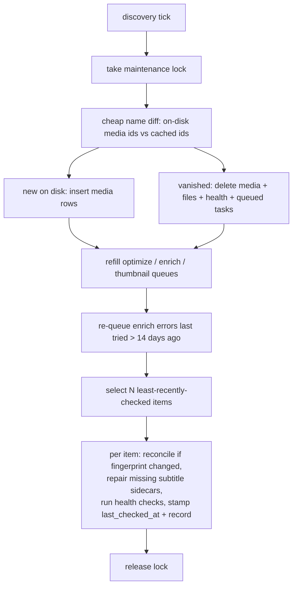

# Discovery agent

How FileFin keeps the cache and the work queues in step with the filesystem on its own, so
the three manual "scan" buttons become optional and the library stays healthy without anyone
pressing anything. A timer-driven **discovery agent** runs on an admin-chosen interval; the
reusable candidacy, reconcile, and health logic it shares with the buttons is the
**scanner**.

## Two jobs, kept distinct

- **Refill (actionable).** "Needs attention" is exactly what the three buttons do: enqueue an
  optimize / enrich / thumbnail task, and the relevant agent handles it. The fix is
  automatic, so it is never recorded as a health "issue". The shared refill logic lives in
  the scanner and is used verbatim by the buttons and the agent (see `optimizer.md`,
  `enricher.md`, `thumbnailer.md`).
- **Health (not auto-fixable).** Conditions the agent cannot fix: a missing or unparseable
  `meta.json`, a media folder with no video file, a listed video file gone or zero-byte, a
  referenced poster gone, an orphaned optimizer copy (source gone) or sized poster variant
  (no base). These are recorded and surfaced to the admin; the agent does not try to fix
  them.
- **Repair (fixable in place).** Missing subtitle sidecars: a video file with no `.srt`
  beside it but text subtitle tracks inside the container is fixed on the spot rather than
  reported, because the fix is a local ffmpeg extraction with no queue and no external
  service (see below).

Folder-level drift (a folder on disk but not in the cache, or vice versa) is neither of the
above: it is handled by the reconcile itself, which is why this is a *discovery* agent and
not just an auto-presser of the buttons.

Alongside the refills the tick also **retries stale enrich failures**: an errored enrich task
whose last attempt is older than a fixed 14-day interval is flipped back to pending so the
rate-limited enrich agent tries it again. This is discovery-only - the manual "Enrich scan"
button stays never-enriched-only and leaves error rows put (see `enricher.md`). It is the one
place a failed OMDb match self-heals short of a full rebuild.

## Health lives in the cache, never in the media tree

A `media_health` cache table records, per item, when it was last checked, a **fingerprint**
of the folder (meta.json mtime + a signature of the file list, so an unchanged item is
cheaply skipped), whether it is healthy, and a JSON list of issues when not. Health is
derived data: it is cleared by a full rebuild and re-derived by the sweep, exactly what the
disposable cache is for (see `../library.md`). It is never written into the media tree because
the headline check is "does meta.json parse?" (which a corrupt meta.json could not record
inside itself), and because stamping every item each sweep would churn the meta.json mtimes
the home view depends on (see `../playback-state.md`).

## A sweep, rate-limited and rolling

Each tick does a cheap whole-tree name diff, then fully processes only the N
least-recently-checked items, so a large library is swept as a continuous trickle rather than
a thundering herd. The agent holds a **maintenance lock** shared with the full rebuild so the
two never mutate the cache at once, and a running guard skips a tick while the previous one is
still in flight.

That guard is the same object that carries the sweep's live progress, so **only one sweep of
either kind runs at a time** and whichever it is can be watched. This matters because a tick
with subtitles to extract runs for minutes, not seconds: a forced full sweep launched during
one is refused, and the refusal names the running scope rather than leaving the admin with a
button that will not start and a Progress page showing nothing.

```mermaid
flowchart TD
    TICK[discovery tick] --> LOCK[take maintenance lock]
    LOCK --> DIFF[cheap name diff: on-disk media ids vs cached ids]
    DIFF --> ADD[new on disk: insert media rows]
    DIFF --> DEL[vanished: delete media + files + health + queued tasks]
    ADD --> REFILL[refill optimize / enrich / thumbnail queues]
    DEL --> REFILL
    REFILL --> RETRY[re-queue enrich errors last tried > 14 days ago]
    RETRY --> ROLL[select N least-recently-checked items]
    ROLL --> ITEM[per item: reconcile if fingerprint changed,\nrepair missing subtitle sidecars,\nrun health checks, stamp last_checked_at + record]
    ITEM --> UNLOCK[release lock]
```

The batch is the only thing the **full sweep** changes: the same tick body runs over every
item instead of the N least-recently-checked ones, in the background with a progress bar. It
is the brute-force companion to "Run discovery now" and the way a library is repaired in one
go after a fix lands, instead of waiting out a rotation.

## Subtitle repair

The player renders only external `.srt` sidecars, so a file whose subtitles live only inside
its container shows none (see `../playback.md`). Import externalises those tracks, but a
folder imported before a track could be named that way keeps its subtitles hidden forever.
The rolling pass closes that gap: for each video file with **no `.srt` sidecar at all**, it
probes the container and extracts the missing text tracks exactly as import does (see
`../import.md`).

Each file's extraction is capped by a timeout. Demuxing a text track is fast even on a long
film, so the cap is not a budget but a stop: one pathological file would otherwise hang
ffmpeg, and with it the sweep that holds the guard, leaving the agent wedged and every manual
sweep refused until a restart.

Because the sweep walks the library least-recently-checked first, one folder can be most of a
rotation away from its turn. An admin who has just noticed a film with no subtitles does not
want to wait for that, so the detail page's Admin card carries a **Rebuild subtitles** action that runs the same
repair over that one folder immediately. Its work is detached from the request - a folder of
thirty episodes outlives any proxy's patience, and a disconnect must not kill ffmpeg halfway.

The gate is deliberately cheap and stateless - a file that already has a sidecar is skipped on
a directory read alone, so a swept library costs nothing and no cache column is needed to
remember which files were examined. The price is that a file with no subtitles anywhere is
probed once per rotation, which is also what lets a track added to the file later still be
found. The sidecars are the agent's own writes, so the folder fingerprint is re-read after a
repair and the next sweep does not mistake them for drift.

## Reconcile is the incremental sibling of rebuild

The full **rebuild** (see `../library.md`) flushes the whole cache and re-derives it from disk.
The discovery **reconcile** reaches the same end state incrementally: the cheap diff inserts
rows for newly appeared folders and deletes rows (plus health and queued tasks) for vanished
ones, and the rolling per-item pass re-reads a folder only when its fingerprint changed. Both
share one per-folder read and the same rules (skip sub-categories and optimizer artifacts,
meta.json-or-folder-name fallback, stable path-hash media id, other-media propagation), so
discovery never reimplements rebuild's logic.

## Interval setting, applied live

`DiscoveryInterval` (off / 1h / 3h / 12h / 24h) is a normal live setting (see `../runtime.md`):
writing it signals the discovery supervisor to re-arm its ticker (or idle, when off) without
a restart. The supervisor follows the same cancellable pattern as the optimizer (a context,
a reconfig channel, and a context-aware sleep), is started once at boot, and is shared across
listener rebinds. A boot-time agent waits for the install and cache to be ready before its
first sweep. The "Run discovery now" admin action triggers an immediate sweep through the
same tick body.

## Surfacing health

The admin dashboard summary carries a health block (items with issues, items never checked,
last sweep time, the interval label); a dedicated endpoint lists the flagged items with their
issue codes and last-checked time. The three per-queue scan buttons remain for granular
manual control.

A sweep has no queue to list, so the Progress page reads its live snapshot directly alongside
the queue-backed agents: its scope (a rolling batch or the whole library), the folder count
done against the total, and how many subtitle sidecars the repair has written so far. The
snapshot lingers after a sweep ends, so the page shows the section only while the sweep
reports itself running.

## Endpoints

| method + path                       | purpose                                            |
|-------------------------------------|----------------------------------------------------|
| `POST /api/admin/settings/discovery`| set the sweep interval (off / 1h / 3h / 12h / 24h) |
| `POST /api/admin/discovery/run`     | trigger an immediate sweep (one rolling batch)     |
| `POST /api/admin/discovery/sweep`   | sweep the whole library at once, in the background |
| `GET  /api/admin/discovery/sweep/progress` | live progress of a full sweep               |
| `POST /api/admin/media/{id}/subtitles` | repair one folder's subtitle sidecars now       |
| `GET  /api/admin/health`            | list items currently flagged with issues           |
