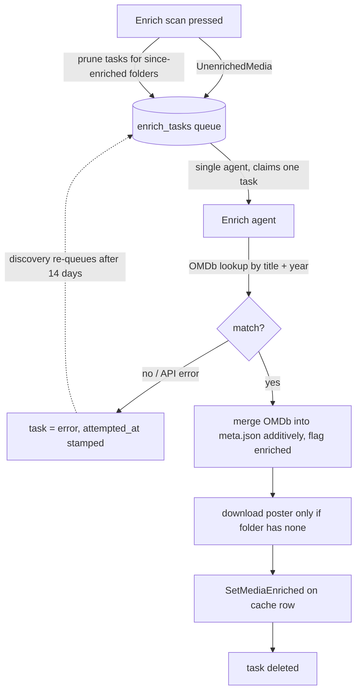

# Media enricher

How existing media gets its rich metadata and poster from OMDb, after it is already in the
library. Import never calls OMDb (see `../import.md`): every folder lands unenriched - a
folder/upload stub (title/year), or a Plex folder carrying Plex's own metadata - and this
subsystem fills the gaps later without re-importing the file. The fill is **additive**: it
never overwrites a value the import already wrote, so Plex's metadata (and any imported
poster) survives and only the holes are completed.

## The enriched flag is the whole signal

Every `media` row carries an `enriched` flag. Import always leaves it unset (no source is
enriched at import time); the enricher sets it once it has merged an OMDb result in. The
durable record is the media folder's `meta.json` on disk - the `enriched` column is just a
cache mirror, re-derived on a rebuild (a folder whose `meta.json` is enriched, or merely
carries an `imdbID`, counts as enriched so it is never needlessly re-queued).

The enricher turns unenriched media into a work queue, drains it one lookup at a time, and
writes the result back to both disk and cache.

## One rate-limited agent

Unlike the optimizer's elastic pool, enrichment runs a **single agent for the process
lifetime** (started once, never cancelled). It rests briefly between lookups so OMDb is not
hammered, and idles when there is no work, no config, or no API key configured. A task
interrupted by a restart is reset from `enriching` back to `pending` on first recovery, so
nothing is lost across restarts.

The queue is **transient cache state**: it is refilled by the shared scanner - run on demand
by the "Enrich scan" button and on a timer by the discovery agent (see `discovery.md`) -
which queues a task per still-unenriched media folder and prunes tasks for folders enriched
since. A `not-found` or API error fails the task, stamps `attempted_at` on the task row, and
leaves it visible to the admin; only a poster download failure is tolerated (the media still
counts as enriched, keeping any existing poster).

## Failed matches self-heal on a slow retry

A failure is no longer terminal. The error task keeps blocking the manual scan (which stays
**never-enriched-only** - it queues stub folders and leaves error rows put), but the discovery
agent re-queues any error task whose `attempted_at` is older than a fixed **14-day** interval,
so a transient OMDb outage or a title OMDb only lists later heals itself without a full cache
rebuild. The stamp lives on the transient `enrich_tasks` row rather than on `media` or in
`meta.json`: it must survive the discovery reconcile re-inserting a media row from disk, and
writing it into `meta.json` would churn the mtime the home view and discovery fingerprint
depend on. A re-queued task that fails again gets a fresh `attempted_at` and waits another two
weeks - natural backoff - while a successful retry deletes the task like any other. Legacy
error rows predating the stamp read as `attempted_at = 0` and are swept in once on the first
discovery tick after upgrade, draining at the agent's rate-limited pace. See `discovery.md`
for where the re-queue sits in the tick and `../rematch.md` for the last-tried / next-retry
times shown to the admin.

## Other-media is never enriched

A category flagged **other media** (home videos / recordings) is skipped entirely: its
folders would not match OMDb, so there is no title lookup, no text fields, and no poster
download. The scan resolves each media item's owning-category **effective** flag once (the
root-propagated value stored on every category cache row - see `../mediaformat.md`) and never
queues an other-media folder; as a belt-and-suspenders guard the agent also finishes any
other-media task without a lookup should a stale one slip through. A media item in a
**sub-category** therefore inherits its root category's flag. Posters for these folders come
from the thumbnail agent's frame-extraction path instead (see `thumbnailer.md`).

## What a successful enrich writes

| target | write |
|--------|-------|
| `meta.json` | the OMDb result **merged additively** into the existing file (existing values win), flagged `enriched`, **keeping** the ffprobe `technical` block written at import time, and **preserving** the per-user `state` object (see `../playback-state.md`) - the write goes through the shared per-folder lock (`importer.Manager.Update`) so a concurrent playback event is never dropped |
| `poster.*` | downloaded into the media folder **only when the folder has no poster** and OMDb returns one; an existing poster is never overwritten |
| `media` cache row | description, plot, and poster name updated; `enriched` set |

## Additive vs replace: one write path, two callers

The write above is the **additive** mode of a shared write path. The admin manual re-match (see
`../rematch.md`) reuses the same path in **replace** mode: the chosen OMDb record wins over the
existing `meta.json`, the cache row's title/year are corrected to the admin-confirmed values (the
agent instead pins them to the folder), and the poster is refreshed (the old base poster and its
sized variants removed so the thumbnailer rebuilds them). Both modes preserve the ffprobe
`technical` block and the per-user `state`, and both go through the same per-folder lock - so an
admin fixing a wrong match and the agent filling a fresh one share one code path and one set of
invariants.

## Dependencies

- **OMDb client** (`omdb`) - the same small client the importer uses; enrichment is gated on
  the OMDb API key set in Settings. With no key, the agent simply idles. Lookups and poster
  downloads take the request `context`, so a shutdown interrupts an in-flight HTTP call.
- **meta.json format** (`importer.MetaFromOMDb` / `MergeMeta` / `ReadMeta` / `WriteMeta`) -
  shared with the importer so both halves write the identical on-disk shape; `MergeMeta` is
  what keeps enrichment additive. `MetaFromOMDb` shares one `metaBuilder` with the Plex and
  Jellyfin meta-builders, so all three assemble the metadata/ratings maps the same way.
- **db (shared task queue)** - `enrich_tasks` is one instance of the generic queue helper
  shared with the optimizer and thumbnailer (see `optimizer.md`).
- **ffprobe** `technical` block - produced at import time (see `../import.md`); enrichment
  preserves it rather than re-probing.

## Endpoints

| method + path                       | purpose                                              |
|-------------------------------------|------------------------------------------------------|
| `POST /api/admin/enrich/scan`       | queue an enrich task per unenriched media folder     |
| `GET  /api/admin/enrich/active`     | in-flight enrichments + count still pending          |

The admin manual-match endpoints (list unmatched, search OMDb, apply a chosen record) live with
the flow that uses them in [`../rematch.md`](../rematch.md).
