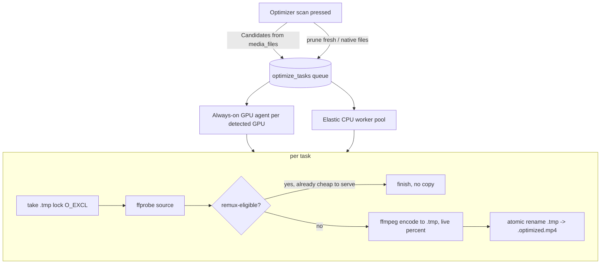

# Pre-transcoder (optimizer)

How FileFin avoids live transcoding by pre-building a browser-direct-play copy of every
media file the browser cannot play natively. Each non-native source gets a sibling
`<source-base>.optimized.mp4` (H.264/AAC, faststart) written next to it. Once that copy is
fresh, playback serves it directly with byte-range seeking and never spins up an on-the-fly
HLS transcode (see `../playback.md`). The optimizer trades disk and idle CPU/GPU now for cheap,
seekable playback later.

## Queue, agents, and the on-disk copy

The optimizer is a queue drained by background agents. The durable record is the
`.optimized.mp4` on disk; the `optimize_tasks` table is transient cache state, rebuilt by a
scan from `media_files`. The scan is run on demand by the "Optimizer scan" button and on a
timer by the discovery agent (see `discovery.md`) - so the queue refills itself, but the
agents below still only drain whatever it holds.

A **candidate** is a media file the browser cannot direct-play that lacks a *fresh*
optimized sibling (a sibling older than its source is stale and re-queued). Remux-eligible
sources - H.264 with AAC/MP3/no audio - are detected only after probing and finish without a
copy, because live HLS can already serve them by a cheap stream-copy.

## The .tmp file is the lock

Each task's in-progress encode writes to `<optimized>.tmp`, created with `O_EXCL` so it
**doubles as a per-item lock**: a second agent that finds the file existing simply backs off.
On success the temp is atomically renamed into place; on failure or cancellation it is
removed. The suffix is not a video extension, so a leftover is never scanned as media.

Crash recovery runs at the start of every optimizer run (after the previous run's goroutines
have fully exited, so no live lock is touched): it sweeps stale `.tmp` locks under the data
dir and resets any `encoding` row orphaned by a crash back to `pending`.

## Modes and the two agent types

The optimizer mode is chosen in Settings and decides which agents run. Changing it signals
the supervisor, which cancels the current run, waits for it to drain, and relaunches.

| mode | agents running |
|------|----------------|
| `none` | nothing (off, the default) |
| `gpu`  | one always-on worker per detected GPU |
| `cpu`  | the elastic software-worker pool only |
| `all`  | the always-on GPU worker(s) **plus** the elastic CPU pool |

- **Always-on agent(s)** - detection enumerates every DRM render node and keeps each one
  that passes a real micro-encode (VAAPI), so a host with several GPUs gets one always-on
  worker per card, each pinned to its own device; a single worker on software encoding is the
  fallback when no node can encode. Each worker grabs the next pending task the instant it
  finishes one, idling between empties. With more than one GPU each worker's Progress-page
  label is suffixed with its device (e.g. `GPU:renderD128`) so concurrent encodes are
  distinguishable. The shared queue's race-free claim and the per-item `.tmp` lock make the
  workers safe to run concurrently with no further coordination.
- **Elastic CPU pool** - a load-aware autoscaler that only ever *adds* libx264 workers, one
  per ramp interval, while there is pending work, no live viewer, CPU headroom (below the
  target busy %, read from `/proc/stat` via `sysload`), and fewer than `NumCPU` workers. Each
  worker drains until the queue empties, then exits; the pool re-adds on the next refill.
  Workers are never killed mid-encode, so a load spike cannot thrash a partial encode.

## Yielding to viewers

Live playback always wins. Before claiming a task, every agent waits while a transcode
session is active (`Manager.ActiveSessions() > 0`), and the CPU autoscaler will not add
workers while a viewer is watching. Background encoding resumes once playback goes idle.

## Live progress

Encode percent comes from ffmpeg's `-progress` stream (out_time vs probed duration). The
worker keeps the freshest value in an in-memory map keyed by task id and mirrors it to the
row about once a second. The admin **Progress** page polls `GET /api/admin/optimize/active`
and overlays the in-memory percent on each active row.

## Dependencies

- **transcode** - encoder detection, the optimized-sibling path/freshness convention, the
  remux-eligibility probe, and the ffmpeg argument builders are all shared with live playback
  (see `../playback.md`).
- **ffrun** - the shared ffmpeg runner launches the encode, captures a bounded tail of
  stderr, and surfaces a failure as a uniform `ffmpeg: <err>: <last line>`. The same runner
  backs the thumbnailer and the live HLS streamer, so subprocess capture is written once.
- **db (shared task queue)** - `optimize_tasks` is one instance of the `taskQueue` helper in
  `internal/db/taskqueue.go` (race-free claim, finish, fail, prune, reset-to-pending) shared
  verbatim with the enrich and thumbnail queues; only the table name and the two extra columns
  (`percent`) differ.
- **sysload** - coarse CPU busy% so the CPU pool scales only into real headroom.

## Endpoints

| method + path                        | purpose                                            |
|--------------------------------------|----------------------------------------------------|
| `POST /api/admin/optimize/scan`      | queue an optimize task per stale/missing candidate |
| `GET  /api/admin/optimize/active`    | in-flight encodes (live percent) + count pending   |
| `POST /api/admin/settings/optimizer` | set the mode (none/cpu/gpu/all); relaunches agents |
