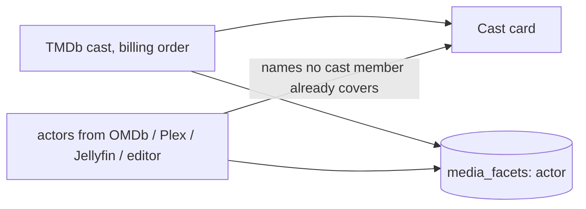
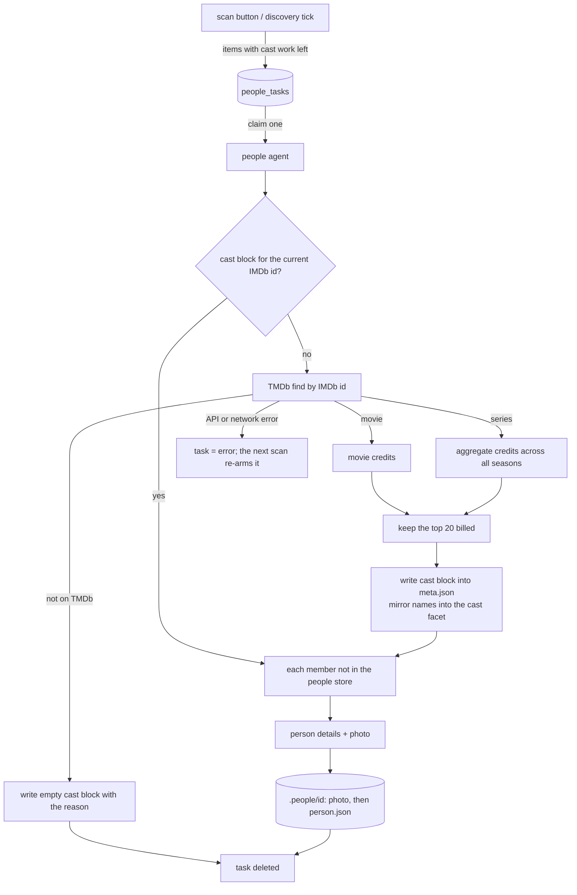

# People agent (cast and actor photos)

How an item's Cast card gets faces. OMDb gives an item only a short comma-separated actor
list: usually three names, no ids, no pictures. The people agent adds TMDb as a second,
optional source for the cast. It resolves each item's full billed cast through the IMDb id the
enricher already stored (see `enricher.md`), and it downloads each person's photo **once** into
a store shared by the whole library. Everything is fetched server side and kept in the data
dir, so the browser only ever loads photos from FileFin and the app still works offline.

Without a TMDb key the agent idles, and nothing about the library changes.

## Two stores, split by ownership

| store | where | holds | written by |
|-------|-------|-------|------------|
| the item's **cast block** | `meta.json` (`cast`) | the IMDb id it was resolved from, the TMDb title id and kind (movie or series), when it was fetched, why it is empty (if it is), and the top billed members: TMDb person id, name, character, billing order | only this agent, through the shared per-folder lock, keeping every other section |
| the **people store** | `<dataDir>/.people/<tmdb-person-id>/` | `person.json` (name, known-for department, birth and death dates, TMDb profile path, fetch time) and one small photo | only this agent |

The people store is keyed by **TMDb person id, never by name**: names collide and change.
It lives in the data dir, not the cache, so a cache rebuild or a move to a new machine keeps
every photo. A person is fetched once. A stored person is never fetched again, whichever item
first credited them.

The data dir root is walked for categories, so the store is a dot-folder: that walk skips every
dot-folder, and a category name may not start with a dot (see `../mediaformat.md`).

## The existing actors list stays

The `actors` list other sources write (OMDb, Plex, Jellyfin, the metadata editor) is left
untouched. The cast block sits beside it, because the two are not the same list:

- OMDb names about three actors; TMDb bills the whole cast, up to twenty kept here.
- Sources order East Asian names differently (`Xiwei Tian` in one, `Tian Xiwei` in the other).

Where the two lists overlap they are matched **order-insensitively**: the same set of name
tokens after folding case and accents and dropping hyphens and apostrophes. So one person
never appears twice, and an actor only OMDb knows still shows up.

The same merged list feeds the searchable cast facet, so clicking a portrait finds that
person's other items even when only TMDb knows them. A rebuild re-derives it from `meta.json`.

A cast block records the IMDb id it came from. After a re-match to another IMDb id, the old
cast describes a different title: it is ignored (the card falls back to the actors list, the
facet drops its names) until the agent refreshes it.

## One agent, a transient queue

Like the enricher and the probe agent, a **single agent** runs for the process lifetime and
drains a transient `people_tasks` queue one item at a time. It rests between items, and the
TMDb client paces every request on top of that, retrying once after a rate-limit reply. A task
interrupted by a restart goes back to pending on first recovery.

- For a series the character is the role the actor played in the most episodes; one actor
  credited for two parts of a movie is folded into one member.
- The photo is fetched at TMDb's 185 px profile size and re-encoded to WebP with the same
  ffmpeg pipeline the thumbnailer uses. If that encode fails, the original JPEG is kept.
- `person.json` is written **last**. A person whose photo failed to download for a passing
  reason therefore has no record and is tried again on the next pass. A person or photo TMDb
  no longer has is stored without it, so it is not asked for forever.
- A title TMDb does not know gets an empty cast block that carries the reason, so it is not
  asked again every sweep. A re-match (a new IMDb id) makes it a candidate again.

## Candidacy

An item has cast work left when it has an IMDb id and either it has no cast block for that id
yet, or one of the block's members is missing from the people store. Without a TMDb key
nothing is queued. The scan also prunes tasks for items now complete, and it re-arms error rows:
their causes are transient, and the item still needing work is why the scan came back.

The refill runs on the **Re-scan cast photos (TMDb)** maintenance button and on every discovery
tick, beside the other refills (see `discovery.md`).

## Endpoints

| method + path                    | purpose                                                  |
|----------------------------------|----------------------------------------------------------|
| `POST /api/admin/people/scan`    | queue a task per item with cast work left                |
| `GET  /api/admin/people/active`  | in-flight cast resolves + count still pending            |
| `GET  /api/people/{id}/photo`    | a stored person's photo, for any signed-in user, cached by the browser for a month |
| `POST /api/admin/settings/tmdb-key` | set/clear the TMDb key (a v3 API key or a v4 read access token) |

The media detail response carries a `people` list for the Cast card: the cast members with
their character and photo URL, then the uncovered actors, plus a flag for the TMDb credit shown
under the card (see `../frontend.md`).

## Dependencies

- **TMDb client** (`tmdb`) - find by IMDb id, movie credits, series aggregate credits, person
  details, profile image. It accepts either kind of TMDb credential and keeps the key out of
  errors and logs.
- **people store** (`people`) - the `.people` folder, atomic `person.json` writes, the photo
  encode, and the name folding shared with the cast facet and the Cast card.
- **meta.json** (`importer.Manager.Update`) - the cast block is written under the same
  per-folder lock as every other `meta.json` writer.
- **db (shared task queue)** - `people_tasks` is one more instance of the generic `taskQueue`.
- TMDb's terms ask for attribution: a line under the key in Settings and a small credit on the
  Cast card.
