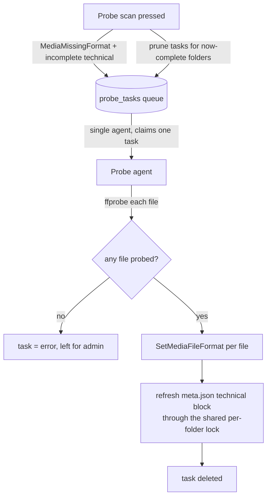

# Format-probe agent

How FileFin keeps each media file's **true format** - the container and codecs ffprobe
actually reads, not the filename extension - current on the cache and in `meta.json`, so
playback and the optimizer decide from content rather than a possibly-lying extension (see
`../playback.md`, `../mediaformat.md`). A library where every file is named `.avi` is
direct-played when its real format allows and transcoded only when it truly must be.

## Why an agent, and why self-healing

The extension is a poor judge: an `.avi` may really be H.264/MP4 the browser can play
directly, and an `.mp4` may hold HEVC it cannot. ffprobe already decodes the real container
and codecs at import time and writes them into `meta.json`'s `technical` block and the
`media_files` format columns (`container` / `video_codec` / `audio_codec`). But that
import-time write can go missing: a full cache **rebuild** re-derives `media_files` from disk
and leaves the format columns empty, and a `meta.json` `technical` block can be removed or
arrive incomplete. Missing/stale technical info is **auto-fixable**, so per the
refill-vs-health split (see `discovery.md`) it is a queue **refill**, not a health issue: the
discovery agent enqueues a probe task and this agent re-probes and rewrites the truth, so the
cache self-heals.

## One agent, a transient queue

The probe agent mirrors the enricher and thumbnailer exactly: a **single agent for the
process lifetime**, draining a transient `probe_tasks` queue one task at a time, resting
briefly between probes and idling when there is no work or no config. A task interrupted by a
restart is reset from `probing` back to `pending` on first recovery. The durable record is
the format columns plus the `meta.json` `technical` block on disk; the queue is disposable
cache state, refilled by the scanner.

## Candidacy

A media item is a probe candidate when **any** of its files has empty format columns (the
rebuild/reconcile shape), or its `meta.json` lacks a complete `technical` block (no block, or
no container/video codec). A folder whose `meta.json` is missing or unparseable is **not** a
probe candidate - that is a health condition the discovery agent surfaces (see `discovery.md`)
- so a probe never fabricates a `meta.json`. The scan upserts a task per candidate and prunes
pending/error tasks for items now complete; it is idempotent (INSERT OR IGNORE; prune never
touches a probing row), so a manual press and a discovery tick coexist.

## What a successful probe writes

| target | write |
|--------|-------|
| `media_files` (`container` / `video_codec` / `audio_codec`) | the true format of **each** file, from its own ffprobe decode |
| `meta.json` `technical` block | refreshed from the first successfully probed file, through the shared per-folder lock (`importer.Manager.Update`) so a concurrent playback-state write is never dropped; rewritten only when a `meta.json` already exists |

A folder whose files all fail to probe fails the task (left visible to the admin) rather than
silently retrying.

## Refilled by the scanner, scheduled by discovery

Like the other queues, `probe_tasks` is refilled by the shared scanner - on demand by the
**Probe scan** button and on a timer by the **discovery agent** (see `discovery.md`), which
runs the probe refill alongside the optimize / enrich / thumbnail refills each tick. This is
what makes the format truth self-heal after a rebuild without anyone pressing a button.

## Dependencies

- **ffprobe** - the same single `-show_format -show_streams` decode used at import; the
  agent uses the configured ffprobe binary (falling back to `PATH`).
- **transcode** - the `DirectPlayable` rule that consumes the probed format lives there,
  shared with the playback serve decision and the optimize-candidate filter (see
  `../playback.md`, `optimizer.md`).
- **db (shared task queue)** - `probe_tasks` is one instance of the generic `taskQueue`
  helper shared verbatim with the enrich and thumbnail queues (race-free claim, finish, fail,
  prune, reset-to-pending); only the table name differs.
- **meta.json format** (`importer.ReadMeta` / `Manager.Update`) - shared with the importer
  and enricher so the `technical` block keeps the identical on-disk shape.

## Endpoints

| method + path                    | purpose                                          |
|----------------------------------|--------------------------------------------------|
| `POST /api/admin/probe/scan`     | queue a probe task per item missing format/technical |
| `GET  /api/admin/probe/active`   | in-flight probes + count still pending           |
