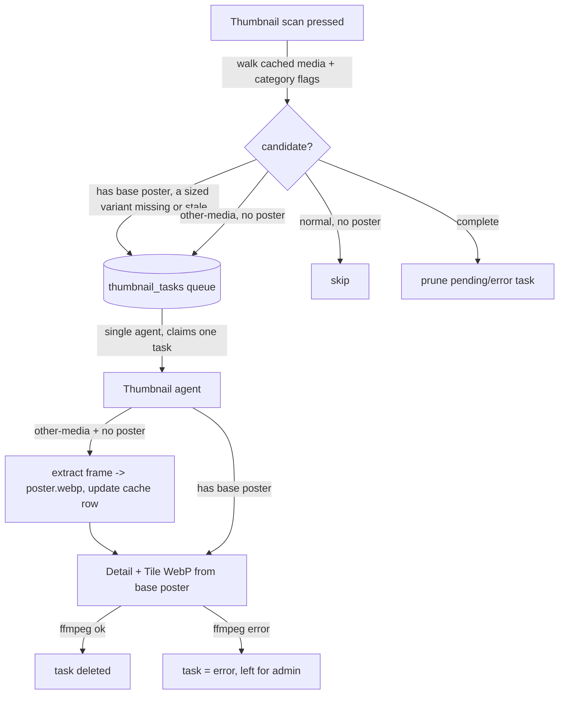

# Thumbnail agent

How FileFin pre-builds the two fixed-size WebP posters every media folder needs, so the
frontend never scales a full-resolution poster at request time. It is the fourth background
agent, modelled on the enricher (single agent, transient queue), and shares the optimizer's
"ffmpeg does all the image work" approach - there is no Go image dependency.

## Two sized variants from one base poster

Each media folder has a base `poster.*` (placed by the importer, downloaded by the enricher,
or - for other-media - derived from a video frame, see below). The agent derives two
fixed-size WebP files beside it, their pixel target embedded in the filename so name and size
can never drift:

| file | size | fit | used by |
|------|------|-----|---------|
| `poster_280.webp` | width 280, aspect preserved | scale | media detail page |
| `poster_180.webp` | 180x270 (2:3) | cover + center-crop | category + home tiles |

These match the frontend CSS (the detail poster is a fraction of the body width; grid tiles
are a fixed 2:3 `object-fit: cover`).

## Other-media folders have no poster to start from

A category flagged **other media** (home videos / recordings - the effective, root-propagated
flag, see `../mediaformat.md`) is never enriched (see `enricher.md`), so its folders have no
downloaded poster. For these the agent first extracts
a single video frame - seeking a small offset to skip a black opening frame, cropping to the
largest 2:3 area - and writes it as the folder's base `poster.webp`. It then updates the
media cache row's poster name so `HasPoster` flips true everywhere (detail, grids, rebuild),
and derives the two sized variants from that base exactly as for a normal poster.

A **normal** media folder with no base poster is skipped: there is nothing to derive from
(the enricher will supply a poster later, and the next scan picks it up).

## One agent, transient queue

- The queue (`thumbnail_tasks`, `UNIQUE(media_id)`) is **transient cache state**, refilled by
  the shared scanner - the "Thumbnail scan" button on demand and the discovery agent on a
  timer (see `discovery.md`). Each task carries the owning category's effective other-media
  flag so the agent knows whether the frame path applies.
- Candidacy: a folder with a base poster is a candidate when either sized variant is missing
  or older than the base poster (stale); an other-media folder with no poster is a candidate;
  a normal folder with no poster is skipped. Folders now complete have their pending/error
  task pruned.
- A **single agent for the process lifetime** claims one task at a time, rests briefly between
  local encodes, and idles when the queue is empty or no config exists. A task interrupted by
  a restart is reset from `generating` back to `pending` on first recovery. An ffmpeg failure
  fails the task and leaves it visible to the admin.
- Atomic writes: every WebP is encoded to a `.tmp` sibling and renamed into place, so a crash
  never leaves a half-written `poster_*.webp`.

## Serving: sized when present, base as fallback

`GET /api/media/{id}/poster?size=detail|tile` serves the matching sized variant when it
exists, falling back to the base `poster.*` while the agent has not produced it yet (so the
UI works before and during generation). No `size` param serves the base poster unchanged. The
frontend requests `?size=detail` for the detail page and `?size=tile` for every grid/home
tile.

Base-poster discovery (the rebuild scan, `FindSidecarPoster`, the cache `poster` column)
matches the exact basename `poster.<ext>` and ignores the `poster_<digits>.webp` variants, the
same way the optimizer's `.optimized.mp4` is ignored, so a sized thumbnail is never mistaken
for the base poster.

## Dependencies

- **ffrun** - every WebP encode and the frame-extraction probe run through the shared ffmpeg
  runner (bounded stderr capture + uniform `ffmpeg: <err>: <last line>` failure), the same one
  the optimizer and live HLS streamer use.
- **db (shared task queue)** - `thumbnail_tasks` is one instance of the generic queue helper
  shared with the optimizer and enricher (see `optimizer.md`); its only extra column is
  `other_media`, carried so the agent knows whether to extract a frame poster.

## Endpoints

| method + path                       | purpose                                              |
|-------------------------------------|------------------------------------------------------|
| `POST /api/admin/thumbnail/scan`    | queue a task per folder needing (re)built thumbnails |
| `GET  /api/admin/thumbnail/active`  | in-flight thumbnail jobs + count still pending       |
| `GET  /api/media/{id}/poster?size=` | sized variant (detail/tile) with base-poster fallback |
