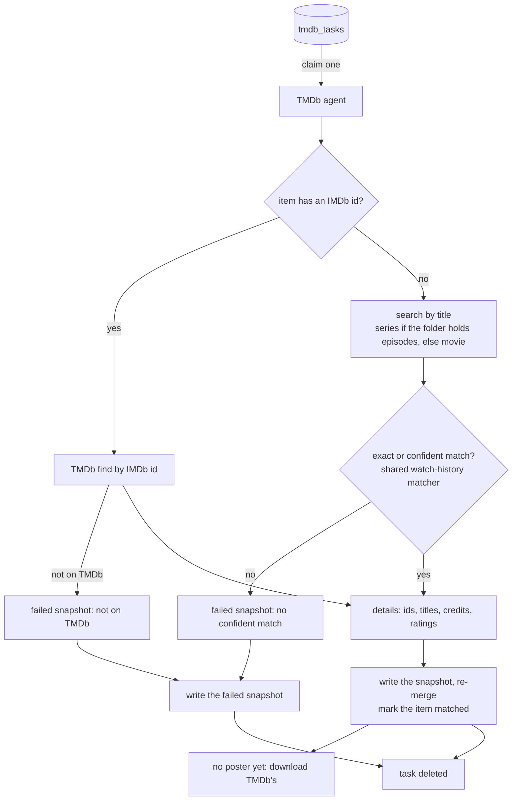

# TMDb agent

How every item gets a TMDb record beside its OMDb one. The agent looks each item up on TMDb
and stores the answer as the item's TMDb snapshot in `meta.json`; the merge (see
`../sources.md`) then fills gaps, cross-checks the two sources, and reports what they
disagree on. For an item OMDb never matched, TMDb is often what matches it at all: it is
usually stronger on Asian dramas and anime.

Without a TMDb key the agent idles and nothing is queued.

## Two ways to a match

- **By IMDb id** - an item OMDb matched resolves straight to its TMDb movie or series; no
  guessing.
- **By title** - an item with no IMDb id is searched by its title. Only an exact or confident
  pairing from the matcher the watch-history imports use counts (see `../mal.md`): a unique
  title with a year at most one off. Anything vaguer is recorded as a miss, because a wrong
  match is worse than none.
- A TMDb match is a match: the item leaves the "No metadata" list and gets TMDb's fields. When
  TMDb links it to an IMDb id, that id is filled in, and the OMDb record is then fetched by it
  (see `enricher.md`).
- A miss is kept as a failed snapshot and retried after 14 days; a re-match to another IMDb id
  makes the item a candidate again at once. An API or network failure fails the task instead,
  and the next scan re-arms it.

The details request fetches everything the merge compares in one call: title, original and
alternative titles, release date, runtime (per episode for a series), plot, tagline, genres,
languages, countries, directors and writers (a series' creators), the top billed names, the
US content rating, the TMDb score, the poster, and the IMDb id.

## Candidacy

An item is a candidate when it has no TMDb snapshot, when its snapshot belongs to another
IMDb id than the item has now, or when its failed lookup is old enough to retry.
Other-media categories are never looked up. The refill runs on the **Re-scan metadata
(TMDb)** maintenance button and on every discovery tick (see `discovery.md`).

## Endpoints

| method + path | purpose |
|---------------|---------|
| `POST /api/admin/tmdb/scan` | queue a task per item without a current TMDb snapshot |
| `GET  /api/admin/tmdb/active` | in-flight TMDb matches + count still pending |
| `POST /api/admin/media/{id}/tmdb-search` | TMDb candidates for the manual match view |
| `POST /api/admin/media/{id}/tmdb-match` | apply a chosen TMDb title (see `../rematch.md`) |

## Dependencies

- **TMDb client** (`tmdb`) - find by IMDb id, search, details, poster, shared with the people
  agent (`people.md`).
- **The merge** (`sources`) - the snapshot adapter that maps TMDb's vocabulary onto OMDb's,
  and the merge itself.
- **db (shared task queue)** - `tmdb_tasks` is one more instance of the generic `taskQueue`.
