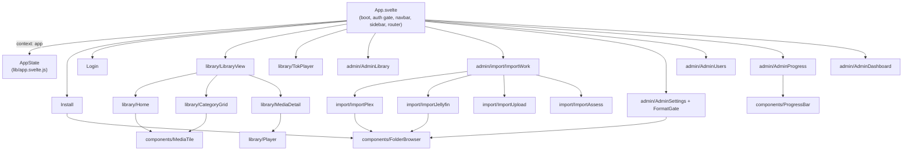

# Frontend (Svelte 5 + Bulma)

The web UI is a single-page Svelte 5 app built by Vite and embedded into the binary
(`//go:embed all:dist`). It is plain Svelte (no SvelteKit). Styling is Bulma 1.0, loaded as
prebuilt CSS and forced into dark mode; only a thin theme + a handful of layout/player rules are
custom.

## Styling: Bulma, dark, prebuilt

- `web/index.html` carries `data-theme="dark"` on `<html>`, forcing Bulma's native dark mode
  regardless of OS preference.
- `web/src/main.js` imports `bulma/css/bulma.min.css` first, then `web/src/app.css`, so the custom
  rules always win.
- `app.css` does two things only: retint Bulma's accent (the former `#4f8cff` expressed as
  `--bulma-primary-*` / `--bulma-link-*` HSL variables) and style what Bulma has no component for -
  the app shell layout, the poster grid and tiles, the media-detail page, and the fullscreen
  TokTok player. Custom classes are namespaced (`ff-*`, `poster-*`, `tok-*`) to avoid colliding
  with Bulma's own `.grid` / `.card` / `.tile` / `.title`.
- No CDN: Bulma is vendored via npm and bundled, so the app works fully offline.

## State: one AppState in context

All frontend state and the logic that mutates it live in a single class, `AppState`
(`web/src/lib/app.svelte.js`), built on runes (`$state` / `$derived` fields). `App.svelte` creates
one instance, puts it in context under the key `app`, and every view reads it with
`getContext('app')`. This keeps the reactivity graph in one place (as it was when the UI was one
file) while letting the markup split into focused components. The fetch wrapper lives separately in
`web/src/lib/api.js`.

The two `<video>` players are the only pieces of logic that do not live in `AppState`: their
wiring is a Svelte `$effect` (direct-play vs HLS decision, subtitle tracks, progress reporting,
cleanup), which must run inside the component that owns the element, so it lives in `Player.svelte`
and `TokPlayer.svelte`. `pendingSeek` and `tokHls` stay on `AppState` because they are shared
across the effect and other methods; the detail player's `hls` is private to `Player.svelte`.

## Routing

Client routing uses the History API and lives entirely on `AppState`: `go(path)` pushes then
applies a URL, `route()` applies the current URL without pushing, and `applyAdmin()` selects the
admin sub-view and coordinates its pollers. `App.svelte` wires `popstate` and the page-teardown
progress flush in `onMount`. The view router in `App.svelte` is a single `{#if}` chain over
`view` / `adminView` / `importPage` that mounts the matching view component.

## Shared components

- `components/MediaTile.svelte` - one poster tile; props `m`, `onRemove`, `showWatched`.
- `components/FolderBrowser.svelte` - the directory/file picker reused by install, the settings
  import-folder edit, and the Plex/Jellyfin source pickers; rendered as a centered Bulma modal over
  a dimmed backdrop, closable by the header `x`, Cancel, backdrop click, or Escape. The caller
  supplies the listing and the navigate/select/close callbacks, so the same widget drives
  directory-only and file-picking flows.
- `components/ProgressBar.svelte` - a Bulma progress bar with an inline percent label.

## Build

`just build` runs `npm install && npm run build` in `web/`, then `go build`. Bulma adds ~200 KB
(gzipped ~68 KB) of CSS to the embedded bundle; hls.js is a lazily-imported separate chunk.
