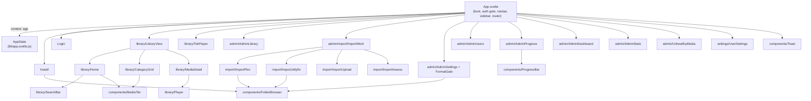

# Frontend (Svelte 5 + Bulma)

The web UI is a single-page Svelte 5 app built by Vite and embedded into the binary
(`//go:embed all:dist`). It is plain Svelte (no SvelteKit). Styling is Bulma 1.0, loaded as
prebuilt CSS and forced into dark mode; only a thin theme + a handful of layout/player rules are
custom.

## Styling: Bulma, dark, prebuilt

- `web/index.html` carries `data-theme="dark"` on `<html>`, forcing Bulma's native dark mode
  regardless of OS preference.
- `web/src/main.js` imports `bulma/css/bulma.min.css` first, then `web/src/app.css`, so the custom
  rules always win.
- `app.css` does two things only: retint Bulma's accent (the former `#4f8cff` expressed as
  `--bulma-primary-*` / `--bulma-link-*` HSL variables) and style what Bulma has no component for -
  the app shell layout, the poster grid and tiles, the media-detail page, and the fullscreen
  TokTok player. Custom classes are namespaced (`ff-*`, `poster-*`, `tok-*`) to avoid colliding
  with Bulma's own `.grid` / `.card` / `.tile` / `.title`.
- No CDN: Bulma is vendored via npm and bundled, so the app works fully offline.

## State: one AppState in context

All frontend state and the logic that mutates it live in a single class, `AppState`
(`web/src/lib/app.svelte.js`), built on runes (`$state` / `$derived` fields). `App.svelte` creates
one instance, puts it in context under the key `app`, and every view reads it with
`getContext('app')`. This keeps the reactivity graph in one place (as it was when the UI was one
file) while letting the markup split into focused components. The fetch wrapper lives separately in
`web/src/lib/api.js`.

The two `<video>` players are the only pieces of logic that do not live in `AppState`: their
wiring is a Svelte `$effect` (direct-play vs HLS decision, subtitle tracks, progress reporting,
cleanup), which must run inside the component that owns the element, so it lives in `Player.svelte`
and `TokPlayer.svelte`. `pendingSeek` and `tokHls` stay on `AppState` because they are shared
across the effect and other methods; the detail player's `hls` is private to `Player.svelte`.

## Routing

Client routing uses the History API and lives entirely on `AppState`: `go(path)` pushes then
applies a URL, `route()` applies the current URL without pushing, and `applyAdmin()` selects the
admin sub-view and coordinates its pollers. `App.svelte` wires `popstate` and the page-teardown
progress flush in `onMount`. The view router in `App.svelte` is a single `{#if}` chain over
`view` / `adminView` / `importPage` that mounts the matching view component. The top-level `view`
is `library`, `admin`, or `settings`; `/settings` is available to every authenticated user, while
`/admin/*` falls back to the library for non-admins.

The library has a fourth `libMode`, `search`, alongside `home` / `category` / `detail`. Library
search renders **on the home page**: `library/Home.svelte` always shows the `SearchBar` (a text
input next to a field-scope dropdown) at the top, and `route()` reads `q` + `field` from the
`/search?...` query string into `AppState`. In default mode Home shows the three lists
(continue / favorites / completed); once a search is active those lists give way to a single
results grid (with a result count, or a plain "No matches"). `LibraryView` reuses `Home` for
both modes, so the search section is shared. Submitting calls `runSearch` (pushes the `/search`
URL); Clear calls `clearSearch` (returns to `/`). The [media detail page](library.md#search)
turns its facets - cast, genre, director, language, year - into pivot links that navigate into
a scoped search.

The top bar is a Bulma `navbar`: the **FileFin** brand on the left, which is a link back to the
library home, and a right-aligned `navbar-end` holding a username dropdown. The dropdown's trigger
is the current user's display name; its items are **Settings** (routes to `/settings`), **Admin**
(admin-only, routes to the admin area), and **Sign out**, with `is-active` marking the current
view. It is a click-toggle backed by `AppState.userMenuOpen` and closes on an outside click (a
window listener) or on item select. The per-user settings page (`settings/UserSettings.svelte`) is
distinct from the admin Settings page; it holds the account view and the
[MyDramaList import](mdl.md) section (save a username, preview the scraped matches, confirm to
import watched + 1-10 ratings). The detail page carries a matching 1-10 rating control beside the
favourite/watched actions.

## Shared components

- `components/MediaTile.svelte` - one poster tile; props `m`, `onRemove`, `showWatched`.
- `components/FolderBrowser.svelte` - the directory/file picker reused by install, the settings
  import-folder edit, and the Plex/Jellyfin source pickers; rendered as a centered Bulma modal over
  a dimmed backdrop, closable by the header `x`, Cancel, backdrop click, or Escape. The caller
  supplies the listing and the navigate/select/close callbacks, so the same widget drives
  directory-only and file-picking flows.
- `components/ProgressBar.svelte` - a Bulma progress bar with an inline percent label.
- `components/Toast.svelte` - the global success/error notice stack (bottom-right), rendered once
  at the app root and fed from `AppState.toasts` (each setting save, scan, and rebuild pushes one);
  auto-dismisses, or closes on the `x`.

The admin **Settings** page is a tabbed view (System / Library / Playback / Automation / Logging /
Maintenance). The active tab is part of the URL (`/admin/settings/<tab>`), so it is deep-linkable and
survives a reload; switching tabs keeps the working copies (a reload only happens on a fresh entry).
Editable tabs bind to working fields on `AppState` and compare them against a saved `settingsBaseline`
to drive per-tab dirty getters; each tab's Save posts only the changed sub-groups and then re-syncs the
baseline from the response. The read-only System tab is two boxes: a **Dashboard** of install facts plus a live discovery status
("Off", or a "next run in ..." countdown with a "force now" link, driven by a clock that ticks only
while Settings is open), and a **Tasks** box showing the per-type background backlog (queued + running)
from `GET /api/admin/tasks`, refreshed by the same clock every few seconds.
`FormatGate` still gates the page on first run, before a media format is chosen.

## Dashboard and Statistics

The admin **Dashboard** (`admin/AdminDashboard.svelte`) is a row of summary cards plus the health-issue
table, all from one `GET /api/admin/summary` call. One card is **optimize coverage**: the percentage of
files that need a direct-play copy and already have a fresh one. "Needs a copy" is judged the same way the
optimizer decides candidacy, so direct-playable and remux-eligible files (which never get a copy) are
excluded from the ratio (see `agents/optimizer.md`).

The **Statistics** page (`admin/AdminStats.svelte`) is a deeper view over the same media-format data from
`GET /api/admin/stats`: the library broken down by container, video codec, and audio codec, and a
playability breakdown (direct play / remux / optimized / needs optimize / unprobed). Each dimension is
shown as a chart beside an exact-count table. Charts use Chart.js, vendored via npm and **lazy-imported**
in this component only (a separate bundle chunk, like hls.js), so it stays out of the main bundle and the
app remains fully offline.

The **Unhealthy media** page (`admin/UnhealthyMedia.svelte`) is one component with two modes off the
route sub-segment: a list of items with no OMDb metadata match yet (plus the read-only disk-health
issues below it), and, at `/admin/unhealthy/<mediaId>`, a detail view that shows the file facts and
current match, searches OMDb from an editable title/year/IMDb-id form, and applies a chosen candidate.
Its data and actions live on `AppState.unhealthy`; the library detail page carries an admin-only
"Force metadata match" button that routes here for any item (see [`rematch.md`](rematch.md)).

## Build

`just build` runs `npm install && npm run build` in `web/`, then `go build`. Bulma adds ~200 KB
(gzipped ~68 KB) of CSS to the embedded bundle; hls.js and Chart.js are each lazily-imported separate
chunks.
