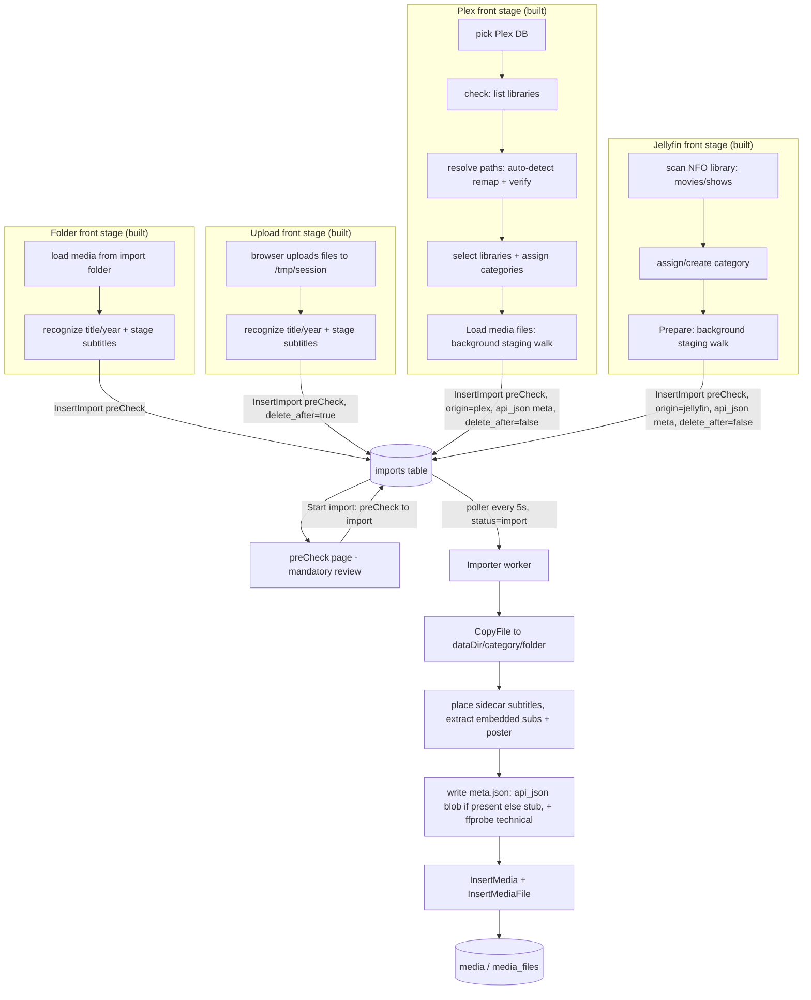
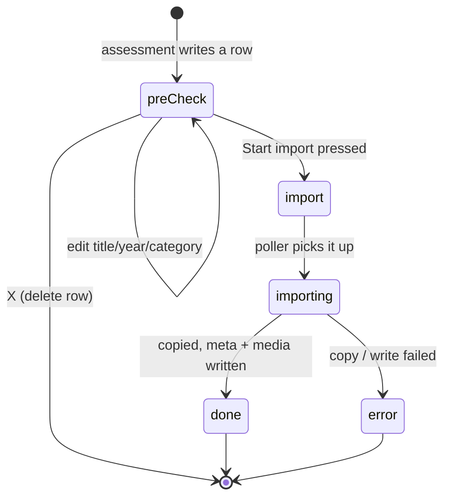

# Import subsystem

How media gets from an external source into the data directory as a media folder. The
**folder**, **upload**, **Plex**, and **Jellyfin** sources are all built today.
Whatever the source, **every flow converges on the same mandatory preCheck page**
(`/admin/library/import`) before a single file is copied.

Import never touches OMDb. The folder/upload sources produce a media folder with a **stub
`meta.json`** (title, year) plus ffprobe technical details; the **Plex** source instead
writes Plex's own metadata through the row (an `api_json` blob). Either way the folder is left
**unenriched**, so the background media enricher later fills any gaps from OMDb - and it does
so **additively**, never overwriting values (or a poster) the import already wrote, so Plex's
metadata is kept and only the holes are filled (`agents/enricher.md`). OMDb is looked up in exactly
one place, that agent, and nowhere here. Any sidecar subtitles and a `poster.*` ride along
into the media folder regardless of source.

## Every source converges on the preCheck page

The import pipeline is split in two halves that only meet at the `imports` table:

- A **source front stage** does whatever is specific to that source and ends by writing
  one `preCheck` row per candidate file. There is one front stage per source; they share
  nothing but the rows they produce. The folder, upload, and Plex stages are built so far.
- The **preCheck page** is the single mandatory checkpoint every flow lands on. It shows
  the staged `preCheck` rows so the admin can review, edit titles and years, drop rows,
  and finally press **Start import**, which flips those rows to `import`. No source
  bypasses it; nothing is copied before it. Rows the library already holds are marked
  here (see **Duplicate detection** below).
- The **importer** (consumer) is a single shared background process. It drains rows
  whose status is `import`, copies the file into the canonical layout, places any sidecar
  subtitles, extracts embedded subtitle tracks (below), places the poster, probes it with
  ffprobe, writes a stub `meta.json`, and inserts `media`/`media_files` rows.

The importer (and the preCheck page) depend only on the columns of an `imports` row, never
on which front stage wrote it. Every source (folder, upload, Plex, Jellyfin) drives the page
and the importer **exactly the same** - they never know or care how a row was produced. The
only per-source hint they carry is the `origin` column, used purely to drive UI affordances
(Plex and Jellyfin lock the delete-after checkbox off), never to change importer behaviour.



## Source front stages

| source | front stage (everything before the preCheck page) |
|--------|----------------------------------------------------|
| **Folder** *(built)* | scan the configured import folder, recognize each video file's title/year/episode, detect sidecar subtitles and a `poster.*`, write a `preCheck` row per file (no OMDb) |
| **Upload** *(built)* | the browser uploads one or more files (a per-file progress bar each) into a unique `/tmp/{session}` dir, then the same staging runs against that dir - identical to folder import but with `delete_after` forced on, so the `/tmp` working files are always cleaned up |
| **Plex** *(built)* | pick the Plex DB (read-only), **check** lists its libraries, **resolve** auto-detects how the DB's paths map onto the real filesystem, the admin selects libraries and assigns each a FileFin category (or creates one from the Plex name), then **Load media files** runs a background staging walk that writes one `preCheck` row per locatable file - carrying Plex's metadata blob, poster, and subtitles, `origin=plex`, `delete_after=false`. See the Plex section below |
| **Jellyfin** *(built)* | pick a Jellyfin/Kodi **NFO library** directory on the server and a target category (existing or created from a typed name), then **Prepare** runs a background staging walk: it scans the tree (`internal/jellyfin`), auto-detecting each entry as a movie (`movie.nfo` / `<video>.nfo` / loose file) or show (`tvshow.nfo` / `Season NN/` / episode `.nfo`s), builds the `meta.json` blob from the NFO fields (`importer.MetaFromJellyfin`, no OMDb), attaches sidecar subtitles and the chosen poster/fanart image, and writes one `preCheck` row per video file - `origin=jellyfin`, `delete_after=false` (it reads a library the user keeps). No DB and no path remap: it reads real on-disk paths. Multi-disc grouping of **loose** files (the old `DetectPart`) is not ported yet - each loose video is its own item; foldered multi-part movies are still grouped |

## Status lifecycle

A row moves through five statuses. Producers create `preCheck`; the admin pressing
**Start import** bulk-flips `preCheck` to `import`; the poller drives the rest.



## `imports` columns

| column        | meaning                                                            |
|---------------|-------------------------------------------------------------------|
| `id`          | autoincrement primary key                                         |
| `category_id` | target category id (from `config.json`); the category folder name is joined from `categories` at read time, not stored |
| `source_path` | absolute path of the source video in the import folder            |
| `filename`    | base name of the source (shown in the assessment table)           |
| `title`       | recognized (or admin-edited) title                                |
| `year`        | recognized (or admin-edited) year, 0 if unknown                   |
| `status`      | `preCheck` / `import` / `importing` / `done` / `error`            |
| `season`      | recognized season number, 0 for a movie / single file             |
| `episode`     | recognized episode number, 0 for a movie / single file            |
| `subtitles`   | JSON list of detected sidecar subtitle files, or empty            |
| `poster`      | path of a `poster.*` found beside the source, placed at import; empty if none |
| `copied`      | bytes copied so far (mirrored from the live progress map)         |
| `total`       | total bytes to copy                                               |
| `error`       | failure message when `status = error`                             |
| `delete_after`| remove the source file after a successful import (default false)  |
| `api_json`    | source-supplied `meta.json` blob; written by Plex (an `importer.Meta` from Plex's fields), empty for folder/upload. The importer writes it verbatim but leaves the folder unenriched, so the enricher later fills gaps additively. OMDb is still never called here |
| `origin`      | which front stage produced the row (`folder` / `upload` / `plex`); a UI hint only, the importer ignores it |

The `duplicate` field on the wire has no column behind it: it is derived per response from
the live library (see **Duplicate detection**).

`delete_after` makes the source a **vacuum**: when set, the importer deletes the source
file once the copy and `media` row are committed (best-effort - a failed delete is logged,
not fatal, because the import already succeeded). It removes the whole footprint, not just
the video: the sidecar subtitles the row carried and the poster beside it (both already
copied into the media folder) go too, and then every parent folder the removal left
**empty** is pruned upwards, stopping at the first folder that still holds something and
never removing the import folder itself. A folder that still holds a not-yet-imported
episode or an unstaged file is therefore always kept, while a fully imported import folder
is left empty rather than littered with husk directories and orphaned subtitles. It defaults to false so future producers
that import from a library someone keeps (Plex/Jellyfin) leave originals intact. The folder
assessment page exposes it as a per-batch checkbox (defaulting on) whose value is written
onto the staged rows when **Start import** is pressed. For the **Plex** source it is forced
**off** at staging time and the checkbox is locked off, because Plex imports read from a
library the user keeps - the originals are never touched.

For the **upload** source `delete_after` is forced on at staging time and the checkbox is
locked, because the source lives in a throwaway `/tmp/{session}` dir. Once the last
unfinished row pointing into a session dir completes, the importer removes the whole dir
(video, sidecars, and all). A periodic sweep is the backstop: it reclaims any
`filefin-upload-*` dir that is past a short idle TTL and referenced by no unfinished row
(files uploaded but never started, or a session abandoned before assessment); a dir whose
`preCheck` rows still exist is kept regardless of age.

## Duplicate detection

Every staged row is checked against the existing library before it can be started, so
importing something that is already there is caught on the preCheck page instead of after
the copy. The check is **derived, never stored**: it runs each time rows are handed to the
page (assessment, listing, and again after a title/year edit), because both the library and
the row's own title/year keep moving.

Pairing reuses the **watchlist matcher** (`mdl.md`, `mal.md`) - the same normalized-title,
year-strict logic the watch-history imports use - so a row matches a library item on an
exact or confident grade only; the matcher's approximate grade is ignored, since a guessed
duplicate would train the admin to click past the warning. An **episode** row is judged
differently: a show folder matching by title is expected, so it counts as a duplicate only
when the matched item already holds that exact season/episode, and the next episode of a
running series stages clean.

The result is advisory. The page marks each matched row and warns above **Start import**,
but nothing is blocked or dropped automatically - a deliberate re-import (a better rip of a
film already in the library) stays the admin's call.

## Subtitles

Two things happen, in order, right after the copy (both best-effort - a subtitle failure
never fails an import):

1. **Sidecars** detected beside the source ride along on the row (`subtitles` column) and are
   placed next to the placed video as `<base>.<lang>.srt`, converting non-SRT text formats to
   SRT and copying bitmap formats (VobSub/PGS) verbatim.
2. **Embedded tracks** are then externalised: the importer probes the copied file with ffprobe
   and, for each **text** subtitle track that carries a **known language** (a real
   `tags.language` that is not `und`; bitmap codecs like PGS/VobSub/DVB are skipped because
   they need OCR and the player only renders SRT), extracts it with ffmpeg to a
   `<base>.<lang>.srt` sidecar. A language already covered by a sidecar (including the ones
   just placed in step 1) is **skipped**, and the first track of a language wins, so a second
   same-language track is skipped too. Unknown-language and bitmap tracks are left in the
   container untouched.

The player only renders external `.srt` sidecars, so this is what makes a muxed-in subtitle
visible (see `playback.md`).

## Posters

A `poster.*` next to the source rides along: the front stage records it on the row (so the
assessment table can flag which items have artwork), and the importer copies it into the
media folder as `poster.<ext>`. The match is a per-video `<video-base>.<imgext>` first, then
a folder-level `poster.<imgext>`. An existing poster in the target folder is kept, so a
multi-episode show places one once and a re-import never clobbers it. A source poster with no
usable extension (Plex's metadata-bundle posters carry none) is content-sniffed at placement
so it still lands under a sensible extension (defaulting to `.jpg`).

When the source carried no poster, the media folder simply has none until the **media
enricher** downloads one later (see `agents/enricher.md`). The poster is the only artwork import
handles; the rich OMDb metadata always comes from the enricher.

## How `media` / `media_files` get populated

The importer writes `media` rows as imports complete: for each imported row it inserts
one `media` row (id = `sha1(category + "/" + folder)[:12]`, matching the old scanner's
media id) and one `media_files` row (movies are single-file, so `idx` 0 and
season/episode 0).

The cache is also **fully rebuildable from the data folder**. `POST /api/admin/rebuild`
(the "Rebuild database" button on the Settings header) flushes the cache and re-derives
it from disk: categories first (from each folder's `config.json`), then every media
folder inside them - reading `meta.json` (falling back to the folder name) for the
title/year/description, collecting the video files and `poster.*`. Imports are transient
and cannot be reconstructed, so a rebuild simply drops them (handy for clearing stale
import rows). The `media`/`media_files` cache and the rebuild are owned by the library
subsystem - see `library.md`.

## What import writes (and what it leaves for later)

Import never consults OMDb. A folder/upload import gets a **stub `meta.json`** (title,
year) plus a `technical` block from **ffprobe** (duration, container, codecs,
dimensions); ffprobe is best-effort, so if it is not on `PATH` the `technical` block is
omitted and the import still succeeds. The row's `media` cache entry is therefore created
flagged **unenriched**.

A row carrying a source metadata blob in `api_json` (the **Plex** source) is different
only in *what* it writes: the importer unmarshals that blob into the folder's `meta.json`
(still attaching the ffprobe `technical` block) instead of a stub. The folder is still
created **unenriched**, so the enricher treats it like any other - except its merge is
additive, so Plex's fields survive and only the gaps are filled. `meta.json` is
folder-wide, so for a multi-episode show the first imported episode writes it and the rest
reuse what is on disk.

`meta.json` also carries the per-user playback `state` object (see `playback-state.md`), so
the importer writes it through the **shared per-folder lock** (`importer.Manager.Update`)
that the enricher and the playback-state handlers also use. Every write is a preserving
read-modify-write: a playback event landing mid-import can never be dropped, and the import
never clobbers state.

The rich OMDb fields (description, ratings, actors, tags) and the poster are added
afterwards by the background **media enricher**, which looks each *unenriched* folder up on
OMDb and **merges** the result into its `meta.json` in place (existing values win, an
existing poster is kept) without re-importing the video. That agent is the *only* place in
FileFin that calls OMDb - see `agents/enricher.md`.

## The Plex source

Plex stores **absolute paths as the Plex process saw them**, which routinely differ from
where FileFin sees the same files (a Docker container path, or a migrated/remounted
library). The Plex front stage handles this with two independent path channels:

- A **media remap** - a `from -> to` prefix substitution applied to each media file and
  external-subtitle path. It is **auto-detected with verification**: the resolver stats a
  ~10-file probe set spread across the selected libraries, first as-is (a co-located
  install resolves green with no input), then by chopping leading components off a missing
  probe and re-joining the suffix onto an admin-supplied **search base** (longest suffix
  first). A candidate is accepted only when a clear majority of probes resolve to exactly
  one existing path each - a suffix that matches in more than one place is ambiguous and
  counts as a failure, and a basename-only match is never auto-accepted. When detection
  cannot turn a library green the UI asks for the media location (the search base) and
  re-verifies; an unresolved library is blocked, not staged.
- A **metadata-dir** value for the poster bundle, defaulting to the directory derived from
  the DB path and overridable for relocated mounts.

Staging is a background filesystem walk (not a copy): it counts the selected files, then
for each one applies the remap, confirms the file exists, builds the subtitle list and the
`meta.json` blob from Plex's fields (`importer.MetaFromPlex`, no OMDb), and writes a
`preCheck` row (`origin=plex`, `delete_after=false`). Missing files are skipped and
counted. A single in-memory job state drives the progress bar; on finish the UI lands on
the preCheck page like every other source. Originals are read-only throughout.

### Shared staging driver

The Plex and Jellyfin front stages differ only in how they discover work (open a DB and
apply a remap vs. walk an NFO tree); both end by producing a flat list of source-neutral
**staged items** (per-file path, S/E, marshalled meta blob, subtitle JSON, poster, target
category) and handing it to **one shared `stageImport` driver**. The driver does the
identical part for every source: per item, honour cancellation, confirm the source exists,
insert the `preCheck` row, and advance a shared progress **tracker** (the in-memory job
state, begin/advance/fail/done behind one mutex - one tracker instance per source). A
missing source file or a dropped insert is logged and counted as not-staged rather than
silently lost. So remap and subtitle resolution are Plex's own responsibility, but the
staging loop, progress accounting, and `imports`-row shape are written once.

The Jellyfin scanner reuses the shared `recognize` name parser (title/year and the
season-folder test) rather than its own regexes, and reads each directory once per scan.

## Progress

There is no SSE/WebSocket. The worker holds live copy byte counts in an in-memory map
(`id -> {copied, total}`) and mirrors them to the row. The admin **Progress** page
polls `GET /api/admin/imports/active` (~1s) for rows still `import`/`importing` and
renders a bar per row; the bar disappears when the row reaches `done`.

The upload step has its own, separate progress: each file is uploaded as its own request
and the browser renders one progress bar per file from the XHR upload events. That is
client-side and finishes before staging; it is unrelated to the server-side copy bars above.

## Endpoints

| method + path                          | purpose                                        |
|----------------------------------------|------------------------------------------------|
| `POST /api/admin/import/assess`        | folder source: scan + stage one category       |
| `POST /api/admin/import/upload/begin`  | upload source: open a `/tmp` session, return token|
| `POST /api/admin/import/upload/file`   | upload source: store one file (multipart) in the session|
| `POST /api/admin/import/upload/assess` | upload source: stage the session dir (delete_after on)|
| `GET  /api/admin/import/plex/default`  | Plex source: probe standard Plex DB locations, return the first that exists |
| `POST /api/admin/import/plex/check`    | Plex source: open the DB read-only, list its libraries |
| `POST /api/admin/import/plex/resolve`  | Plex source: per-library path status (as-is / remap auto-detect + verify) |
| `POST /api/admin/import/plex/prepare`  | Plex source: start the background staging walk |
| `GET  /api/admin/import/plex/progress` | Plex source: live staging job state (total/done/staged/missing) |
| `POST /api/admin/import/jellyfin/prepare`  | Jellyfin source: start the background NFO-library staging walk |
| `GET  /api/admin/import/jellyfin/progress` | Jellyfin source: live staging job state (total/done/staged/missing) |
| `GET  /api/admin/imports?status=`      | list rows (optionally filtered by status)      |
| `PUT  /api/admin/imports/{id}`         | edit a staged row's title/year/category        |
| `DELETE /api/admin/imports/{id}`       | drop a staged row                              |
| `POST /api/admin/import/start`         | bulk preCheck -> import (the poller does rest) |
| `GET  /api/admin/imports/active`       | active rows with live copy progress            |
| `POST /api/admin/settings/omdb-key`    | set/clear the OMDb API key (used by the enricher)|
```
