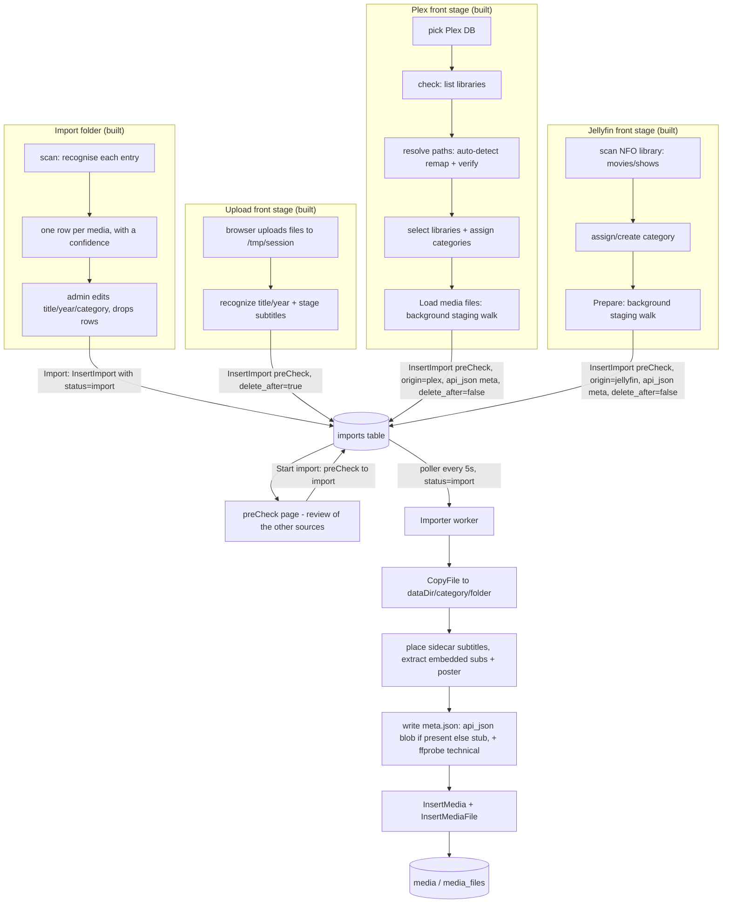
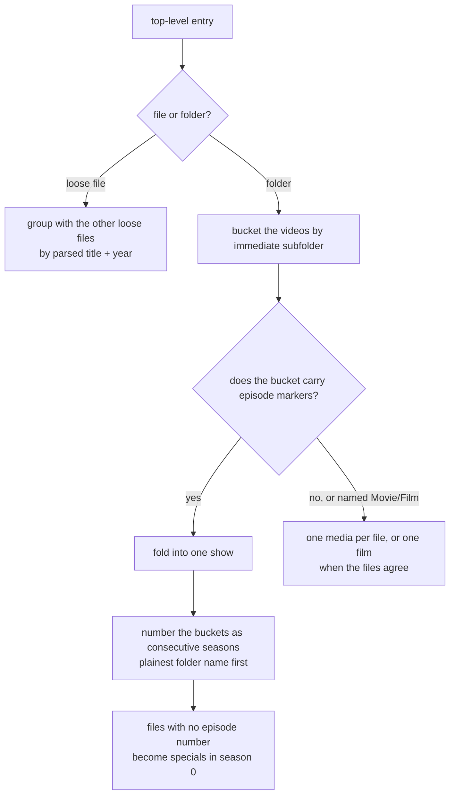
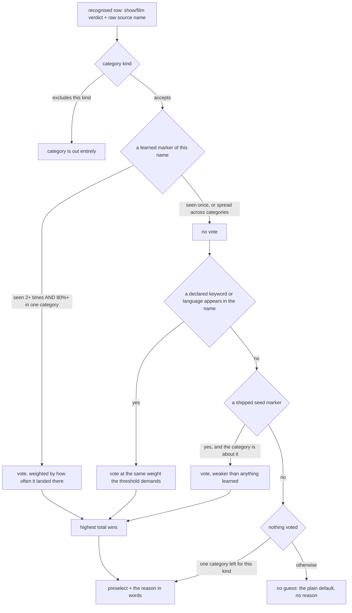
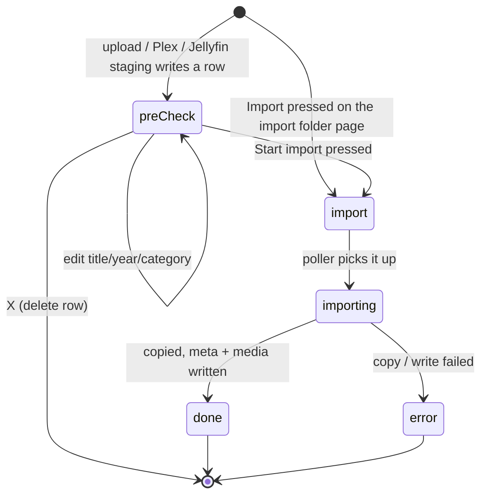
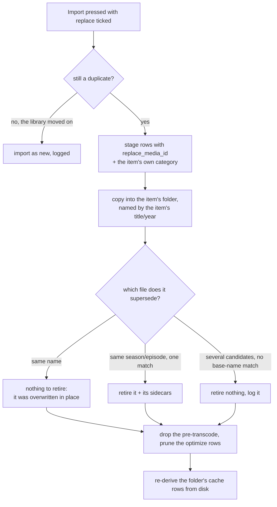
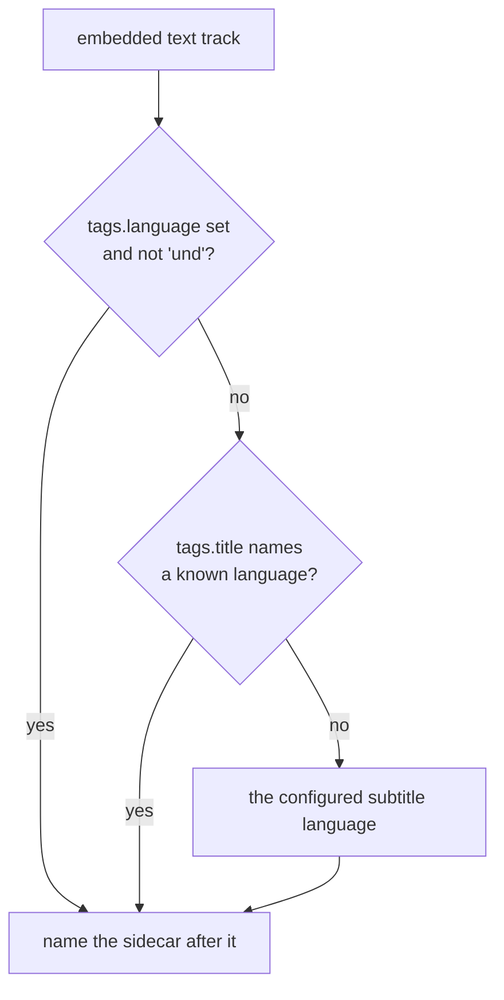

# Import subsystem

How media gets from an external source into the data directory as a media folder. The
**folder**, **upload**, **Plex**, and **Jellyfin** sources are all built today.

Import is its own admin section (`/admin/import`), separate from the Library page that owns
the category tree. The **import folder is the whole page**: it lists one row per recognised
media with the title, year, file count, size, poster/subtitle markers, and duplicate check the
import would use, plus an editable title/year and its own **category dropdown** per row. One
**Import** button at the bottom queues every listed row - each into the category its row names.
There is no second step and no global category picker; a row that should stay behind is dropped
from the table with its **X** and lands in a plain **Not importing** list under the button, where
a **+** puts it back where it was, edits and all.

The other three sources need their own flow (an upload has to transfer files first, Plex and
Jellyfin have to locate and map a foreign library), so they keep the **preCheck page**
(`/admin/import/work`). **Upload files**, **Plex import**, and **Jellyfin import** are buttons in
the page header; the upload flow picks its target category on its own page.
Starting any of them **drops whatever batch was staged before**: only one batch is ever under
review, and the import folder page keeps no staged state of its own to lose - its table is
re-derived from disk every time it is opened.

Import never touches OMDb. The folder/upload sources produce a media folder with a **stub
`meta.json`** (title, year) plus ffprobe technical details; the **Plex** source instead
writes Plex's own metadata through the row (an `api_json` blob). Either way the folder is left
**unenriched**, so the background media enricher later fills any gaps from OMDb - and it does
so **additively**, never overwriting values (or a poster) the import already wrote, so Plex's
metadata is kept and only the holes are filled (`agents/enricher.md`). OMDb is looked up in exactly
one place, that agent, and nowhere here. Any sidecar subtitles and a `poster.*` ride along
into the media folder regardless of source.

## Every source meets at the `imports` table

The import pipeline is split in two halves that only meet at the `imports` table:

- A **source front stage** does whatever is specific to that source and ends by writing
  rows into the table. There is one front stage per source; they share nothing but the rows
  they produce.
- The **importer** (consumer) is a single shared background process. It drains rows
  whose status is `import`, copies the file into the canonical layout, places any sidecar
  subtitles, extracts embedded subtitle tracks (below), places the poster, probes it with
  ffprobe, writes a stub `meta.json`, and inserts `media`/`media_files` rows.

The two halves differ only in **where the review happens**:

- The **import folder** is reviewed *before* anything is written: the page is a pure scan of
  the filesystem, and pressing Import writes its rows already in the `import` status. The table
  the admin just corrected is the check, so a second confirmation would only repeat it.
- The **upload, Plex, and Jellyfin** stages write `preCheck` rows and land on the **preCheck
  page**, where the admin reviews, edits titles and years, drops rows, and presses **Start
  import** to flip them to `import`. Their staging is a background walk (or an upload) whose
  result nobody has seen yet, so it is shown before a byte is copied.

The importer depends only on the columns of an `imports` row, never on which front stage wrote
it. Every source drives it **exactly the same**; the only per-source hint rows carry is the
`origin` column, used purely to drive UI affordances (Plex and Jellyfin lock the delete-after
checkbox off), never to change importer behaviour.


```mermaid
flowchart TD
    subgraph Folder["Import folder (built)"]
        FS[scan: recognise each entry] --> FG[one row per media, with a confidence] --> FE[admin edits title/year/category, drops rows]
    end
    subgraph Upload["Upload front stage (built)"]
        UB[browser uploads files to /tmp/session] --> UR[recognize title/year + stage subtitles]
    end
    subgraph Plex["Plex front stage (built)"]
        PX[pick Plex DB] --> PC2[check: list libraries] --> PR[resolve paths: auto-detect remap + verify] --> PA[select libraries + assign categories] --> PP[Load media files: background staging walk]
    end
    subgraph Jellyfin["Jellyfin front stage (built)"]
        JT[scan NFO library: movies/shows] --> JA[assign/create category] --> JP[Prepare: background staging walk]
    end
    FE -->|Import: InsertImport with status=import| T[(imports table)]
    UR -->|InsertImport preCheck, delete_after=true| T
    PP -->|InsertImport preCheck, origin=plex, api_json meta, delete_after=false| T
    JP -->|InsertImport preCheck, origin=jellyfin, api_json meta, delete_after=false| T
    T --> PC[preCheck page - review of the other sources]
    PC -->|Start import: preCheck to import| T
    T -->|poller every 5s, status=import| W[Importer worker]
    W --> C[CopyFile to dataDir/category/folder]
    C --> SU[place sidecar subtitles, extract embedded subs + poster]
    SU --> M[write meta.json: api_json blob if present else stub, + ffprobe technical]
    M --> MI[InsertMedia + InsertMediaFile]
    MI --> D[(media / media_files)]
```

## Source front stages

| source | front stage (everything before the importer) |
|--------|----------------------------------------------------|
| **Folder** *(built)* | walk the configured import folder and fold it into **one row per media, grouped by top-level entry** (see **Recognition** below): a folder is one media unless its own subfolders say otherwise, and only loose files at the root are grouped by what they parse to. Each row carries its show/film verdict and a **confidence**. Sidecar subtitles and a `poster.*` are counted per row and the duplicate check is applied. The scan writes nothing; pressing **Import** re-runs it, matches the rows the page sent back by id, and inserts one `import` row per file with that row's title, year, and category (no OMDb) |
| **Upload** *(built)* | the browser uploads one or more files (a per-file progress bar each) into a unique `/tmp/{session}` dir, then the same staging runs against that dir - identical to folder import but with `delete_after` forced on, so the `/tmp` working files are always cleaned up |
| **Plex** *(built)* | pick the Plex DB (read-only), **check** lists its libraries, **resolve** auto-detects how the DB's paths map onto the real filesystem, the admin selects libraries and assigns each a FileFin category (or creates one from the Plex name), then **Load media files** runs a background staging walk that writes one `preCheck` row per locatable file - carrying Plex's metadata blob, poster, and subtitles, `origin=plex`, `delete_after=false`. See the Plex section below |
| **Jellyfin** *(built)* | pick a Jellyfin/Kodi **NFO library** directory on the server and a target category (existing or created from a typed name), then **Prepare** runs a background staging walk: it scans the tree (`internal/jellyfin`), auto-detecting each entry as a movie (`movie.nfo` / `<video>.nfo` / loose file) or show (`tvshow.nfo` / `Season NN/` / episode `.nfo`s), builds the `meta.json` blob from the NFO fields (`importer.MetaFromJellyfin`, no OMDb), attaches sidecar subtitles and the chosen poster/fanart image, and writes one `preCheck` row per video file - `origin=jellyfin`, `delete_after=false` (it reads a library the user keeps). No DB and no path remap: it reads real on-disk paths. Multi-disc grouping of **loose** files (the old `DetectPart`) is not ported yet - each loose video is its own item; foldered multi-part movies are still grouped |

## Recognition

Recognition answers three questions about every entry in the import folder: what is this
called, is it a show or a film, and how much should that be trusted. It is deliberately
**offline and deterministic** - no metadata service is consulted here, because the failures it
has to survive are naming conventions, not genuine ambiguity, and the content that parses worst
(CJK dramas, fansub anime) is exactly the content a metadata service knows least about.

### The title is what stands before the first marker

A release name is a title followed by everything the releaser wanted to record. So the parser
looks for the earliest **structural marker** - a year, a season/episode marker, a
quality/source/codec token, a bracketed checksum, a release-group credit - and keeps only what
precedes it. Nothing after a marker can reach the title, which is why an episode title
(`Deaths.Game.S01E02.The.Reason.Youre.Going.to.Hell`) no longer splits a show into one media
per episode.

Markers are matched on the **raw** name, before separators are normalised, so `H.264`, `H_264`
and `H 264` are one rule rather than three. Bracketed decorations are dropped from both ends, a
trailing `-GROUP` or `@GROUP` credit is cut, and a CJK title in front of a romanised one is
dropped so the enricher has a title it can match. A folder name is parsed differently from a
file name in exactly one respect: it has no extension, so nothing may be stripped from its end.

### Show or film is decided once per entry

Any season or episode marker anywhere in an entry makes the **whole entry** a show, and that
verdict is applied to every one of its files - one unmarked extra cannot turn a show back into
a film. The verdict reaches the import table as a column and preselects the row's category.

### Grouping follows the entry, not the parsed title

The unit an admin dropped in the import folder is the top-level entry, so that is the unit the
page shows. Grouping by parsed title instead shatters an entry the moment two of its files
disagree, which is what real release names do constantly.


```mermaid
flowchart TD
    E[top-level entry] --> D{file or folder?}
    D -->|loose file| L[group with the other loose files<br/>by parsed title + year]
    D -->|folder| G[bucket the videos by immediate subfolder]
    G --> C{does the bucket carry episode markers?}
    C -->|yes| S[fold into one show]
    C -->|no, or named Movie/Film| F[one media per file, or one film<br/>when the files agree]
    S --> N[number the buckets as consecutive seasons<br/>plainest folder name first]
    N --> P[files with no episode number<br/>become specials in season 0]
```

Sample, extras, featurette, bonus and trailer folders are skipped outright, as is any file
naming itself a teaser, trailer, sample or preview - they are never the media, so they neither
land in the library nor count towards the checks below.

Several buckets of episodes under one entry are numbered as consecutive **seasons** rather than
merged, or two runs would both claim `S01E01` and collide on disk. The plainest folder name
goes first, since a later season names itself with something extra appended.

### Candidates are scored, not tried in order

An entry offers several possible titles: its folder name, the name of a subfolder, what its
files agree on. All of them are scored by the **same** checks and the least-doubtful one wins;
the order the caller offered them in only breaks a tie. That is what lets a well-named folder
rescue a cryptic file (`Baby.and.Me.2008.DVDRip.XviD-BiFOS/bifos-babyme.avi`) and, in the other
direction, lets a file rescue a useless folder name (`LLBJ/(1990) Liu Lang Bei Jing.avi`).

### Confidence is which checks passed

Confidence is **not** a count of how much work recognition had to do. A title found only by
falling back to the folder name, which then passes every check, is trustworthy. What lowers it
is a failed check:

| check | fails when |
|-------|------------|
| film file count | a film holds several files that are not numbered parts - so it is either misgrouped or really a show |
| title agreement | the files of one media name different titles (a title that merely extends another is agreement, as a later season does) |
| episode numbering | two files claim the same season and episode |
| title junk | release junk, a checksum or an empty bracket pair survived into the title |
| title shape | the title holds nothing that reads like a word, or is a bare `abbrev-abbrev` |
| year range | the year is outside 1900..next year |
| episode run *(soft)* | the episode numbers have gaps |
| year missing *(soft)* | no year was found anywhere |
| season guess *(soft)* | seasons were guessed from sibling folder names rather than stated |

A hard failure makes the row **low**; a soft failure, or a win by a source other than the
expected one, makes it **medium**; everything else is **high**. The import page sorts
low-confidence rows to the top and names the failed check in the marker's tooltip, so the
admin reads the few rows worth reading instead of all of them.

## Which category a row is preselected into

Each scanned row also carries a **guessed category and the reason for it**, shown beside the
row's dropdown the way the confidence marker is. The guess is scored against the categories'
**markers** (`mediaformat.md`), and it is only offered when the evidence is real: one Import
button queues every row, so a confident wrong category misfiles silently, while a missing
guess costs one dropdown.


```mermaid
flowchart TD
    ROW[recognised row: show/film verdict + raw source name] --> KIND{category kind}
    KIND -->|excludes this kind| OUT[category is out entirely]
    KIND -->|accepts| LEARNED{a learned marker of this name}
    LEARNED -->|seen 2+ times AND 80%+ in one category| VOTE[vote, weighted by how often it landed there]
    LEARNED -->|seen once, or spread across categories| NEXT[no vote]
    NEXT --> DECL{a declared keyword or language appears in the name}
    DECL -->|yes| VOTE2[vote at the same weight the threshold demands]
    DECL -->|no| SEED{a shipped seed marker}
    SEED -->|yes, and the category is about it| VOTE3[vote, weaker than anything learned]
    SEED -->|no| NONE
    VOTE --> PICK[highest total wins]
    VOTE2 --> PICK
    VOTE3 --> PICK
    PICK --> OUTP[preselect + the reason in words]
    NONE{nothing voted} -->|one category left for this kind| OUTP
    NONE -->|otherwise| PLAIN[no guess: the plain default, no reason]
```

Two rules are what make this safe rather than clever:

- **A marker votes only when it has been seen at least twice and at least 80% of its sightings
  sit in one category.** That is what makes a region-pure fansub group usable and keeps a
  pan-Asian tracker uploader - which really does split across regions - silent.
- **Nothing is inherited between rows.** Following the previous row's category was built,
  measured against a labelled set of real release names, and dropped: it preselected three more
  rows and got all three wrong, because a dump is not reliably one region at a time.

A short **seeded vocabulary** ships with the app - region-locked platforms (IQIYI, Youku,
MGTV, Tencent, TVING, Viu, wavve, KOCOWA, ...) and anime-only fansub groups - weighted below
anything learned, so the first real evidence overrides it. A seed is only offered to a
category whose declared markers, or failing those its own name, are about the same thing, so a
library with no Chinese category is never told about IQIYI. It is deliberately small: it
bridges the first few imports, it is not a database to maintain.

## Learning at import time

`mediafmt` renames every source to the canonical layout, so the release group, the fansub tag,
the platform and the script of a name **exist only until the import runs**. Learning therefore
happens at staging time, while the raw name is still in hand, which is also why the feature
cannot be backfilled from an existing library and starts cold.

- The markers are read from the **entry name and its first file**, since a release signs
  itself in either place.
- They are learned **once per media, not per file** - a 167-episode show would otherwise drown
  every other signal.
- Only a **successful** staging teaches: a row that staged nothing changes no counts.

The counts are written into the target category's `config.json` (see `mediaformat.md` for the
namespaces and the cap) and can be pruned one at a time from the category page.

## Media that ended up in the wrong category

Markers also answer the question after the fact. Once the enricher has written a media's
**language and country**, they are compared with the declared languages and countries of the
category it sits in; a contradiction is listed on the **Needs attention** page
(`rematch.md`) - the same page that already answers "something about this item is wrong".
A category that declares neither can never be contradicted, and nothing is ever moved
automatically: the report names the category the facets point at and leaves the decision alone.

## Status lifecycle

A row moves through five statuses. The import folder writes `import` rows directly (its review
happened on the page, before anything was written); the other sources create `preCheck` and the
admin pressing **Start import** bulk-flips them. The poller drives the rest.


```mermaid
stateDiagram-v2
    [*] --> import: Import pressed on the import folder page
    [*] --> preCheck: upload / Plex / Jellyfin staging writes a row
    preCheck --> preCheck: edit title/year/category
    preCheck --> [*]: X (delete row)
    preCheck --> import: Start import pressed
    import --> importing: poller picks it up
    importing --> done: copied, meta + media written
    importing --> error: copy / write failed
    done --> [*]
    error --> [*]
```

## `imports` columns

| column        | meaning                                                            |
|---------------|-------------------------------------------------------------------|
| `id`          | autoincrement primary key                                         |
| `category_id` | target category id (from `config.json`); the category folder name is joined from `categories` at read time, not stored |
| `source_path` | absolute path of the source video in the import folder            |
| `filename`    | base name of the source (shown in the assessment table)           |
| `title`       | recognized (or admin-edited) title                                |
| `year`        | recognized (or admin-edited) year, 0 if unknown                   |
| `status`      | `preCheck` / `import` / `importing` / `done` / `error`            |
| `season`      | recognized season number, 0 for a movie / single file             |
| `episode`     | recognized episode number, 0 for a movie / single file            |
| `part`        | which disc of a film split over several files (`CD1`, `part2`), 0 otherwise. It reaches the target file name, so two discs of one film cannot render to the same name and overwrite each other |
| `subtitles`   | JSON list of detected sidecar subtitle files, or empty            |
| `poster`      | path of a `poster.*` found beside the source, placed at import; empty if none |
| `copied`      | bytes copied so far (mirrored from the live progress map)         |
| `total`       | total bytes to copy                                               |
| `error`       | failure message when `status = error`                             |
| `delete_after`| remove the source file after a successful import (default false)  |
| `confidence`  | how much recognition trusted the row's title/year: `high`, `medium`, `low`, empty for rows written before the column existed. Drives nothing in the importer - it records what the admin was shown |
| `api_json`    | source-supplied `meta.json` blob; written by Plex (an `importer.Meta` from Plex's fields), empty for folder/upload. The importer writes it verbatim but leaves the folder unenriched, so the enricher later fills gaps additively. OMDb is still never called here |
| `origin`      | which front stage produced the row (`folder` / `upload` / `plex`); a UI hint only, the importer ignores it |
| `replace_media_id` | the library item this row swaps the payload of instead of creating a media, empty for an ordinary import. Unlike `duplicate` it is stored: it is a decision the admin made, not a derived hint |

The `duplicate` field on the wire (and the `duplicateId` beside it, naming the matched item)
has no column behind it: both are derived per response from the live library (see **Duplicate
detection**), for the import-folder scan and for the preCheck page alike.

`delete_after` makes the source a **vacuum**: when set, the importer deletes the source
file once the copy and `media` row are committed (best-effort - a failed delete is logged,
not fatal, because the import already succeeded). It removes the whole footprint, not just
the video: the sidecar subtitles the row carried and the poster beside it (both already
copied into the media folder) go too, and then every parent folder the removal left
**empty** is pruned upwards, stopping at the first folder that still holds something and
never removing the import folder itself. A folder that still holds a not-yet-imported
episode or an unstaged file is therefore always kept, while a fully imported import folder
is left empty rather than littered with husk directories and orphaned subtitles. It defaults to false so producers
that import from a library someone keeps (Plex/Jellyfin) leave originals intact. The import
folder page exposes it as a per-batch checkbox (defaulting on) whose value is written onto
the rows when **Import** is pressed.

A second checkbox under it, **clean up also non imported media**, widens that from "the files
I imported" to "the folder": once the batch has finished copying, everything still sitting in
the import folder is removed - the rows the admin dropped, sample clips, release notes,
artwork - leaving the folder itself empty. It rides on delete-after (keeping the originals and
wiping the folder would contradict each other) and is armed **in memory** for one batch only:
the poller runs it on the first tick where no import row is unfinished any more, and a restart
mid-batch drops the wish rather than deleting files nobody is waiting on. For the **Plex** source it is forced
**off** at staging time and the checkbox is locked off, because Plex imports read from a
library the user keeps - the originals are never touched.

For the **upload** source `delete_after` is forced on at staging time and the checkbox is
locked, because the source lives in a throwaway `/tmp/{session}` dir. Once the last
unfinished row pointing into a session dir completes, the importer removes the whole dir
(video, sidecars, and all). A periodic sweep is the backstop: it reclaims any
`filefin-upload-*` dir that is past a short idle TTL and referenced by no unfinished row
(files uploaded but never started, or a session abandoned before assessment); a dir whose
`preCheck` rows still exist is kept regardless of age.

## Duplicate detection

Everything on offer is checked against the existing library before it can be imported, so
importing something that is already there is caught on the page instead of after the copy.
The check is **derived, never stored**: it runs on every scan of the import folder and every
time staged rows are handed to the preCheck page (including after a title/year edit), because
both the library and the titles being matched keep moving.

Pairing reuses the **watchlist matcher** (`mdl.md`, `mal.md`) - the same normalized-title,
year-strict logic the watch-history imports use - so a row matches a library item on an
exact or confident grade only; the matcher's approximate grade is ignored, since a guessed
duplicate would train the admin to click past the warning. An **episode** row is judged
differently: a show folder matching by title is expected, so a file counts as a duplicate only
when the matched item already holds that exact season/episode. A whole row is a duplicate only
when **every** file behind it is, so a season pack with one episode already imported still
reads as new work rather than a re-import.

Nothing is blocked or dropped automatically: a deliberate re-import (a better rip of a film
already in the library) stays the admin's call. Both tables mark a duplicate row in the **Dup**
column and offer the two things that decision needs - a comparison to make it, and a replace to
act on it.

### Comparing the two copies

Hovering (or focusing) the marker opens a panel putting the incoming media beside the library
one: path, file count and total size, then the size, resolution, codecs, container, duration and
modification time of one file from each side, with the bigger file and the higher resolution
marked. It is loaded **on demand and cached per row**, because answering costs a re-scan of the
import folder plus two ffprobe runs, and it probes **one file per side only** - a season pack
must not fire an ffprobe per episode because a marker was hovered. ffprobe is best-effort: where
it is unavailable the library side falls back to the cached format columns and `meta.json`'s
technical block, and the sizes and paths still answer most of the question.

The import-folder page never holds filesystem paths (its rows travel by id), so the endpoint
resolves an item exactly the way the import itself does: re-scan, match by id, re-run the
duplicate check. The preCheck sibling resolves a staged row by its row id and folds in the other
staged rows of the same title and year, matching the grouping that page shows.

### Replacing the library copy

A **replace** checkbox beside the marker turns the import from "add a second copy" into "swap
this item's payload". The identity stays with the library item and only the video changes:

- the file lands in the **existing media folder**, named after the **existing** item's title and
  year, so it sits beside its siblings and the media keeps the id derived from that folder;
- `meta.json` survives untouched apart from its technical block, which now describes the new
  payload - so the description, ratings, curated tags, the poster, and every user's watched flag,
  resume pointer, favorite and rating are all kept;
- the file the new one supersedes is removed **after** the copy is committed, together with its
  `.optimized.mp4` pre-transcode and, when the base name changed, its subtitle sidecars;
- the item's cache rows are re-derived from disk through the same per-folder read the discovery
  reconcile uses, rather than patched.

Because the replacement lands in that folder, the row's category follows the library item rather
than the dropdown. The page drops the dropdown from a ticked row altogether - there is nothing to
pick - and such a row counts as ready without one. Should the tick have gone stale by the time
Import is pressed, the row would then have no category at all, so the markers' guess
(**Which category a row is preselected into**, above) stands in and the file is imported as new
rather than dropped.


```mermaid
flowchart TD
    T[Import pressed with replace ticked] --> M{still a duplicate?}
    M -->|no, the library moved on| N[import as new, logged]
    M -->|yes| R[stage rows with replace_media_id<br/>+ the item's own category]
    R --> C[copy into the item's folder,<br/>named by the item's title/year]
    C --> S{which file does it supersede?}
    S -->|same name| SN[nothing to retire:<br/>it was overwritten in place]
    S -->|same season/episode, one match| SO[retire it + its sidecars]
    S -->|several candidates, no base-name match| SA[retire nothing, log it]
    SN --> P[drop the pre-transcode, prune the optimize rows]
    SO --> P
    SA --> P
    P --> D[re-derive the folder's cache rows from disk]
```

The **pre-transcode** is dropped in every case, not only when a file was retired: the common
replace lands on the same name and retires nothing, and while playback already refuses an
`.optimized.mp4` older than its source, a replacement that is *direct-playable* is never queued
for optimizing, so nothing would ever overwrite it. Whether a new one is made at all then falls
out of the re-derived cache row: the optimizer only queues what its freshly probed format says
cannot direct-play (`agents/optimizer.md`).

Both halves of the decision are re-resolved server-side. The page's tick is a wish: the handler
re-runs the match and uses the id **it** found, so a row whose library item vanished between the
table being drawn and Import being pressed simply imports as new, and the importer falls back to
a normal import when the item is gone by the time the copy runs.

## Subtitles

Two things happen, in order, right after the copy (both best-effort - a subtitle failure
never fails an import):

1. **Sidecars** detected beside the source ride along on the row (`subtitles` column) and are
   placed next to the placed video as `<base>.<lang>.srt`, converting non-SRT text formats to
   SRT and copying bitmap formats (VobSub/PGS) verbatim. Whether a text sidecar is already SRT
   is decided by **reading its opening bytes, not by its extension**: ASS/SSA scripts shipped
   under an `.srt` name are common, and copying one verbatim would leave a sidecar the player
   lists but cannot draw cues from. A mislabelled file is therefore routed through the
   converter like any other non-SRT text format. When the conversion cannot run (no ffmpeg),
   the original is kept rather than lost, and the player's own format sniffing still renders
   it (see `playback.md`).
2. **Embedded tracks** are then externalised: the importer probes the copied file with ffprobe
   and extracts each **text** subtitle track with ffmpeg to a `<base>.<lang>.srt` sidecar.
   Bitmap codecs (PGS/VobSub/DVB) are skipped - they need OCR, and the player only renders
   SRT - and are left in the container untouched. A language already covered by a sidecar
   (including the ones just placed in step 1) is **skipped**, and the first track of a
   language wins, so a second same-language track is skipped too.

   Naming a track uses the best evidence it carries, in order:


```mermaid
flowchart TD
    T[embedded text track] --> L{tags.language set\nand not 'und'?}
    L -->|yes| USE[name the sidecar after it]
    L -->|no| TI{tags.title names\na known language?}
    TI -->|yes| USE
    TI -->|no| FB[the configured subtitle language]
    FB --> USE
```

   The fallback matters: releases routinely ship exactly one unlabelled text track (and
   sometimes label a track `English` while leaving the language tag empty). Dropping those
   would lose the only subtitles the file has, so an untagged track is named after the
   library's **Subtitle language** setting - the same answer a sidecar with no language infix
   already gets in step 1.

The player only renders external `.srt` sidecars, so this is what makes a muxed-in subtitle
visible (see `playback.md`). A folder imported before a track could be named this way is
repaired by the discovery agent rather than needing a re-import (see `agents/discovery.md`).

## Posters

A `poster.*` next to the source rides along: the front stage records it on the row (so the
import table can flag which items have artwork), and the importer copies it into the
media folder as `poster.<ext>`. The match is a per-video `<video-base>.<imgext>` first, then
a folder-level `poster.<imgext>`. An existing poster in the target folder is kept, so a
multi-episode show places one once and a re-import never clobbers it. A source poster with no
usable extension (Plex's metadata-bundle posters carry none) is content-sniffed at placement
so it still lands under a sensible extension (defaulting to `.jpg`).

When the source carried no poster, the media folder simply has none until the **media
enricher** downloads one later (see `agents/enricher.md`). The poster is the only artwork import
handles; the rich OMDb metadata always comes from the enricher.

## How `media` / `media_files` get populated

The importer writes `media` rows as imports complete: for each imported row it inserts
one `media` row (id = `sha1(category + "/" + folder)[:12]`, matching the old scanner's
media id) and one `media_files` row (movies are single-file, so `idx` 0 and
season/episode 0).

The cache is also **fully rebuildable from the data folder**. `POST /api/admin/rebuild`
(the "Rebuild database" button on the Settings header) flushes the cache and re-derives
it from disk: categories first (from each folder's `config.json`), then every media
folder inside them - reading `meta.json` (falling back to the folder name) for the
title/year/description, collecting the video files and `poster.*`. Imports are transient
and cannot be reconstructed, so a rebuild simply drops them (handy for clearing stale
import rows). The `media`/`media_files` cache and the rebuild are owned by the library
subsystem - see `library.md`.

## What import writes (and what it leaves for later)

Import never consults OMDb. A folder/upload import gets a **stub `meta.json`** (title,
year) plus a `technical` block from **ffprobe** (duration, container, codecs,
dimensions); ffprobe is best-effort, so if it is not on `PATH` the `technical` block is
omitted and the import still succeeds. The row's `media` cache entry is therefore created
flagged **unenriched**.

A row carrying a source metadata blob in `api_json` (the **Plex** source) is different
only in *what* it writes: the importer unmarshals that blob into the folder's `meta.json`
(still attaching the ffprobe `technical` block) instead of a stub. The folder is still
created **unenriched**, so the enricher treats it like any other - except its merge is
additive, so Plex's fields survive and only the gaps are filled. `meta.json` is
folder-wide, so for a multi-episode show the first imported episode writes it and the rest
reuse what is on disk.

`meta.json` also carries the per-user playback `state` object (see `playback-state.md`), so
the importer writes it through the **shared per-folder lock** (`importer.Manager.Update`)
that the enricher and the playback-state handlers also use. Every write is a preserving
read-modify-write: a playback event landing mid-import can never be dropped, and the import
never clobbers state.

The rich OMDb fields (description, ratings, actors, tags) and the poster are added
afterwards by the background **media enricher**, which looks each *unenriched* folder up on
OMDb and **merges** the result into its `meta.json` in place (existing values win, an
existing poster is kept) without re-importing the video. That agent is the *only* place in
FileFin that calls OMDb - see `agents/enricher.md`.

## The Plex source

Plex stores **absolute paths as the Plex process saw them**, which routinely differ from
where FileFin sees the same files (a Docker container path, or a migrated/remounted
library). The Plex front stage handles this with two independent path channels:

- A **media remap** - a `from -> to` prefix substitution applied to each media file and
  external-subtitle path. It is **auto-detected with verification**: the resolver stats a
  ~10-file probe set spread across the selected libraries, first as-is (a co-located
  install resolves green with no input), then by chopping leading components off a missing
  probe and re-joining the suffix onto an admin-supplied **search base** (longest suffix
  first). A candidate is accepted only when a clear majority of probes resolve to exactly
  one existing path each - a suffix that matches in more than one place is ambiguous and
  counts as a failure, and a basename-only match is never auto-accepted. When detection
  cannot turn a library green the UI asks for the media location (the search base) and
  re-verifies; an unresolved library is blocked, not staged.
- A **metadata-dir** value for the poster bundle, defaulting to the directory derived from
  the DB path and overridable for relocated mounts.

Staging is a background filesystem walk (not a copy): it counts the selected files, then
for each one applies the remap, confirms the file exists, builds the subtitle list and the
`meta.json` blob from Plex's fields (`importer.MetaFromPlex`, no OMDb), and writes a
`preCheck` row (`origin=plex`, `delete_after=false`). Missing files are skipped and
counted. A single in-memory job state drives the progress bar; on finish the UI lands on
the preCheck page like every other source. Originals are read-only throughout.

### Shared staging driver

The Plex and Jellyfin front stages differ only in how they discover work (open a DB and
apply a remap vs. walk an NFO tree); both end by producing a flat list of source-neutral
**staged items** (per-file path, S/E, marshalled meta blob, subtitle JSON, poster, target
category) and handing it to **one shared `stageImport` driver**. The driver does the
identical part for every source: per item, honour cancellation, confirm the source exists,
insert the `preCheck` row, and advance a shared progress **tracker** (the in-memory job
state, begin/advance/fail/done behind one mutex - one tracker instance per source). A
missing source file or a dropped insert is logged and counted as not-staged rather than
silently lost. So remap and subtitle resolution are Plex's own responsibility, but the
staging loop, progress accounting, and `imports`-row shape are written once.

The Jellyfin scanner reuses the shared `recognize` name parser (title/year and the
season-folder test) rather than its own regexes, and reads each directory once per scan.

## Progress

There is no SSE/WebSocket. The worker holds live copy byte counts in an in-memory map
(`id -> {copied, total}`) and mirrors them to the row. The admin **Progress** page
polls `GET /api/admin/imports/active` (~1s) for rows still `import`/`importing` and
renders a bar per row; the bar disappears when the row reaches `done`.

The upload step has its own, separate progress: each file is uploaded as its own request
and the browser renders one progress bar per file from the XHR upload events. That is
client-side and finishes before staging; it is unrelated to the server-side copy bars above.

## Endpoints

| method + path                          | purpose                                        |
|----------------------------------------|------------------------------------------------|
| `GET  /api/admin/import/folder`        | import page: the folder path + one item per recognised media (id, entry, title, year, isShow, confidence, doubts, files, bytes, subs, poster, duplicate + duplicateId, the guessed categoryId + the reason for it); writes nothing |
| `GET  /api/admin/import/folder/{id}/duplicate` | import page: the incoming-vs-library comparison behind a Dup marker (404 when the item is no longer a duplicate) |
| `POST /api/admin/import/folder/start`  | import page: queue the listed media (per row: id, title, year, categoryId) as `import` rows |
| `POST /api/admin/import/upload/begin`  | upload source: open a `/tmp` session, return token|
| `POST /api/admin/import/upload/file`   | upload source: store one file (multipart) in the session|
| `POST /api/admin/import/upload/assess` | upload source: stage the session dir (delete_after on)|
| `GET  /api/admin/import/plex/default`  | Plex source: probe standard Plex DB locations, return the first that exists |
| `POST /api/admin/import/plex/check`    | Plex source: open the DB read-only, list its libraries |
| `POST /api/admin/import/plex/resolve`  | Plex source: per-library path status (as-is / remap auto-detect + verify) |
| `POST /api/admin/import/plex/prepare`  | Plex source: start the background staging walk |
| `GET  /api/admin/import/plex/progress` | Plex source: live staging job state (total/done/staged/missing) |
| `POST /api/admin/import/jellyfin/prepare`  | Jellyfin source: start the background NFO-library staging walk |
| `GET  /api/admin/import/jellyfin/progress` | Jellyfin source: live staging job state (total/done/staged/missing) |
| `GET  /api/admin/imports?status=`      | list rows (optionally filtered by status)      |
| `GET  /api/admin/imports/{id}/duplicate` | preCheck page: the same comparison for a staged row |
| `PUT  /api/admin/imports/{id}`         | edit a staged row's title/year/category, and mark or unmark it as replacing the library copy |
| `DELETE /api/admin/imports/{id}`       | drop a staged row                              |
| `POST /api/admin/import/start`         | bulk preCheck -> import (the poller does rest) |
| `GET  /api/admin/imports/active`       | active rows with live copy progress            |
| `POST /api/admin/settings/omdb-key`    | set/clear the OMDb API key (used by the enricher)|
```
