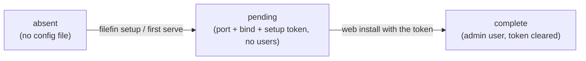
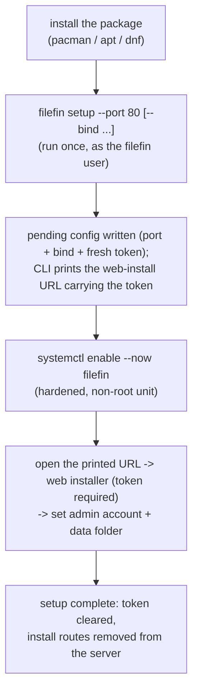

# Install

How a fresh FileFin goes from an unpacked binary to a running, admin-owned appliance. Install
is deliberately split into a **local CLI step** and a **token-gated web step**, so a server
reachable on a public port cannot be seized by whoever loads the setup page first.

## Config lifecycle: absent -> pending -> complete

"Installed" does not mean "the config file exists"; it means **an admin account exists**. The
single config file (`~/.filefin.json`) moves through three states, and the mode switch is
`SetupComplete()` (any users present), not the file's presence.

- **absent** - nothing on disk yet.
- **pending** - a config holding the chosen port, the bind address, and a one-time **setup
  token**, but no users. This is a normal, expected state; install mode is active only here.
- **complete** - an admin account exists and the setup token has been cleared. App mode.

Background agents and the cache treat pending exactly like absent (not ready): they run only
once setup is complete.

## Two-phase flow

**Why split it.** The CLI step runs on the box, with terminal access, so it can just print the
URL and the token. The web step, gated by that token, is the only thing that sets the admin
credentials. A remote attacker can reach the web installer but cannot complete it without the
token, which never travels anywhere the attacker can see.

## The setup token

The token is a 32-byte `crypto/rand` value (URL-safe base64) stored in the config's
`setupToken` field. The config is already `0600`, so the field is the single source of truth -
no side file, no config comment. It is:

- **minted** by `filefin setup` (or by a first `filefin serve` that bootstraps a pending
  config), and **printed** as part of the install URL (`.../?token=<token>`);
- **required** on every install-mode API call: the web installer reads it once from the URL,
  keeps it in memory, scrubs it from the address bar, and sends it as the `X-Setup-Token`
  header (never back in a query string, so it stays out of access logs). `POST /api/install`
  also accepts it in the JSON body as a fallback;
- **checked** with a constant-time compare, failing closed on a missing/empty/wrong token
  (`403`);
- **cleared** the moment setup completes, so it can never be reused.

The token is never exposed by any read endpoint (`/api/state` reports only whether setup is
still needed).

## The CLI

One binary, a tiny subcommand dispatcher (no external deps):

| command | does |
|---------|------|
| `filefin serve [--port N] [--bind ADDR]` | run the server (the default command). With no config it bootstraps a pending config from the flags/defaults and logs the setup URL; with a config it loads that (flags ignored, a differing `--port` warns). |
| `filefin setup [--port N] [--bind ADDR] [--data DIR]` | non-serving bootstrap: write/refresh the pending config with a fresh token, print the install URL(s) and next steps, exit. Refuses once setup is complete. This is the packaged path. |
| `filefin version` | print the release version. |

The printed URL uses the detected hostname/interface addresses plus the chosen port and the
token; when the reachable address cannot be known for sure, the CLI also prints the raw token
and a `http://<host>:<port>/?token=<token>` template to assemble by hand. Ports below 1024
need `CAP_NET_BIND_SERVICE` (the shipped unit grants it) or root.

## Bind address

The listen address is `bindAddress + ":" + port`. The default bind is **all interfaces**
(empty `bindAddress`), which matches "run on port 80 anywhere" and is safe now that install is
token-gated. Set `bindAddress` (or `--bind`) to a loopback address to pin the server to
localhost - the recommended choice behind a reverse proxy, which then terminates TLS and adds
HSTS at the edge.

## Self-disabling installer

The install routes (`POST /api/install`, `GET /api/install/browse`) are mounted **only while
setup is pending**. When setup completes, `POST /api/install` clears the token, persists, and
fires the same reload the port-change path uses; the handler is rebuilt in app mode with the
install routes simply **absent** - the SPA fallback answers those paths instead. There is no
window in which an installed server still exposes an installer. See `runtime.md` for the
reload loop and route mounting.

## Packaging

Distro packages (`.deb`/`.rpm`/Arch, built by GoReleaser's nfpm) install the binary to
`/usr/bin/filefin` and a hardened, **disabled** systemd unit to
`/usr/lib/systemd/system/filefin.service`. Their post-install creates the dedicated `filefin`
system user and `/var/lib/filefin` (0750), then prints the three-step flow. The unit runs as
that non-root user in a tight sandbox (`ProtectSystem=strict`, a single writable
`/var/lib/filefin`, `AmbientCapabilities=CAP_NET_BIND_SERVICE` for low ports). Its
`HOME=/var/lib/filefin` puts both the config (`~/.filefin.json`) and the disposable cache
(`~/.cache/filefin`) under that one writable path; a data folder chosen outside it needs an
extra `ReadWritePaths=` line.
