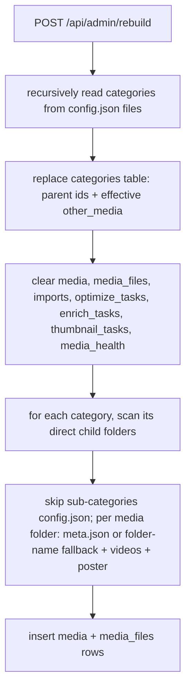
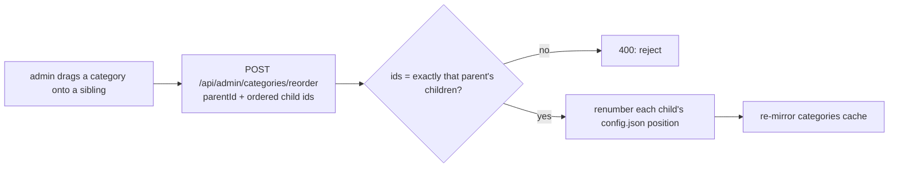
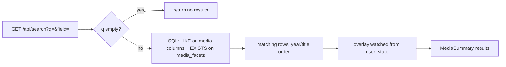

# Library & cache

How FileFin models everything it owns - categories, media folders, and their files - and why
the database is never the source of truth. The **filesystem is authoritative**; the SQLite
database is a disposable cache that can be deleted and fully rebuilt from disk at any time
with no data loss.

## Filesystem is the source of truth

The on-disk shape - the `dataDir / <category tree> / <media-folder> / {videos, meta.json,
poster.*, poster_<W>.webp}` layout, the `config.json`-present discriminator that tells a
category from a media item, arbitrarily nested categories with relpath names, the
`otherMedia` flag and its root-down propagation, the global leaf-name uniqueness rule, and
category CRUD - is documented in **`mediaformat.md`**. The database is a disposable cache
built from those files; this file covers that cache, its rebuild, and browsing.

## The cache mirrors disk

The database is local, per-user SQLite (pure-Go driver, WAL, single write connection). It is
built entirely from a filesystem scan and exists only to make listing and lookups fast.

| table | holds | written by |
|-------|-------|------------|
| `categories` | id / name (relpath) / parent_id / alias / effective other_media / position | rebuild, category admin |
| `media` | one row per media folder (title, year, description, poster, enriched, + denormalized facets: language/country/director/writer) | importer, rebuild, enricher, thumbnail agent |
| `media_files` | one row per video file (index, season/episode, ext, path) | importer, rebuild |
| `media_facets` | the multivalued search facets (one row per actor/genre, tagged by kind) | importer, rebuild, reconcile, enricher |
| `user_state` | per-user playback-state mirror (watched/favorite/rating/has_progress/updated) for cache-served home + watched overlays | playback-state writers, rebuild, reconcile |
| `imports` | the transient import interface | producers + importer (see `import.md`) |
| `optimize_tasks` | transient pre-transcode queue (see `agents/optimizer.md`) | optimizer |
| `enrich_tasks` | transient enrichment queue (see `agents/enricher.md`) | enricher |
| `thumbnail_tasks` | transient sized-poster queue (see `agents/thumbnailer.md`) | thumbnail agent |
| `media_health` | per-item integrity check + fingerprint (see `agents/discovery.md`) | discovery agent |

The `media_facets` and `user_state` rows are **denormalized mirrors** of what each folder's
`meta.json` already holds (the searchable facets and the per-user state). They exist only to
turn search and the home page into indexed queries instead of a per-folder scan; `meta.json`
stays the source of truth, and both are fully re-derived by a rebuild or the rolling reconcile,
so nothing in the cache is authoritative. An in-place schema upgrade backfills them once from
`meta.json` on the next cache open (a `user_version`-gated pass), equivalent to a manual rebuild.

A media id is derived from its data-dir-relative path (see `mediaformat.md`), so the same
folder always maps to the same row across rebuilds. The cache is opened lazily - the first
admin page entered builds it on the fly - and the app keeps working (reading the filesystem)
if the cache is ever unavailable.

## Rebuild from disk

"Rebuild database" flushes the cache and re-derives it from the data folder, realizing the
"cache is fully rebuildable" promise:

Categories come first (the on-disk truth, walked recursively so the cache mirrors the nested
tree with parent links and the propagated other-media flag - see `mediaformat.md`), then for
each category its **direct** child media folders - skipping any child that has its own
`config.json` (that is a sub-category, scanned in its own right). Each media folder is read
from `meta.json` for the title/year/description (falling back to parsing the folder name),
collecting the video files and `poster.*` (the exact `poster.<ext>` basename, never a
`poster_<digits>.webp` sized variant), and skipping optimizer artifacts
(`.optimized.mp4`/`.tmp`) so a derived copy is never mistaken for media. The transient queues
and `media_health` are simply dropped: imports cannot be reconstructed, and
optimize/enrich/thumbnail work and health are re-derivable by a scan.

The **discovery agent** (see `agents/discovery.md`) reaches the same end state *incrementally*: it
diffs the on-disk media-folder set against the cache and re-reads only changed folders,
sharing rebuild's per-folder read and rules rather than reimplementing them. Rebuild is the
flush-everything path; reconcile is its rolling, in-place sibling.

## Browsing the library

End users read the library through the cache: a category lists its media **ordered by year
then title** (chronological browse order), and a media detail folds the cache row, the rich
`meta.json` fields, per-file transcode-eligibility and sidecar subtitles, and the live per-user
watch state into one response. The **home** view is served from the `user_state` mirror: three
indexed queries bucket the user's rows into continue / favorites / completed, ordered by the
per-user updated time (newest first). The per-item watched flag on a category listing comes from
the same mirror in one set lookup, rather than a read per folder.
(The separate `browse` endpoints that walk the raw server filesystem are for the installer and
the import source picker, not library browsing.)

Categories themselves render with each sibling group (the children of one parent) in its stored
**position** order, leaf name breaking ties. An admin reorders a group from the library page by
dragging a category's handle onto another category **at the same level**; a drop across levels
is rejected. The reorder request carries the parent and the full new order of that parent's
children, so the change is confined to one sibling group and a category can never move to a
different parent this way. The server renumbers each child's `config.json` and re-mirrors the
cache (see `mediaformat.md` for what `config.json` stores).

## Search

Browsing is category-first; **search** is the cross-library way to find a title or pivot on a
facet. The searchable facets - actors, genres (tags), language, country, director, writer -
are **denormalized** out of each folder's `meta.json` into the cache (scalar columns on `media`
plus the `media_facets` child table) by the scanner that already reads `meta.json` on import,
rebuild, reconcile, and enrich. So a query is **one indexed SQL statement** (`LIKE` on the text
columns, an `EXISTS` on `media_facets` for the multivalued facets), returning the same
`MediaSummary` rows the category and home lists use - the existing tiles render results with no
new plumbing. Results keep the library's year-then-title order; the per-user watched flag is
folded on from the `user_state` mirror.

Search is **submit-driven** (Enter or the button), never per-keystroke. An empty query returns
nothing rather than the whole library. A query is one text value `q` plus a `field` scope
(default `all`):

- `all` - case-insensitive substring across title, description, plot, actors, tags, language,
  country, director, and writer.
- a single text field (`title`, `description`, `cast`, `genre`, `language`, `director`,
  `writer`) - the same substring match within just that facet.
- `year` - exact match against the item's year; `decade` - `1990` or `1990s` matches 1990-1999.

LIKE wildcards in `q` (`%`, `_`) are escaped, so they match literally. Because the facets are a
denormalized mirror, search is only as complete as the last scan: a folder enriched after its
last reconcile shows its new facets once the enricher updates the cache (which it does inline).

The same facets are clickable on a media detail page (cast, genre, director, language, year),
each navigating to `field=<scope>&q=<value>` - the detail page's facets become entry points
into a scoped search. Matching is plain substring (`LIKE`); ranked/tokenized search (FTS5) was
considered and deliberately not adopted, to keep the exact substring semantics with no
driver-feature dependency.

## Naming formats

The media-folder naming style is chosen once in Settings (the `mediafmt` set of valid formats)
and is permanent. The on-disk layout is always the category/media-folder structure above; the
format only dictates how the importer names media folders and their files.

## Endpoints

| method + path                          | purpose                                       |
|----------------------------------------|-----------------------------------------------|
| `GET /api/categories`                  | list categories (id, name, leaf, alias, parentId) |
| `GET /api/category/{id}/media`         | list a category's media (+ user watched flag) |
| `GET /api/media/{id}`                  | full media detail                             |
| `GET /api/media/{id}/poster`           | base poster image (`?size=detail\|tile` for sized WebP, see `agents/thumbnailer.md`) |
| `GET /api/home`                        | continue / favorites / completed buckets      |
| `GET /api/search`                      | library-wide facet search (`q`, `field`; live `meta.json` scan) |
| `POST/PUT/DELETE /api/admin/categories`| create / re-alias / delete (empty only)       |
| `POST /api/admin/categories/reorder`   | renumber one parent's children (siblings only) |
| `POST /api/admin/rebuild`              | flush and rebuild the cache from disk          |
