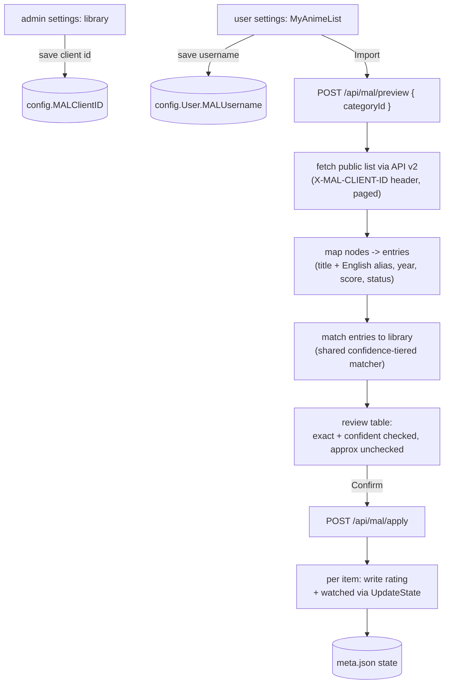

# MyAnimeList import

How a user pulls their MyAnimeList (MAL) watch history and 1-10 ratings into FileFin. Unlike
MyDramaList, MAL has an official API: another member's **public** list is readable with only a
client id (no per-user OAuth), so FileFin reads the API directly rather than scraping. The flow
is user-driven and explicitly confirmed: nothing is written until the user reviews the proposed
matches.

## The client id, and what follows

MAL's API v2 requires an application **client id**, sent as an `X-MAL-CLIENT-ID` header. A public
anime list is then readable without OAuth. The client id is a one-time, server-wide admin setting
(modeled on the OMDb key); when it is unset the MyAnimeList importer is disabled and the UI says
so. That shapes the subsystem:

- The importer is **unavailable** until an admin sets the client id.
- Only **public** lists are readable; a private or empty list yields nothing.
- The release year comes from the API (`start_season.year`, falling back to the year in
  `start_date`), so it is reliable enough to make the year part of the match decision.

## The flow

- The **client id** is a server-wide setting saved by an admin through
  `POST /api/admin/settings/mal-client-id`. `GET /api/me` returns `malConfigured` so the UI can
  hint when the importer is unavailable.
- The MAL **username** is a per-user profile field on `config.User`, saved by the user themselves
  through `POST /api/profile/mal` (auth-gated, not admin-gated) and echoed back by `GET /api/me`.
- **Preview** fetches and matches synchronously - a list is a paged API read plus an in-memory
  match against the media cache, so it needs no background agent or queue. It returns the matched
  proposals (each with the library title and year, the source title and year, the rating, and
  whether it would mark the item watched) and the titles that found no library item. It writes
  nothing.
- The fetch pages through the API's `paging.next` links until exhausted. Each node maps to one
  entry: the romaji `title` is the primary, and the English `alternative_titles.en` plus the
  latin `alternative_titles.synonyms` become aliases the matcher can fall back to (the Japanese
  alternative is skipped - it folds to an empty key).
- **Status -> state**: a `completed` status marks the item watched; the 0-10 score is imported as
  a 1-10 rating for any status that carries one (0 means unrated). The two are independent.
- **Apply** takes only the rows the user confirmed and writes each through the same per-folder
  `meta.json` path every other state writer uses (see [`playback-state.md`](playback-state.md)),
  so a rating import can never drop anyone's resume pointer or the OMDb metadata. The write path
  is shared with the MyDramaList importer. Re-running is idempotent.

## Matching and scope

Matching is the shared, confidence-tiered matcher described in [`mdl.md`](mdl.md#matching): titles
are normalized (lowercase alphanumerics, diacritics and a leading article folded away), a title
unique in the library is trusted even with an absent or slightly-off year (**confident**), a
colliding title stays year-strict, and a still-unmatched title drops to a bounded fuzzy fallback.
Exact and confident rows are pre-selected; approximate rows are left **unselected** for review. For
MyAnimeList the entry also carries its English alias and synonyms, so a romaji title can still match
a library item filed under its English name.

Both importers accept an optional **category scope**: when the user picks a category, the match
candidates are restricted to that category and its descendants. Scoping an anime list to the Anime
category is the structural fix for cross-title collisions - the anime list never even sees a
same-titled Korean drama filed elsewhere.
