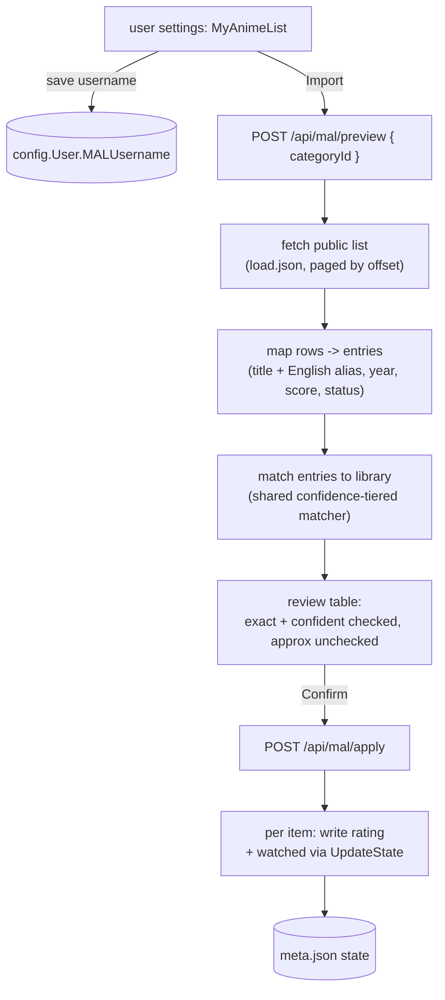

# MyAnimeList import

How a user pulls their MyAnimeList (MAL) watch history and 1-10 ratings into FileFin. MAL's
official API v2 needs an application client id, which we do not have, so - exactly like the
[MyDramaList importer](mdl.md) - FileFin reads the member's **public** list instead. The flow is
user-driven and explicitly confirmed: nothing is written until the user reviews the proposed
matches.

## Why the public list, and the limits that follow

The MAL API v2 gates even a public list behind an `X-MAL-CLIENT-ID` header. But the public list
page is backed by an unauthenticated JSON endpoint - `myanimelist.net/animelist/{user}/load.json`
- that the site's own front end pages through, and that needs no key. FileFin reads that. Unlike
the MyDramaList scraper the surface is **JSON, not HTML**, so it is far less tied to page markup,
but the same posture and limits apply:

- Only **public** lists are readable; a private or empty list yields nothing.
- The endpoint is undocumented and could change; an offline fixture test exists to catch a break
  early.
- The release year comes from the row's air-date string (`MM-DD-YY`), whose two-digit year is
  resolved on a fixed pivot. It is less precise than the old API's `start_season.year`, but the
  matcher treats year as a tolerance/tiebreak, so a library-unique title still matches without it.
- MAL titles and on-disk titles rarely agree exactly, so matching is **approximate** and always
  goes through a review step.

## The flow

- The MAL **username** is a per-user profile field on `config.User`, saved by the user themselves
  through `POST /api/profile/mal` (auth-gated, not admin-gated) and echoed back by `GET /api/me`.
  There is no server-wide setting: the importer is always available, like MyDramaList's.
- **Preview** fetches and matches synchronously - a list is a paged fetch plus an in-memory match
  against the media cache, so it needs no background agent or queue. It returns the matched
  proposals (each with the library title and year, the source title and year, the rating, and
  whether it would mark the item watched) and the titles that found no library item. It writes
  nothing.
- The fetch loops `load.json?status=7&offset=n` (`status=7` is every bucket), advancing the offset
  a page at a time until a short page signals the end. Each row maps to one entry: the romaji
  `anime_title` is the primary and the English `anime_title_eng` becomes an alias the matcher can
  fall back to (dropped when it collapses to the primary's key).
- **Status -> state**: a `completed` status marks the item watched; the 0-10 score is imported as
  a 1-10 rating for any status that carries one (0 means unrated). The two are independent - a
  rated but dropped title imports only the rating.
- **Apply** takes only the rows the user confirmed and writes each through the same per-folder
  `meta.json` path every other state writer uses (see [`playback-state.md`](playback-state.md)),
  so a rating import can never drop anyone's resume pointer or the OMDb metadata. The write path
  is shared with the MyDramaList importer. Re-running is idempotent.

## Matching and scope

Matching is the shared, confidence-tiered matcher described in [`mdl.md`](mdl.md#matching): titles
are normalized (lowercase alphanumerics, diacritics and a leading article folded away), a title
unique in the library is trusted even with an absent or slightly-off year (**confident**), a
colliding title stays year-strict, and a still-unmatched title drops to a bounded fuzzy fallback.
Exact and confident rows are pre-selected; approximate rows are left **unselected** for review. For
MyAnimeList the entry also carries its English alias, so a romaji title can still match a library
item filed under its English name.

Both importers accept an optional **category scope**: when the user picks a category, the match
candidates are restricted to that category and its descendants. Scoping an anime list to the Anime
category is the structural fix for cross-title collisions - the anime list never even sees a
same-titled Korean drama filed elsewhere.
