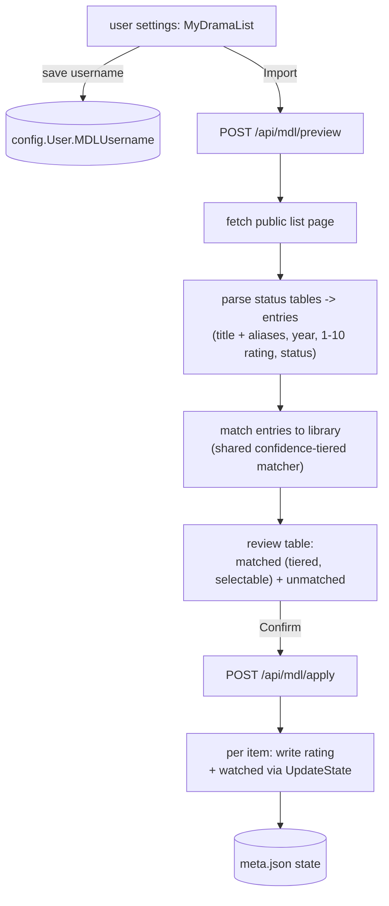
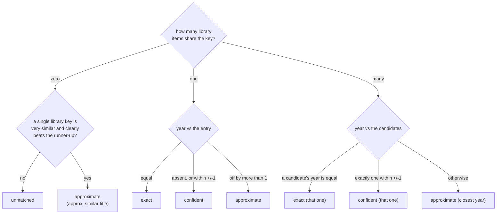

# MyDramaList import

How a user pulls their MyDramaList (MDL) watch history and 1-10 ratings into FileFin. MDL's
official API is closed to the public, so FileFin reads the **public** profile list page and
matches it against the local library. The flow is user-driven and explicitly confirmed: nothing
is written until the user reviews the proposed matches.

## Why scraping, and the limits that follow

MDL issues no public API keys, so there is no authenticated data feed to call. The one openly
readable surface is a member's public list page (`mydramalist.com/dramalist/{username}`), which
server-renders a table per status bucket with each title, its year, and the member's score. That
shapes the whole subsystem and its limits:

- Only **public** lists are readable; a private or empty list yields nothing.
- Parsing depends on MDL's HTML and is therefore **fragile** - an upstream markup change breaks it,
  which an offline fixture test exists to catch early.
- MDL titles and on-disk titles rarely agree exactly, so matching is **approximate** and always
  goes through a review step.

## The flow

- The MDL username is a **per-user** profile field on `config.User`, saved by the user themselves
  through `POST /api/profile/mdl` (auth-gated, not admin-gated) and echoed back by `GET /api/me`.
- **Preview** scrapes and matches synchronously - a list is a single page fetch plus an in-memory
  match against the media cache, so it needs no background agent or queue. It returns the matched
  proposals (each with the library title, the MDL title, the rating, and whether it would mark the
  item watched) and the MDL titles that found no library item. It writes nothing.
- Parsing walks the page in document order: each status label sets the current bucket, and every
  following row with a title cell becomes an entry in it. A score of `0.0` means unrated.
- **Status -> state**: `Completed` marks the item watched; the 1-10 rating is imported for any
  status that carries one. The two are independent - a rated but dropped title imports only the
  rating. MDL's half-point scores are rounded to the nearest integer.
- **Apply** takes only the rows the user confirmed and writes each through the same per-folder
  `meta.json` path every other state writer uses (see [`playback-state.md`](playback-state.md)),
  so a rating import can never drop anyone's resume pointer or the OMDb metadata. Re-running is
  idempotent.

## Matching

Matching is a shared, source-neutral matcher (the MyAnimeList importer in [`mal.md`](mal.md) uses
the same one, so every rule below lives in one place and improves both sources at once).

**Normalization.** Both sides are reduced to a comparison key: lowercased, `&` folded to `and`,
diacritics folded to their base letters (so a macron or accent no longer blocks a romanization
match), a single leading article (`the` / `a` / `an`) dropped, and everything else reduced to
alphanumerics. Titles are paired on that key.

**Aliases.** An entry may carry alternative titles to try when its primary title keys to nothing.
MyDramaList serves two for free on each title anchor - the `oldtitle` attribute and the title's URL
slug (de-slugged, e.g. `/734-i-will-die-soon` -> `i will die soon`) - so a drama filed under a
different romanization can still match. Aliases that collapse to the same key as the primary title
are dropped.

**Confidence tiers.** Each match is graded, and the grade decides pre-selection. The year sharpens
the grade but is only strict where it has to be - to break a *collision* (an anime "Kingdom" and a
Korean drama "Kingdom" sharing a key); for a title unique in the library it adds no friction. The
tolerance for "close enough" is **+/-1 year**.

- **exact** and **confident** rows arrive **pre-selected**; **approximate** rows arrive
  **unchecked**, so a weaker match is never applied without a deliberate tick.
- The review table tags each row with its tier: `exact`, `confident`, or `approx: <reason>` (a year
  mismatch shows `approx: year x != y`; a fuzzy hit shows `approx: similar title`).

**Fuzzy fallback.** When the primary title and every alias key to nothing, a bounded similarity
pass scores the entry against the library keys by edit-distance ratio and offers the best only when
it clears a high threshold **and** clearly beats the runner-up (so a near-tie never produces a
silent guess). A fuzzy hit is always **approximate**. The personal library is small, so the pass is
cheap; length-gap pruning bounds it further.

Unmatched titles are listed so the user can see what was skipped.

The preview optionally restricts its candidates to a **category** and its descendants. Scoping a
list to one category is the structural fix for cross-title collisions - a list scoped to a category
never sees a same-titled item filed elsewhere.
