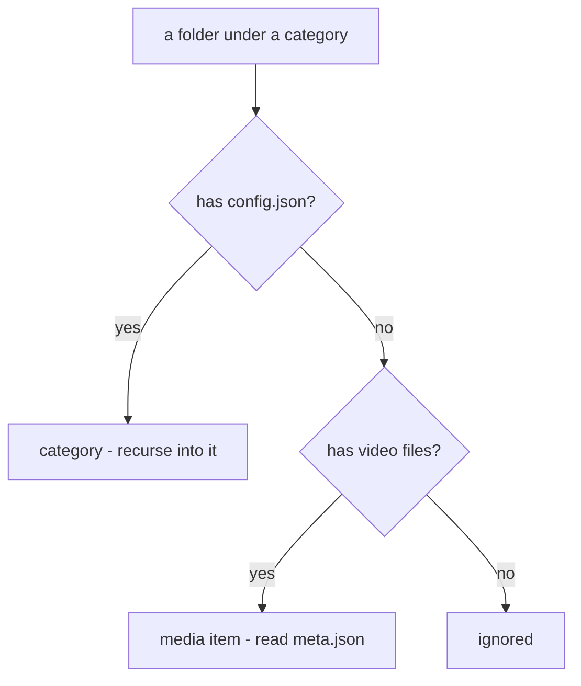
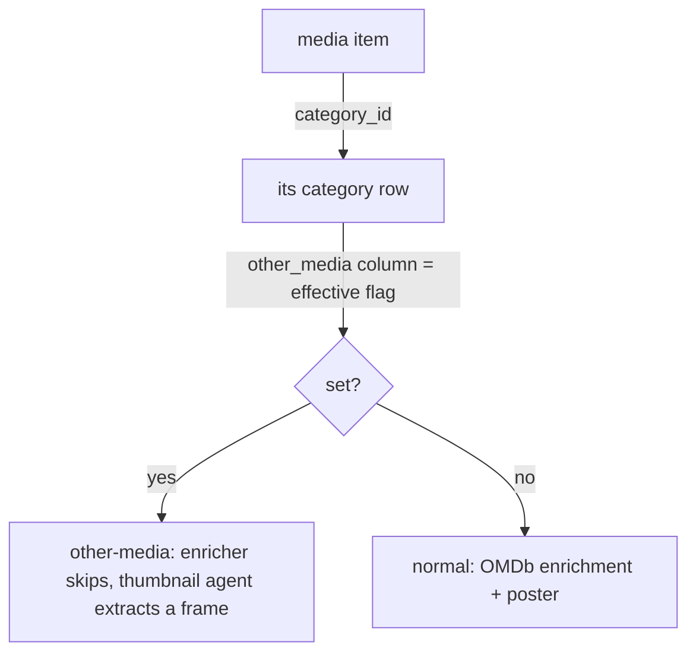

# FileFin media format & category tree

The on-disk shape of everything FileFin owns, and the rule that distinguishes a category
from a media item. The **filesystem is authoritative**; the SQLite database is a disposable
cache rebuildable from these files at any time (the cache side lives in `library.md`).

## On-disk layout

```
dataDir/
  <category>/                         config.json  -> this folder is a category
    <sub-category>/                   config.json  -> nested category (any depth)
      <media-folder>/                 no config.json, has video -> media item
        <video file(s)>
        meta.json                     version, title, year, rich fields, genres, tags,
                                      technical, per-user state
        poster.*                      base poster (jpg/png/webp)
        poster_280.webp               detail variant (thumbnail agent)
        poster_180.webp               tile variant (thumbnail agent)
    <media-folder>/                   a category holds media folders + sub-categories
      ...
```

## The discriminator: config.json present?

A folder is a **category** exactly when it contains `config.json`; otherwise a folder that
contains at least one video file is a **media item**. This single rule yields arbitrary
nesting for free with one uniform recursion.



Within any category's children: `config.json` -> sub-category (scanned as its own category);
else video-bearing -> media item; else ignored. A category folder therefore holds media
folders and sub-category folders, never loose video files.

## Categories: relpath name, parent, alias-only sub-config

- A category's **name is its path relative to `dataDir`** (`"Movies"`, `"Movies/Action"`),
  which keeps the name unique and lets `filepath.Join(dataDir, name)` resolve at every call
  site. The **leaf** (last path segment) is the display/uniqueness key; **parent** is the
  enclosing category's relpath (`""` for a top-level category).
- `config.json` holds the stable **id** (minted by the cache at creation) and the **alias**.
  The **other-media** flag is stored only on a **top-level** category; sub-categories never
  carry it and inherit the root's flag (see below).
- `config.json` also holds a **position**: the category's manual sort order **among its
  siblings** (the children of one parent). Categories are listed with each sibling group in
  position order, falling back to leaf name when positions tie (so legacy configs with no
  position keep alphabetical order). Position is meaningful only within a sibling group; it is
  never compared across parents. See `library.md` for the reorder flow.
- `config.json` also holds the category's **markers** - what belongs in it. The whole section
  is omitted while a category has none, so a library that never touches them keeps its files
  byte-identical to before markers existed. See **Category markers** below.
- **Global leaf-name uniqueness:** creating any category requires its leaf to differ from
  every existing category's leaf anywhere in the tree, so indented labels and dropdowns are
  never ambiguous (media folder names are unaffected).
- **CRUD:** create-under-parent (optional parentId; writes the folder + config and inserts the
  cache row; a new category is appended last in its sibling group), **empty-only delete** (a
  category with media folders or sub-categories is non-empty, so a parent cannot be removed
  before its children), alias edit (other-media accepted only on a top-level category), and
  **reorder** (renumber one parent's children to a new order; siblings only). The `config.json`
  files are the source of truth; the cache is re-mirrored after every change.

## Category markers

Markers describe what belongs in a category. They come from two origins and are the same
mechanism either way, which is why they live together in one section of `config.json`:

| field       | origin           | meaning                                                              |
|-------------|------------------|----------------------------------------------------------------------|
| `kind`      | declared         | `films`, `shows`, or absent for both. A category is ruled out entirely for the other kind |
| `languages` | declared         | the languages this category holds, matched against what the enricher later writes |
| `countries` | declared         | the same, for the country                                            |
| `keywords`  | declared         | words that, appearing in a raw source name, are a vote for this category |
| `learned`   | written by imports | a namespaced marker to how often media carrying it was imported here |

Learned markers are namespaced by the kind of signal they are - `grp:` (release group),
`tag:` (bracketed fansub tag), `plat:` (streaming platform), `script:` (writing system) - so
one map covers every signal and a new kind of signal needs no schema change. The map is
**capped at 50 entries per category**, pruned by count (lowest first, ties by name), which
keeps the file small and hand-editable.

Markers are **authoritative on disk, never in the cache**: a rebuild wipes the cache, and
evidence gathered over many imports must not be rebuildable-away. Everything the categories
have learned therefore survives a rebuild exactly as ids and aliases do.

The declared half is edited on the **category page** (see `library.md`); the learned half is
written by the import folder at staging time and pruned from the same page. How both are used
to preselect a category is in `import.md`.

## Effective other-media flag (root-down propagation)

The other-media flag (home videos / recordings: skip OMDb, derive posters from a frame -
see `agents/enricher.md` and `agents/thumbnailer.md`) is set on a top-level category and applies to its
entire subtree. The cache stores each category's **effective** flag - the root's own flag,
propagated down - so the agents resolve a media item's flag with a single lookup, never a
tree walk.



A category's own flag lives in its config.json (top-level only); the cache column holds the
propagated value, recomputed on every rebuild and on any other-media toggle.

## Media id: relpath, and why it is stable

A media item's id is `sha1(<media-folder path relative to dataDir>)[:12]` -
`sha1("Movies/Alien")` for a top-level item, `sha1("Movies/SciFi/Alien")` for a nested one.
Because a top-level item's relpath is unchanged by the nesting model, **existing ids (and the
per-user resume/watch state keyed off them) are preserved** - introducing sub-categories
required no data migration.

## Authoritative vs. rebuildable

| on disk (authoritative) | in the cache (rebuildable) |
|-------------------------|----------------------------|
| `config.json` (id, alias, top-level other-media, position, markers) | `categories` rows (parent_id, effective other_media, position) |
| `meta.json` (version, title, year, rich fields, genres, tags, technical, per-user state) | `media` / `media_files` / `media_facets` rows |
| `poster.*` and the sized `poster_<W>.webp` variants | the `poster` basename on the media row |

The **filename extension is never trusted** for a playback or optimize decision: a library
where every file is named `.avi` regardless of its real format is judged by the **probed
true format** instead. ffprobe reads the actual container and codecs at import; they are
written into the `meta.json` `technical` block and mirrored onto `media_files`
(`container` / `video_codec` / `audio_codec`), and the direct-play and optimize-candidate
decisions read those columns. The on-disk filename is left untouched. A rebuild leaves the
format columns empty and the probe agent backfills them, exactly like enrich/thumbnail work
(see `agents/probe.md`).

## meta.json carries a version

`meta.json` declares its own shape in a **`version`** key, because one rename could not
otherwise be told apart from the shape that preceded it: before version 2 the key `tags` held
the **genres**, and version 2 renamed it to `genres` so `tags` could carry the hand-curated
list. A file with no version key (or a lower one) is read as the older shape and folded into
the current one; any write stamps the current version. See `tags.md` for the fold and how a
library settles onto the new shape without a manual migration.

See `library.md` for how the cache is built, rebuilt, and browsed.
