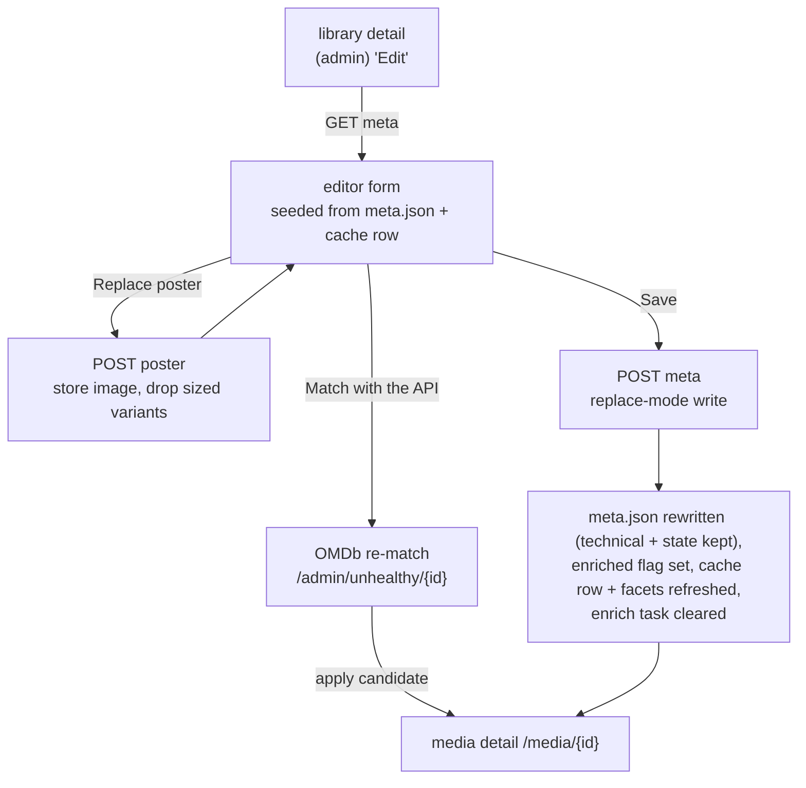

# Metadata editor

How an admin edits a media item's descriptive metadata and poster by hand. This is the
manual counterpart to the automatic OMDb enricher (see [`agents/enricher.md`](agents/enricher.md))
and the OMDb re-match flow (see [`rematch.md`](rematch.md)): where those pull a record from
OMDb, the editor lets an admin type any field directly and upload an arbitrary poster image.
It is reached from the library detail page's admin-only **Edit** button and is admin-only end
to end.

## What it edits

The editor is a view over a folder's `meta.json` (see [`library.md`](library.md) and
[`mediaformat.md`](mediaformat.md) for the on-disk shape). It exposes the descriptive fields
an admin might want to correct:

- **Basics** - title and year (these also drive browsing and search, so they are written to
  the cache row as well as `meta.json`).
- **Overview** - the short description and the long plot.
- **Details** - the single-value metadata fields: released, runtime, language, country,
  director, writer, content rating, awards, box office, IMDb id.
- **Ratings** - IMDb, Rotten Tomatoes, and Metacritic.
- **Cast** - the actor list (one per line).
- **Genres and tags** - two comma-separated lists, both stored lowercase: the genres the
  metadata source supplied (replaced on every re-match) and the hand-curated tags no agent ever
  writes (see `tags.md`).
- **Poster** - a preview with a replace/upload control.

Two parts of `meta.json` are never touched by the editor: the ffprobe **technical** block
(owned by the probe path) and the per-user **state** block (resume pointers, watched flags,
favourites, ratings - see [`playback-state.md`](playback-state.md)). Any metadata or rating
key the form does not surface (for example an importer-supplied `plex` rating) is preserved
untouched on save.

## The flow

- **Match with the API** is a shortcut into the existing OMDb re-match page for the same item,
  for when an admin would rather pick a database record than type fields by hand. Applying a
  candidate there now lands on the item's detail page (see [`rematch.md`](rematch.md)).
- **Save** is a replace-mode write: the admin-entered fields win, the technical and state
  blocks are carried over from the current file, and the item is flagged **enriched** so it
  drops off the "Unhealthy media" unmatched list. It shares the same cache-write path as the
  enricher and the OMDb re-match, so the media row and its search facets never drift from
  `meta.json`. Any leftover enrich task for the item is cleared, and the admin lands on the
  freshly written detail page.

## Poster upload

Replacing the poster is its own immediate action rather than part of the form save, so the
metadata save stays a plain JSON request and the image upload streams separately. A picked
image is content-sniffed (JPEG, PNG, WebP, or GIF; anything else is rejected), written into
the media folder as the base `poster.<ext>`, and the previous base poster plus its stale sized
variants are removed so the thumbnail agent (see [`agents/thumbnailer.md`](agents/thumbnailer.md))
rebuilds them from the new image. The cache row is pointed at the new file and the preview
refreshes in place.

## Endpoints

| method + path                          | purpose                                                        |
|----------------------------------------|----------------------------------------------------------------|
| `GET  /api/admin/media/{id}/meta`       | raw editable fields for the form (from the cache row + meta.json) |
| `POST /api/admin/media/{id}/meta`       | save edited fields (replace-mode write) and refresh the cache  |
| `POST /api/admin/media/{id}/poster`     | upload a replacement base poster (multipart image)             |

## Dependencies

- **Enrichment write path** - the shared cache-row projection helper and the `meta.json`
  manager's per-folder lock (see [`agents/enricher.md`](agents/enricher.md)).
- **Thumbnail agent** - rebuilds the sized poster variants after an upload replaces the base
  image (see [`agents/thumbnailer.md`](agents/thumbnailer.md)).
- **Frontend** - the library detail "Edit" button and the editor view (see
  [`frontend.md`](frontend.md)).
