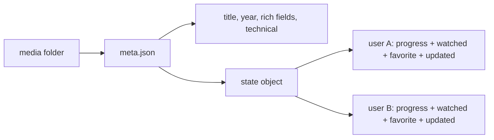
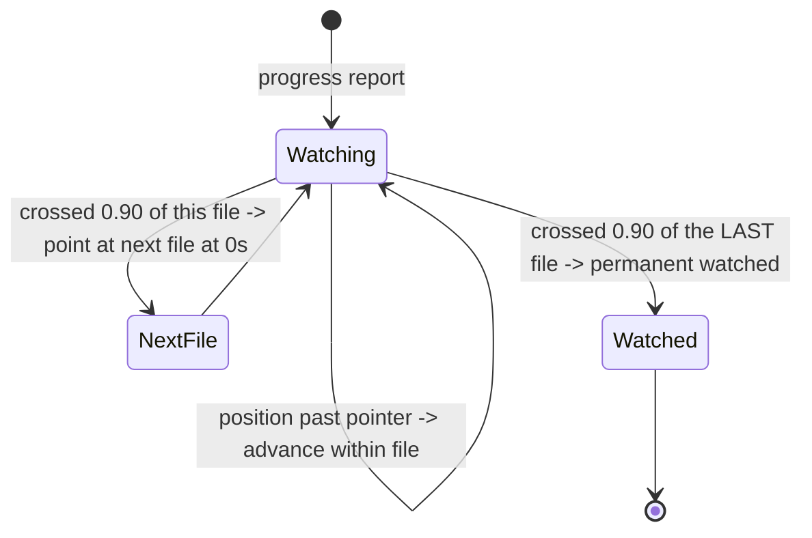

# Playback state

How FileFin remembers, per user, where you stopped, what you have finished, and what you
favourited - and why that survives a cache wipe. State lives in a `state` object inside each
media folder's `meta.json`, so it is part of the filesystem source of truth, not the
disposable cache (see `library.md`). There is no separate sidecar: one machine-written JSON
file per media folder holds both the media metadata and every user's playback state.

## State lives in meta.json

`meta.json`'s `state` object is keyed by username, one entry per user who has interacted with
that item. An entry records a resume pointer, a permanent watched flag, a favourite flag, and
an `updated` unix-seconds timestamp. A folder nobody has touched carries no `state` key.

This is a **deliberate exception** to the read-only-data-dir rule: alongside setup and the
importers, the playback-state writer is one of the things that writes into a media folder
during normal use. A cache rebuild never reads the `state` object (it recovers only the
title/year/description), so flushing the cache cannot regress anyone's watch history; the home
view reads these files live.

## The resume pointer only moves forward

A playback report (file index, position, duration) folds into the user's entry through a pure
engine in the `state` package. Files are addressed by a stable **ref** derived from the ordered
file list: `SxE` for a numbered episode, `""` for a single-file folder, `#N` otherwise - so a
pointer stays valid as files are re-scanned.

Rules the engine enforces:

- The pointer **never regresses** - rewatching an earlier file leaves it untouched; it only
  moves to a later file, or a later second within the furthest file.
- Crossing the **watched threshold** (90% of a file) advances the pointer to the next file at
  0s; crossing it on the last file sets the folder's permanent `watched` flag.
- Clearing watched also clears the pointer, so a leftover pointer cannot bounce the item back
  into "continue".

The engine is **clock-free**: the writer stamps `updated` (current unix seconds) on every
change, so the pure `Apply`/`View`/`Refs` functions stay deterministic and testable.

## Derived views

The detail view needs more than the raw entry, so a `View` derivation produces: the folder
watched flag, the continue file index + seconds, and a per-file watched array (every file
before the pointer, or all files when the folder is watched). The home buckets come from
reading every folder's state live and keeping those whose entry matches: a pointer-but-not-
watched goes to **continue**, `favorite` to **favourites**, `watched` to **completed**, each
ordered newest-first by the per-user `updated` timestamp (the file's own mtime is useless for
ordering, because the importer and enricher also touch `meta.json`).

## One lock, three writers

`meta.json` now has three writers - the importer, the OMDb enricher, and the playback-state
handlers - so they share **one per-folder lock** owned by `importer.Manager`. Every write is a
preserving read-modify-write committed atomically via temp-file-plus-rename: it loads the
current `meta.json`, applies only the section it owns, and writes the whole thing back, so a
progress event can never drop the OMDb fields and an enrich can never drop anyone's state. The
state handlers go through `Manager.UpdateState` (read entry, apply the engine function, stamp
`updated`); the importer and enricher go through `Manager.Update` (see `import.md` /
`agents/enricher.md`). The pure engine lives in the `state` package and imports nothing from
`importer`, so the dependency points one way.

## Endpoints

| method + path                          | purpose                                        |
|----------------------------------------|------------------------------------------------|
| `POST   /api/media/{id}/progress`      | fold a playback report into the user's state   |
| `DELETE /api/media/{id}/progress`      | clear the resume pointer                       |
| `DELETE /api/media/{id}/watched`       | clear the watched flag (and the pointer)       |
| `POST   /api/media/{id}/favorite`      | set/clear the favourite flag                   |
