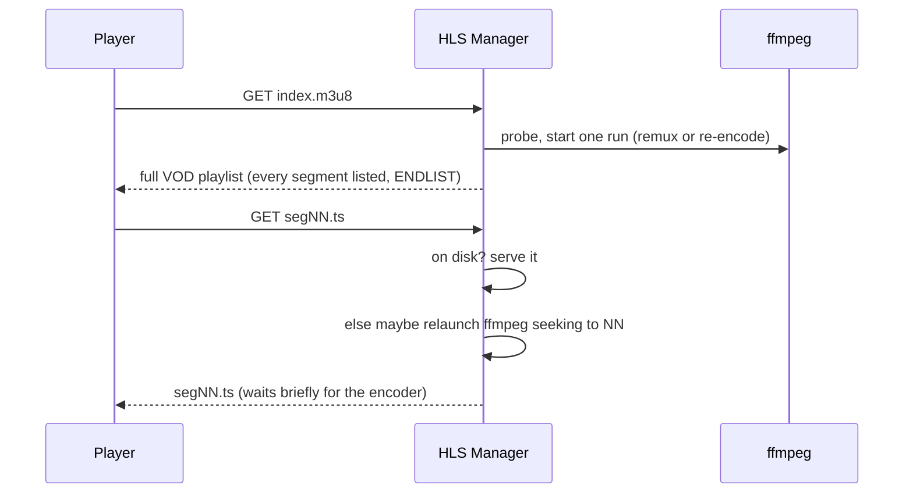

# Video player / streaming

How a media file gets from disk to a playing `<video>` element in the browser, including
subtitles. The guiding rule: **direct-play whenever possible, transcode only when forced**,
and never transcode something the pre-transcoder could have prepared (see `agents/optimizer.md`).

## The serve decision

For each file request the server resolves what to actually serve from the cached file row
and what sits next to it on disk. The "can the browser play this as-is" test is by the
**probed true format** - the container and codecs ffprobe actually read - not the filename
extension, so a mislabeled file (e.g. an H.264/MP4 named `.avi`) direct-plays and a
deceptive one (HEVC in an `.mp4`) does not. The format is stored on `media_files` at import
and refreshed by the probe agent (see `agents/probe.md`); a row not yet probed falls back to
judging by the extension.

```mermaid
flowchart TD
    REQ[GET .../file/n] --> SIB{fresh .optimized.mp4 sibling?}
    SIB -->|yes| DP[direct-play the sibling, byte-range]
    SIB -->|no| NAT{probed format direct-playable?\n(extension fallback if unprobed)}
    NAT -->|yes| DP2[direct-play the source, byte-range]
    NAT -->|no| TON{transcoding enabled?}
    TON -->|no| ERR[415 Unsupported Media Type]
    TON -->|yes| HLS[307 redirect to the HLS playlist]
```

- **Direct play** - a source whose probed format is browser-native (an MP4-family container
  with H.264 + AAC/MP3/no audio, or a WebM/Matroska container with VP8/VP9/AV1 + Opus/Vorbis/no
  audio), and any source with a fresh optimized sibling, are streamed as-is via
  `http.ServeContent` with full byte-range/seek support. This is the fast, cheap path and the
  one the optimizer exists to maximize.
- **HLS transcode** - everything else redirects to an on-the-fly HLS playlist, when the
  global transcoding toggle is on. The player requests the playlist directly; the `415`/redirect
  branch only guards stray callers and the toggle.

## On-the-fly HLS

When a file must be transcoded, a session manager streams it as seekable VOD HLS produced by
one ffmpeg run per session.



Key properties:

- **Up-front VOD playlist.** The playlist lists every segment with `#EXT-X-ENDLIST` before
  encoding finishes, so the player shows the full seek bar immediately.
- **One encoder, repositioned on seek.** A session runs a single ffmpeg process. A request for
  a segment far past the encode head (or behind the run's start) relaunches the encoder
  seeking there under `-copyts`, with keyframes forced on the absolute segment grid so
  segments stay aligned across relaunches. The new encoder is started before the old one is
  cancelled, so a launch failure leaves the session alive.
- **Remux fast path.** A remux-eligible source (H.264 + AAC/MP3/no audio) is stream-copied
  into TS instead of re-encoded, and races through the file sequentially (never repositioned).
- **Lazy + reaped.** The manager is built on first playback from the configured ffmpeg paths
  and detected encoder, and discarded when transcoding settings change. Each session owns a
  temp dir of segments; idle sessions are reaped and their temp dirs removed.
- **Cancellable, fail-fast segment wait.** A request for a not-yet-encoded segment waits on a
  `select`, not a fixed poll-and-sleep: it returns the instant the segment appears, the request
  is cancelled, the deadline elapses, or the encoder process dies. The session tracks its
  current encoder run (a `done` channel plus the exit error); a genuine ffmpeg failure (one not
  caused by our own cancel-for-reposition) ends the wait immediately and is logged with the
  last stderr line, instead of stalling for the full timeout.

The HLS manager's `ActiveSessions()` count is what the optimizer reads to yield to live
viewers (see `agents/optimizer.md`); both halves share the `transcode` package's encoder detection,
remux probe, and ffmpeg argument builders. The probe itself is one `ffprobe`-package call
(`-show_format -show_streams`) shared with import; the ffmpeg launch and stderr capture go
through the shared `ffrun` runner used by the optimizer and thumbnailer too.

## Subtitles

Sidecar subtitle files dropped next to a media file (`<base>.<lang>.srt`, optional qualifiers
like `.forced`) are surfaced per file in the detail view. The browser's native `<track>`
needs WebVTT, so each subtitle is converted from SRT to WebVTT **per request, streamed**,
while the source stays SRT on disk. Sidecar recognition and the language labelling live in
the `subtitle` package; matching/listing is shared with import and the detail view.

Only external `.srt` sidecars are rendered - embedded subtitle tracks are not read at play
time. Instead, **import** externalises a file's embedded text subtitle tracks to `.srt`
sidecars (one per known language, skipping languages already covered), so they show up here
like any other sidecar. See `import.md` (Subtitles).

## Watch progress

The player periodically reports its position; that report folds into the per-user
`state.json` and drives resume and the "watched" flag. That subsystem is documented
separately in `playback-state.md`.

## Settings that affect playback

| setting | effect |
|---------|--------|
| transcoding on/off | when off, non-native files without an optimized sibling return `415` |
| ffmpeg / ffprobe paths | tools the manager invokes (default to `PATH`) |
| hardware accel (auto/off, device) | steers encoder detection (VAAPI vs software) |

## Endpoints

| method + path                                  | purpose                                  |
|------------------------------------------------|------------------------------------------|
| `GET /api/media/{id}/file/{n}`                 | direct-play, or 307 to HLS               |
| `GET /api/media/{id}/file/{n}/hls/index.m3u8`  | the VOD HLS playlist                     |
| `GET /api/media/{id}/file/{n}/hls/{seg}`       | one transcoded segment                   |
| `GET /api/media/{id}/file/{n}/sub/{k}`         | the k-th sidecar subtitle as WebVTT      |
