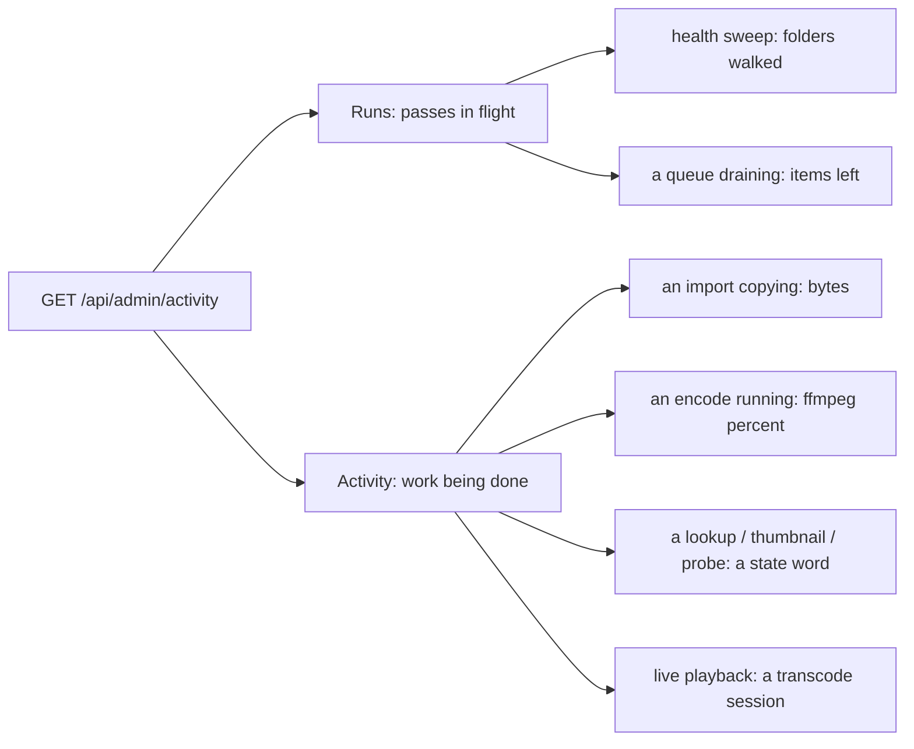

# Progress page

What the admin Progress page shows while the server is busy, and why it is split in two.

## Runs and Activity

The agents split their work in two (see `agents.md`): deciding what needs doing, and doing
it. The page follows that seam.

- A **run** is one pass with a beginning and an end. It gets one progress bar that fills once
  and then disappears.
- An **activity** item is one unit of work actually being done, long enough to be worth
  watching. Together they read like a process list.

Neither column lists what is idle: a kind with nothing to do is absent rather than rendered
as an empty section, so a quiet server shows an empty page rather than a wall of "nothing
running" headings.

## A queue has no denominator

The health sweep knows its own total because it walks a list. A queue does not: it only knows
how many items are left. So a queue's run is its **drain** - the stretch from the queue going
non-empty to it emptying again. The first non-empty count sets the total, the run fills as
agents work through it, and a refill that adds more while it runs **raises the total** rather
than sending the bar backwards. When the queue empties the run ends, and the next non-empty
queue starts a fresh one.

This is all in memory: it is a view of the queues, not a fact about them, and it starts over
after a restart.

## Claimed is not working

The optimizer was the reason the page could not be read. It claims a task, probes it, and a
source live HLS can already stream-copy finishes **without encoding at all** - in a fraction
of a second. Listing every claimed task therefore strobed dozens of empty bars per second.

Two rules fix it, and they are independent:

1. **Candidacy filters remux-eligible sources up front**, from the codecs the probe agent
   already wrote onto the cache row, so those files never reach the queue (see
   `agents/optimizer.md`). A row not yet probed cannot be judged and is still decided by the
   agent after its own probe.
2. **An optimize item appears only once ffmpeg is encoding it**, i.e. once it has a live
   percent. That covers the unprobed rows rule 1 has to let through.

The other queues need no such rule: their agents are single (or rate-limited), so a claimed
enrich/thumbnail/probe task really is being worked on.

## One snapshot, not six polls

The page reads one endpoint, so every part of it describes the same instant. It previously
issued five per-queue requests plus the sweep's, and rendered each as it landed, which made
the page shimmer even when nothing was churning.

## What playback shows, and what it cannot

Live playback appears as an activity item, with no percentage: the server encodes ahead of a
viewer whose position it does not know.

Only **transcoded** playback is visible. A direct-played file is streamed as byte ranges
straight off disk (see `playback.md`) and has no session object, so nobody watching one shows
up here. Covering every viewer would mean driving the list from the periodic watch-progress
reports instead (see `playback-state.md`) - a different source with a different lifetime.

## Endpoints

| method + path               | purpose                                            |
|-----------------------------|----------------------------------------------------|
| `GET /api/admin/activity`   | the whole page: runs in flight and work being done |

The per-queue `/api/admin/{optimize,enrich,thumbnail,probe}/active` endpoints remain for the
scan buttons' own reporting.
