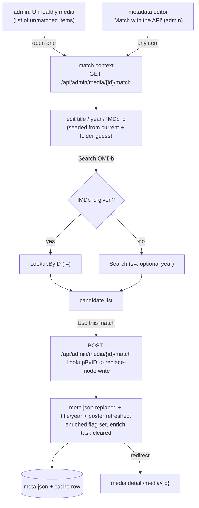

# Metadata matching (Unhealthy media)

How an admin fixes media that OMDb could not match, or corrects a wrong match. The automatic
enricher (see [`agents/enricher.md`](agents/enricher.md)) looks each folder up by its title and
year and, on a miss, leaves the item flagged for review rather than guessing. This subsystem is
the admin surface that reads those items and drives a **manual** OMDb match: search by an
alternative title / year / IMDb id, pick from the candidates the API returns, and apply the
chosen record. It is admin-only, and it writes through the same enrichment path - in **replace**
mode - so a re-match corrects the metadata and poster instead of merely filling gaps.

## What counts as unmatched

A media item is "unmatched" when its cache row is still `enriched = 0` - it has no OMDb metadata
yet. That covers two cases the page shows side by side:

- **errored** - the enricher tried and OMDb returned nothing (the failure message is kept on the
  item's enrich task and shown on the row, alongside when it was last tried);
- **queued** - not yet attempted (still waiting its turn in the enrich queue).

An errored item is not stuck: the discovery agent re-queues a failure whose last attempt is older
than 14 days (see [`agents/enricher.md`](agents/enricher.md)), so the page also shows, for an
errored item, **when it was last tried** and **when discovery will retry it** - the admin can wait
for the automatic retry or fix it by hand now.

Items in an **other-media** category are excluded: they are never matched against OMDb by design
(see [`agents/enricher.md`](agents/enricher.md)), so they never belong on this list.

This is distinct from **disk health** (missing files, unparseable `meta.json`), which the discovery
agent records in `media_health` (see [`agents/discovery.md`](agents/discovery.md)). The Unhealthy
media page shows that health list too, read-only, below the matching list, so the admin has one
"needs attention" surface; the dashboard keeps its own copy.

A third read-only list sits between them: **possibly in the wrong category**. Once an item has
been matched, its language and country are compared with the ones its category declares (see
[`mediaformat.md`](mediaformat.md)); a contradiction is listed with the category the facets
would suggest instead. It is the same question this page already answers, asked of the filing
rather than the metadata, so it belongs here rather than on a page of its own. A category that
declares no languages or countries has said nothing to be wrong about, an item the lookup
recorded no origin for cannot contradict anything (that is a metadata gap, which the lists
above are for), and nothing is ever moved automatically.

## The flow

- The **match context** carries the folder and file details, the item's current match (title, year,
  IMDb id, plot, poster) for a re-match comparison, the enrich failure reason if any (with the
  last-tried and next-retry times), and a folder-name guess (from the same recognizer the importer
  uses) to seed the form.
- **Search** hits OMDb two ways: an entered IMDb id resolves directly to one record; otherwise a
  title (with an optional year and movie/series kind) returns a candidate list. A "not found"
  search is presented as "no candidates", not an error.
- Candidate poster thumbnails are **proxied** through the server
  (`GET /api/admin/omdb/poster/{imdbId}`) so the picker loads them same-origin; nothing is written
  to disk until a match is applied.
- **Apply** re-fetches the chosen record by IMDb id (the authoritative source), writes it in replace
  mode, corrects the cache row's title/year, refreshes the poster, sets `enriched`, and clears any
  leftover enrich task. The item drops off the unmatched list, and the admin is redirected to the
  freshly written media detail page.

## The write: additive vs replace

Both the automatic enricher and this manual match go through one shared write path. The only
difference is which side wins:

| | additive (enricher) | replace (manual match) |
|---|---|---|
| metadata fields | existing `meta.json` wins field by field (fills gaps only) | the chosen OMDb record wins |
| title / year | forced to the folder's own values | the admin-confirmed values (correcting a mis-parse) |
| poster | downloaded only when the folder has none | refreshed: the old base poster and its sized variants are removed so the thumbnail agent rebuilds them |
| technical block, per-user state | always preserved | always preserved |

Preserving the ffprobe `technical` block and the per-user `state` (resume pointers, ratings, watched
flags - see [`playback-state.md`](playback-state.md)) is what makes a re-match safe: only the
descriptive metadata and poster change. The write goes through the shared per-folder lock, so a
concurrent playback event is never dropped.

## Endpoints

| method + path                                | purpose                                                     |
|----------------------------------------------|-------------------------------------------------------------|
| `GET  /api/admin/unmatched`                  | list every unmatched item (errored or queued), with reason  |
| `GET  /api/admin/misfiled`                   | list matched items whose language/country contradicts their category, with the category that fits |
| `GET  /api/admin/media/{id}/match`           | one item's match context for the detail view                |
| `POST /api/admin/media/{id}/omdb-search`     | OMDb candidates by title+year, or a single record by IMDb id |
| `POST /api/admin/media/{id}/match`           | apply the chosen record (replace-mode write)                |
| `GET  /api/admin/omdb/poster/{imdbId}`       | proxy a candidate's small poster thumbnail (same-origin)    |

## Dependencies

- **OMDb client** (`omdb`) - extended for this flow with a multi-result `Search` (`s=`) and a
  by-id `LookupByID` (`i=`) alongside the enricher's title `Lookup` and poster download. Gated on
  the OMDb API key; with no key the page's search and apply are unavailable.
- **Enrichment write path** - the shared additive/replace helper and the `meta.json` builders (see
  [`agents/enricher.md`](agents/enricher.md)).
- **Frontend** - the admin `Unhealthy media` view and the metadata editor's "Match with the API"
  button (see [`frontend.md`](frontend.md)). On the list, clicking a row opens the OMDb match view,
  while clicking the item's **title** links straight to the metadata editor for that item, for when
  an admin would rather type the fields by hand than pick a database record. The editor is also
  reached from the library detail page's admin "Edit" button (see [`metaedit.md`](metaedit.md)).
