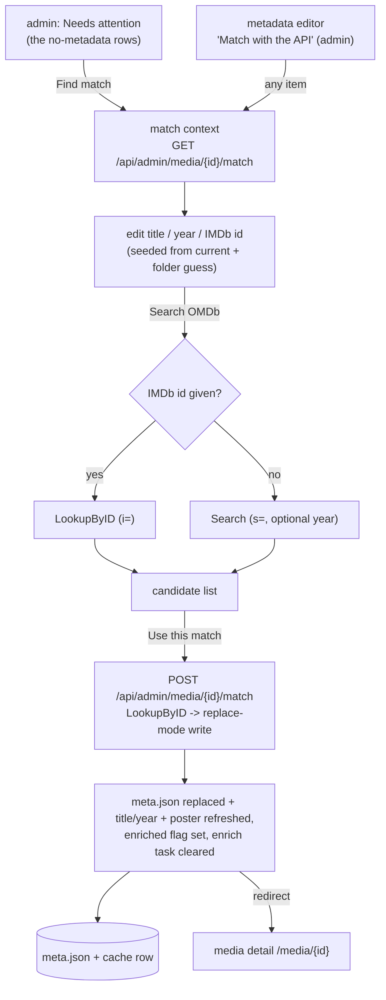

# Metadata matching (Needs attention)

How an admin fixes media that OMDb could not match, or corrects a wrong match, and the page that
surface lives on. The automatic enricher (see [`agents/enricher.md`](agents/enricher.md)) looks
each folder up by its title and year and, on a miss, leaves the item flagged for review rather
than guessing. This subsystem is the admin surface that reads those items and drives a **manual**
OMDb match: search by an alternative title / year / IMDb id, pick from the candidates the API
returns, and apply the chosen record. It is admin-only, and it writes through the same enrichment
path - in **replace** mode - so a re-match corrects the metadata and poster instead of merely
filling gaps.

## The Needs attention page

The matching list is one of five things an admin can be asked to look at, so they share one page
(`/admin/attention`) rather than five. Each is a separate question with a separate report behind
it, but they are presented as **one list, one row per problem**, because an admin arrives asking
"what needs doing", not "which of five subsystems is unhappy".

| problem | what it means | report | the fix offered |
|---------|---------------|--------|-----------------|
| **Disk** | the folder itself is broken: no `meta.json`, an unparseable one, a missing or zero-byte file, a leftover derived artifact | `media_health`, written by the discovery agent (see [`agents/discovery.md`](agents/discovery.md)) | **Details** - what the issue means and what a human has to do, since the app cannot fix it |
| **No metadata** | `enriched = 0`: no source has matched it, whether it errored or is still queued | this document, below | **Find match** - the manual OMDb / TMDb drill-in |
| **Conflict** | the metadata sources disagree on a field no pick or rule has settled | see [`sources.md`](sources.md) | **Merge** - the side-by-side merge view |
| **Name** | the folder or its files contradict the item's own metadata | see [`rename.md`](rename.md) | **Rename** - apply the plan |
| **Category** | the looked-up language and country contradict the markers of the category it sits in | below | **Review** - open the item; nothing is ever moved automatically |

Rows are ordered by severity in that order: what is broken first, what is merely suggested last.
Filter chips carry each class's count (kept in the query string, so a filtered view survives a
reload) and are always shown, so "nothing is wrong" reads as a zero rather than as a section that
quietly vanished. Every row carries exactly one primary action, so no row is a dead end - which is
why a disk row, which the app cannot fix for you, still gets a button that explains it.

The page fetches the five reports in parallel and merges them client-side. They stay separate
endpoints because they answer separate questions and are each independently testable; only the
presentation is unified. The dashboard shows the total as a single tile linking here, and no
longer keeps its own copy of any of the lists.

## What counts as unmatched

A media item is "unmatched" when its cache row is still `enriched = 0` - it has no OMDb metadata
yet. That covers two cases the list shows side by side:

- **errored** - the enricher tried and OMDb returned nothing (the failure message is kept on the
  item's enrich task and shown on the row, alongside when it was last tried);
- **queued** - not yet attempted (still waiting its turn in the enrich queue).

An errored item is not stuck: the discovery agent re-queues a failure whose last attempt is older
than 14 days (see [`agents/enricher.md`](agents/enricher.md)), so the drill-in shows, for an
errored item, **when it was last tried** and **when discovery will retry it** - the admin can wait
for the automatic retry or fix it by hand now.

Items in an **other-media** category are excluded: they are never matched against OMDb by design
(see [`agents/enricher.md`](agents/enricher.md)), so they never belong on this list.

## What counts as misfiled

Once an item has been matched, its language and country are compared with the ones its category
declares (see [`mediaformat.md`](mediaformat.md)); a contradiction is listed with the category the
facets would suggest instead. It is the same question this page already answers, asked of the
filing rather than the metadata. A category that declares no languages or countries has said
nothing to be wrong about, an item the lookup recorded no origin for cannot contradict anything
(that is a metadata gap, which the other lists are for), and nothing is ever moved automatically.

## The flow

```mermaid
flowchart TD
    L["admin: Needs attention<br/>(the no-metadata rows)"] -->|Find match| D["match context<br/>GET /api/admin/media/{id}/match"]
    FM["metadata editor<br/>'Match with the API' (admin)"] -->|any item| D
    D --> E["edit title / year / IMDb id<br/>(seeded from current + folder guess)"]
    E -->|Search OMDb| S{"IMDb id given?"}
    S -->|yes| BYID["LookupByID (i=)"]
    S -->|no| SRCH["Search (s=, optional year)"]
    BYID --> C["candidate list"]
    SRCH --> C
    C -->|Use this match| AP["POST /api/admin/media/{id}/match<br/>LookupByID -> replace-mode write"]
    AP --> W["meta.json replaced + title/year + poster refreshed,<br/>enriched flag set, enrich task cleared"]
    W --> MJ[(meta.json + cache row)]
    W -->|redirect| DET["media detail /media/{id}"]
```

- The **match context** carries the folder and file details, the item's current match (title, year,
  IMDb id, plot, poster) for a re-match comparison, the enrich failure reason if any (with the
  last-tried and next-retry times), and a folder-name guess (from the same recognizer the importer
  uses) to seed the form.
- **Search** hits OMDb two ways: an entered IMDb id resolves directly to one record; otherwise a
  title (with an optional year and movie/series kind) returns a candidate list. A "not found"
  search is presented as "no candidates", not an error.
- Candidate poster thumbnails are **proxied** through the server
  (`GET /api/admin/omdb/poster/{imdbId}`) so the picker loads them same-origin; nothing is written
  to disk until a match is applied.
- **Apply** re-fetches the chosen record by IMDb id (the authoritative source), writes it in replace
  mode, corrects the cache row's title/year, refreshes the poster, sets `enriched`, and clears any
  leftover enrich task. The item drops off the unmatched list, and the admin is redirected to the
  freshly written media detail page.

## Matching with TMDb

The match view has a source switch: **OMDb** (as above) or **TMDb**, searched by title and an
optional year, its candidates shown with their original title and TMDb id. Applying a TMDb
candidate stores it as the item's TMDb snapshot, marks the item matched, and re-merges (see
[`sources.md`](sources.md)). When TMDb links the title to an IMDb id the item's OMDb record
does not share, OMDb is re-matched to that id in the same action, so both sources describe
the same work; then the merge view opens. The current TMDb match (or why the last lookup
found none) is shown beside the OMDb one, with a **Compare sources** button.

A re-match of either source is a fresh start for the merge: another source's record of the
old match is dropped until it is looked up again, and only the fields pinned by hand stay
pinned.

## The write: additive vs replace

Both the automatic enricher and this manual match go through one shared write path. The only
difference is which side wins:

| | additive (enricher) | replace (manual match) |
|---|---|---|
| metadata fields | existing `meta.json` wins field by field (fills gaps only) | the chosen OMDb record wins |
| title / year | forced to the folder's own values | the admin-confirmed values (correcting a mis-parse) |
| poster | downloaded only when the folder has none | refreshed: the old base poster and its sized variants are removed so the thumbnail agent rebuilds them |
| technical block, per-user state | always preserved | always preserved |

Preserving the ffprobe `technical` block and the per-user `state` (resume pointers, ratings, watched
flags - see [`playback-state.md`](playback-state.md)) is what makes a re-match safe: only the
descriptive metadata and poster change. The write goes through the shared per-folder lock, so a
concurrent playback event is never dropped.

## Endpoints

| method + path                                | purpose                                                     |
|----------------------------------------------|-------------------------------------------------------------|
| `GET  /api/admin/unmatched`                  | list every unmatched item (errored or queued), with reason  |
| `GET  /api/admin/misfiled`                   | list matched items whose language/country contradicts their category, with the category that fits |
| `GET  /api/admin/health`                     | the disk-health rows, each issue with its human-readable detail |
| `GET  /api/admin/misnamed`                   | the name-drift rows (see [`rename.md`](rename.md))          |
| `GET  /api/admin/media/{id}/match`           | one item's match context for the detail view                |
| `POST /api/admin/media/{id}/omdb-search`     | OMDb candidates by title+year, or a single record by IMDb id |
| `POST /api/admin/media/{id}/match`           | apply the chosen record (replace-mode write)                |
| `GET  /api/admin/omdb/poster/{imdbId}`       | proxy a candidate's small poster thumbnail (same-origin)    |
| `GET  /api/admin/conflicts`                  | the Conflict rows (see [`sources.md`](sources.md))          |
| `POST /api/admin/media/{id}/tmdb-search`     | TMDb candidates by title and optional year                  |
| `POST /api/admin/media/{id}/tmdb-match`      | apply a chosen TMDb title (see below)                       |

## Dependencies

- **OMDb client** (`omdb`) - extended for this flow with a multi-result `Search` (`s=`) and a
  by-id `LookupByID` (`i=`) alongside the enricher's title `Lookup` and poster download. Gated on
  the OMDb API key; with no key the page's search and apply are unavailable.
- **Enrichment write path** - the shared additive/replace helper and the `meta.json` builders (see
  [`agents/enricher.md`](agents/enricher.md)).
- **Frontend** - the admin `Needs attention` view and the metadata editor's "Match with the API"
  button (see [`frontend.md`](frontend.md)). A row's **Find match** button opens the OMDb match
  view, while the item's **title** links straight to the metadata editor, for when an admin would
  rather type the fields by hand than pick a database record. The editor is also
  reached from the library detail page's admin "Edit metadata" button (see [`metaedit.md`](metaedit.md)).
