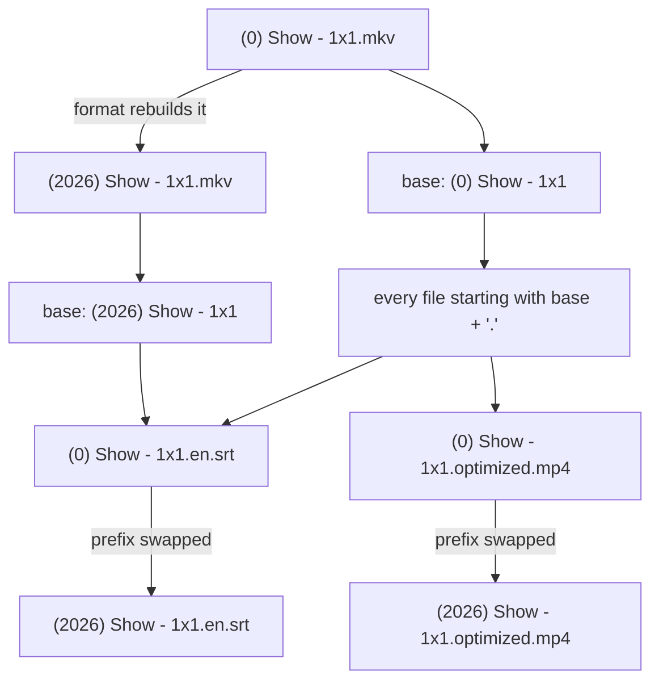
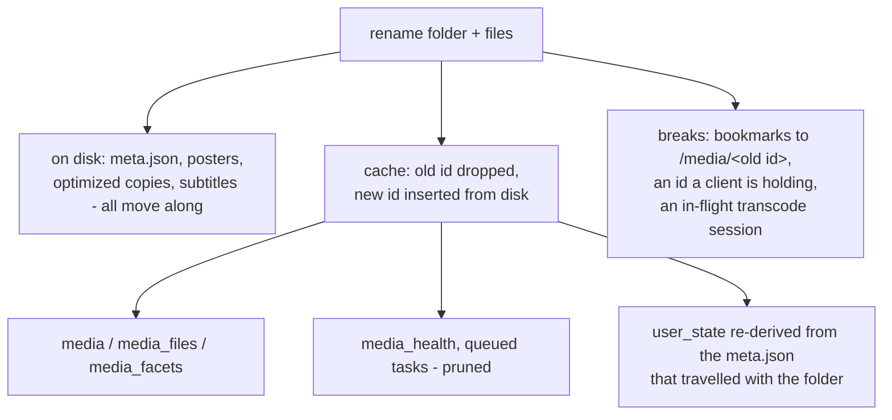

# Folder rename (name drift)

A media folder is named once, at import, from the title and year known at that moment and the
naming format chosen in Settings (see [`library.md`](library.md)). Nothing renames it afterwards.
When a later metadata edit ([`metaedit.md`](metaedit.md)) or an OMDb re-match
([`rematch.md`](rematch.md)) changes the title or fills in a missing year, `meta.json` becomes
right and the folder keeps the old name forever. This subsystem closes that gap: it reports every
item whose names contradict its own metadata, and renames the folder and its files to match.

It is a **reconciler, not a free-text rename**. There is one action - "make the names say what the
metadata says, in the configured format" - and no editable name field. A hand-typed name could
never be reproduced by the format and would drift back on the next metadata change; to get a
different name you change the title or year in the editor, and the rename follows it.

## What counts as misnamed

The expected names come from the item's own cache row and the configured format:

- the **folder** must be what the format builds from the item's title and year;
- each **video file** must be what the format builds from the same title and year plus that
  file's season/episode (or part number, recovered from the existing name - the cache records
  season and episode but never the part);
- every **other file** in the folder must carry the base name of the video it belongs to.

An item is reported when any of those disagree. A folder can be correctly named while the files
inside it are not, and the report says which.

An item with **no year yet** is never reported: its expected name is the `(0) Title` it already
has, so renaming would restate the defect rather than fix it. It belongs on the no-metadata list
until the year is known.

The report is **derived on demand**, not stored - it is a pure function of the cache rows and the
format setting, so it is correct the instant a metadata edit is saved, with no sweep to wait for.

## The prefix-swap rule

Only the **video** names are rebuilt from the format. Every other file follows the base name of
its video:

One rule therefore carries the optimized copies ([`agents/optimizer.md`](agents/optimizer.md)),
the subtitle sidecars and the VobSub pairs ([`playback.md`](playback.md)) without teaching the
renamer any of their conventions. `meta.json`, `poster.*` and the sized `poster_<W>.webp` variants
are not named after anything and are left alone.

Matching requires the base **plus a dot**, and the longest matching base wins: `Show - 1x1` is a
prefix of `Show - 1x10`, so a shorter base must never claim a longer one's sidecars.

## Refusals: a plan is all-or-nothing

The plan is built before anything moves, and is withheld entirely unless it can be applied whole:

| refused when | why |
|--------------|-----|
| a target name already exists on disk | renaming onto it would destroy a file |
| two targets are the same name | the second would overwrite the first |
| the item has no year, or no title, or no files | there is nothing to name it after |
| an optimize job is encoding this item | its worker holds paths that would move under it |
| an unfinished `.optimized.mp4.tmp` sits in the folder | the same, for a job whose row is gone |

A file the cache lists but disk no longer has is skipped rather than refused: that is a health
issue (see [`agents/discovery.md`](agents/discovery.md)), and skipping it also makes a rename
interrupted by an I/O error resumable - the files already moved simply drop out of the recomputed
plan instead of colliding with their own new names.

The plan is always **recomputed on the server** when the rename is applied; the copy the browser
holds is only a description, and it carries none of the authority.

## The id changes, and what survives it

A media id is `sha1(<media-folder path relative to dataDir>)[:12]` (see
[`mediaformat.md`](mediaformat.md)). Renaming the folder is therefore the **one operation that
deliberately changes an item's id**. Everything durable lives inside the folder and travels with
it; only cache rows and outside references are affected.

The re-key is done by the rename itself rather than left to the next discovery tick, using the
same two operations the reconcile uses for a folder that vanished and a folder that appeared - so
there is one definition of "insert this folder into the cache", not two that can drift apart.
Per-user state (resume pointers, watched flags, favorites, ratings - see
[`playback-state.md`](playback-state.md)) is never touched: it is written in `meta.json`, and the
cache's copy is re-derived from that file under the new id.

The folder move runs under the **same per-folder lock** that serializes `meta.json` writes, and
the lock is re-keyed to the new path, so a writer arriving afterwards does not guard a path that
no longer exists.

## Where it appears

- The **Needs attention** page lists every misnamed item with the change it would make, and a
  **Rename** button per row (see [`rematch.md`](rematch.md) for the page as a whole).
- The **metadata editor** offers "Rename to match" whenever a plan applies to the item being
  edited. That is where the drift is created, so it is where the fix is offered.

## Endpoints

| method + path                              | purpose                                                    |
|--------------------------------------------|------------------------------------------------------------|
| `GET  /api/admin/misnamed`                 | every item whose names contradict its metadata, with the plan |
| `POST /api/admin/media/{id}/rename`        | apply the plan; answers with the new media id              |
