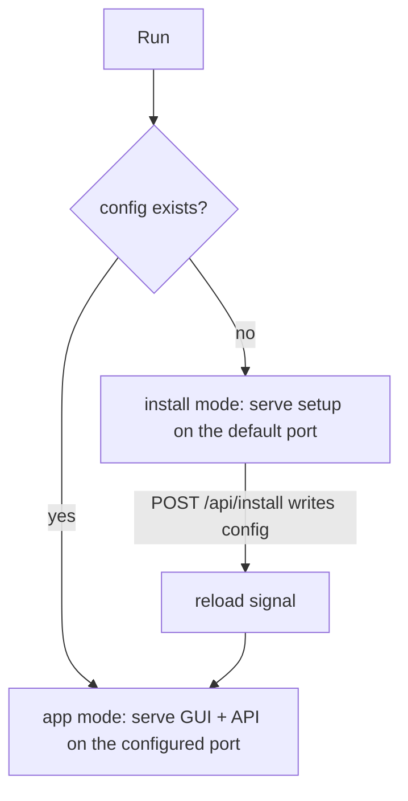
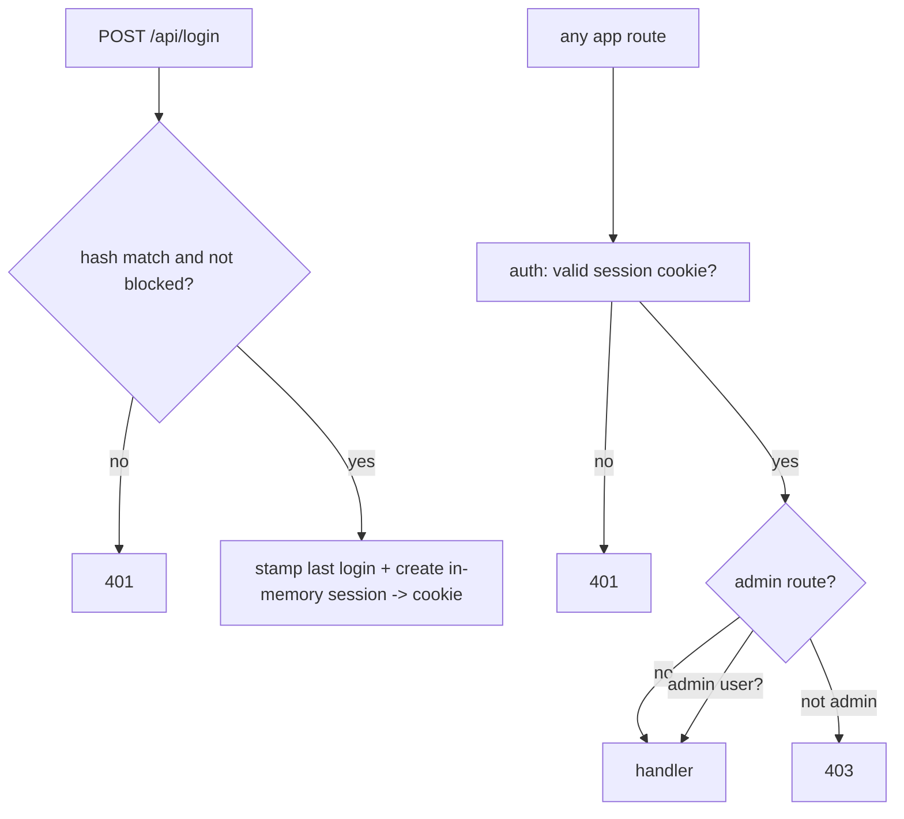
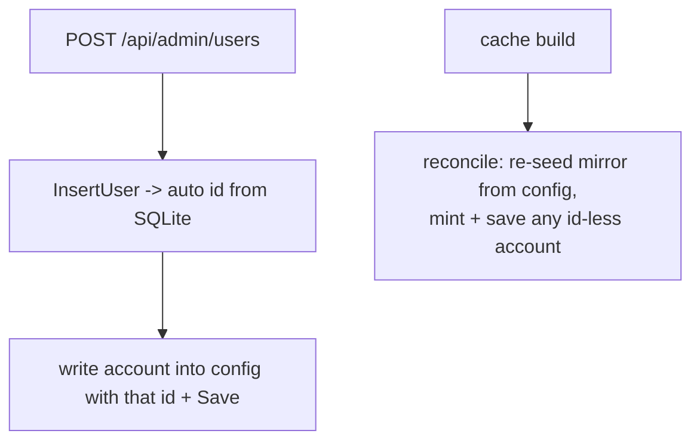

# Server runtime

How the binary boots, decides whether it is a fresh install or a running appliance, serves
the GUI and API, and applies settings changes live. The `server` package *is* the whole
runtime: one process, one embedded frontend, one JSON API, no external services.

## Two modes from one binary

There is a single persisted file - `~/.filefin.json` - holding the port, the data dir, the
user accounts, and all settings. Its presence is the mode switch: no config means **install
mode**, a config means **app mode**. The cache is always local SQLite (see `library.md`), so
there is nothing else to provision.



The server loop owns this: it loads the config (if any), starts the background workers, binds
an HTTP listener, and serves until a **reload signal** arrives - at which point it shuts the
current listener and re-binds from the freshly loaded config. That signal is how first-run
setup makes the chosen port take effect **without a restart**: `POST /api/install` creates the
admin user and writes the config, then fires reload and the loop rebinds in app mode.

## Routes by mode

The router is rebuilt per bind. Install routes (`/api/state`, `/api/install`,
`/api/install/browse`) are always present; the authenticated end-user and admin routes are
mounted only once a config exists. Everything else falls through to the SPA handler, which
serves the embedded Svelte build and falls back to `index.html` for client-side routes, so the
app works fully offline with no external assets.

## Auth

Accounts live in the config as bcrypt hashes; the username is an email. Login verifies the
hash, rejects a **blocked** account (with the same 401 as a bad password, so a block leaks
nothing), records the last-login time, and creates an in-memory session handed back as an
`HttpOnly` cookie; sessions are cleared on restart (there is no persistent session store).



Two middlewares wrap handlers: `auth` requires a valid session and stashes the username;
`admin` additionally requires the user be flagged admin, and lazily ensures the cache is built
on entry (best-effort - admin pages still work if the cache is down). Every `/api/admin/*`
route is behind `admin`, so the gating is enforced server-side regardless of the UI; the SPA
mirrors it by hiding the Library/Admin toggle and the admin nav from non-admins.

## User accounts

The full account record lives in the config (the source of truth): `id`, the email username
(map key), `alias`, `admin`, `blocked`, `createdAt`, `lastLoginAt`, and the bcrypt `hash`. A
disposable SQLite `users` table mirrors this; its **only load-bearing job is minting the
auto-increment `id`**, which is written back into the config. On cache build the mirror is
reconciled from the config: existing accounts are re-seeded at their stored id, and any account
without an id yet (the install admin on first run) has one minted and saved back. So ids are
stable across a cache wipe, and the cache stays fully rebuildable from the config.

The admin **Users** page (`/admin/users`) lists every account and can add a user, edit an
alias, grant/revoke admin, and **block/unblock** (the moderation primitive - there is no hard
delete). Blocking drops the account's active sessions immediately. Guardrails refuse any change
that would lock the install out: an admin cannot block or de-admin their own account, and no
change may leave zero **active** (admin and not blocked) admins. The first user, created at
install, is admin.



## Live settings, no restart

Almost every setting applies in place without rebinding the listener; only the install-time
port choice uses the reload path. Each settings handler goes through one shared `mutateConfig`
helper: it applies the change to a **copy** of the live config, persists that copy, and
publishes it only on a successful save - so a failed write needs no manual rollback (the live
config was never touched), and published configs are never mutated in place. The save itself
is atomic (temp file + rename via the shared `fsutil` helper, mode `0600`). After the swap the
handler pushes the change into the relevant live component:

| setting change | applied by |
|----------------|------------|
| logging level / output | reconfigure the live logger in place (a bad output keeps the current destination, only the level applies, so a typo never silences the app) |
| transcoding on/off, ffmpeg/ffprobe, hardware accel | discard the HLS manager so the next playback re-detects paths/encoder (see `playback.md`) |
| optimizer mode | signal the optimizer supervisor to cancel and relaunch its agents (see `agents/optimizer.md`) |
| discovery interval | signal the discovery supervisor to re-arm its ticker, or idle when off (see `agents/discovery.md`) |
| import folder, OMDb key, media format, subtitle language | stored in config; read on next use by import / enrichment / library |

The admin **Settings** page groups these into tabs (System, Library, Playback, Automation,
Logging, Maintenance). The System tab is read-only install facts (port, data folder, cache
path, media format, user count) plus a live discovery status (the scheduler exposes the next
sweep time, rendered as "Off" or a "next run in ..." countdown); the editable tabs bind to a working copy of the config and
expose one dirty-aware Save per tab that dispatches only the changed sub-groups to the
endpoints above (so one Save may issue one or two POSTs, or none). The whole-library
operations (the four agent re-scans and the cache rebuild) live on the Maintenance tab, not
among the settings; rebuild sits in a confirm-gated danger zone.

## Request/response helpers

The JSON API leans on a few shared `server` helpers so each handler stays thin and uniform:

- **`decodeJSON[T]`** decodes a request body into a typed value behind an `http.MaxBytesReader`
  cap, so no handler streams an unbounded body into memory and the 1 MiB limit is set once.
- **typed responses** - every endpoint returns a named struct (or generic `queueStatus[T]` /
  `scanResult`) fed to `writeJSON`, rather than ad-hoc `map[string]any`, so the wire shape is
  defined by Go types the compiler checks.
- **`bestEffort`** logs-and-swallows the deliberately non-fatal writes (cache mirrors of the
  source-of-truth config, throttled progress updates), making "this failure is intentionally
  ignored" greppable instead of a bare `_ =`.

## Background workers

Started once at boot and shared across rebinds (they outlive a listener swap): the import
**poller** (drains the imports queue, see `import.md`), the **optimizer** supervisor (see
`agents/optimizer.md`), the single **enrichment** and **thumbnail** agents (see `agents/enricher.md`,
`agents/thumbnailer.md`), and the **discovery** supervisor (the timer-driven reconcile + health sweep,
see `agents/discovery.md`). Live per-task progress for imports and optimize encodes is kept in
in-memory maps on the server and mirrored to the cache, so the Progress page can poll fresh
values.

## Admin dashboard

The dashboard is the admin landing page. `GET /api/admin/summary` aggregates a cheap overview
in one call - it derives everything from the cache plus the in-memory config and keeps no
long-lived state:

```
{ library:   { categories, media, files },
  users:     { total, admins },
  optimizer: { mode, pending, active },
  enrich:    { pending },
  imports:   { active },
  health:    { issues, unchecked, lastSweep, discovery } }
```

## Logging

One structured logger, reconfigurable live. Events are grouped by facet (`backend`,
`frontend`, `import`, `optimizer`, `enrich`, `thumbnail`, `discovery`) and carry telemetry in
structured fields rather than the message text. The default before any config is info level to
stdout.

## Endpoints

| method + path                    | purpose                                         |
|----------------------------------|-------------------------------------------------|
| `GET  /api/state`                | whether first-run setup is still needed         |
| `POST /api/install`              | first-run: create admin + config, rebind        |
| `GET  /api/install/browse`       | pick a data folder (install mode only)          |
| `POST /api/login` / `logout`     | session create / destroy                        |
| `GET  /api/me`                   | current user + admin flag + alias               |
| `GET  /api/admin/summary`        | dashboard overview (library/users/optimizer/enrich/imports/health) |
| `GET  /api/admin/health`         | list items flagged with issues (see `agents/discovery.md`) |
| `POST /api/admin/discovery/run`  | trigger an immediate discovery sweep            |
| `GET  /api/admin/users`          | list accounts (id, email, alias, admin, blocked, timestamps) |
| `POST /api/admin/users`          | create an account (mints id, writes config)     |
| `PUT  /api/admin/users/{id}`     | edit alias / admin / blocked / password         |
| `GET  /api/admin/settings`       | read settings                                   |
| `POST /api/admin/settings/*`     | apply a setting live (see table above)          |
