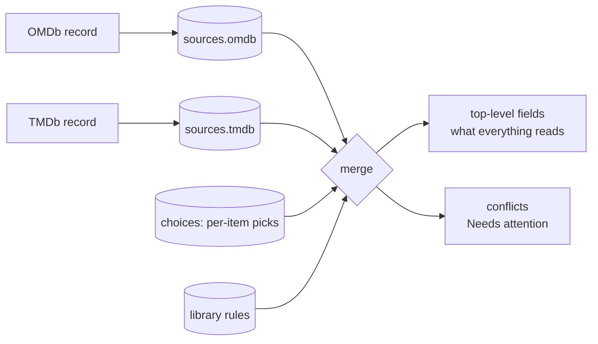
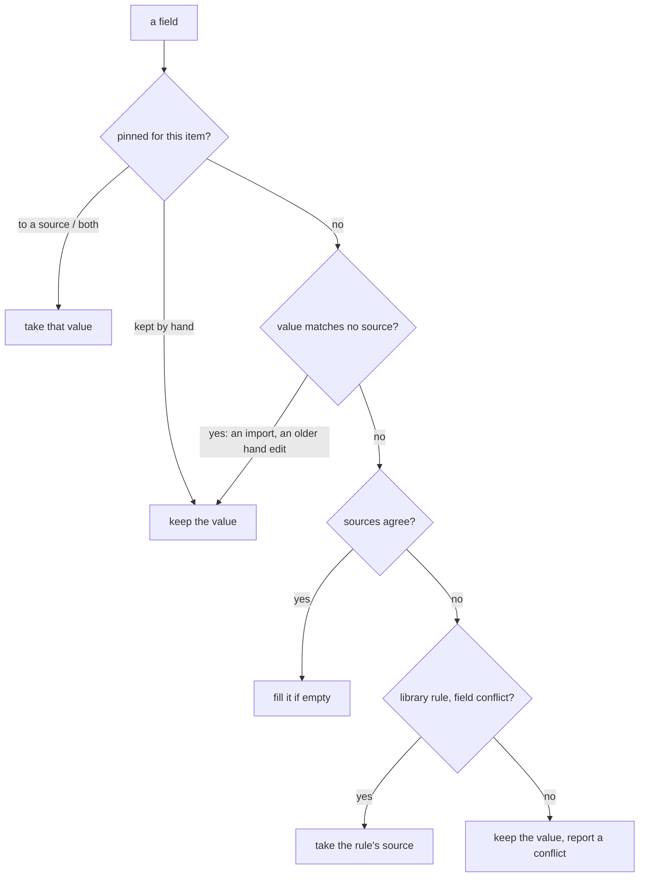

# Metadata sources and the merge

How FileFin combines what several metadata databases say about one item. OMDb was long the
only source; TMDb is now a second one, and the model is built so a third is one more
snapshot and one more column, not a redesign. The idea: keep every source's own answer, merge
them field by field, and when they contradict each other, show it and let an admin decide,
for one item or as a rule for the whole library.

## Snapshots and the merged view

Each source's record of an item is kept in `meta.json` under `sources`, keyed by source
(`omdb`, `tmdb`). A snapshot holds the source's own words - its title and year, not the
folder's - in the same field shape as the top level, plus the source's id, the kind (movie
or series), the IMDb id it belongs to, when it was fetched, and the source's poster reference.
A lookup that found nothing is kept too, as a snapshot carrying only the reason, so it is
not repeated every sweep.

The top-level fields stay the **merged view** that everything else reads: the cache, search,
the detail page, the facets. Nothing downstream knows sources exist. The new keys are
additive, so the `meta.json` version is unchanged.

The merge runs whenever a snapshot is written (the enricher, the TMDb agent, a re-match),
when an admin applies a merge, and across the whole library in the background when a rule
changes. It is idempotent: merging a merged item again changes nothing.

## How a field is decided

Every field has a policy that says what "agree" means for it:

| policy | fields | agree when | on disagreement |
|--------|--------|------------|-----------------|
| title | title | the title or one of TMDb's alternative or original titles folds the same | field conflict |
| year | year | the same year | one year apart: field conflict; more: identity conflict |
| identity | kind (movie or series), IMDb id | equal | identity conflict |
| runtime | runtime | within 10% (at least 3 minutes) | field conflict |
| release | release date | the same year (the day differs by country) | field conflict |
| directors | directed by | one list of names contains the other | field conflict |
| writers | written by | the lists share a name (writing credits vary a lot) | field conflict |
| exact | content rating | equal after folding case | field conflict |
| union | genres, language, country | never conflicts | the sources' entries combined |
| prose | plot | never conflicts (prose always differs) | the preferred source |
| fill | tagline, original title, awards, box office, TMDb id, cast list | never conflicts | fills a field only one source has |

Ratings are never merged: each source's score sits beside the others (IMDb, Rotten Tomatoes,
Metacritic, TMDb). Names compare with the same folding as the cast (order, accents, hyphens),
and credit notes such as "(screenplay)" are ignored.

Then, for each field:

- **Pinned fields win.** The merge view pins a field to a source, to the union of a list, or
  to its current value. The metadata editor pins every field it changes as "kept by hand", so
  a merge never overwrites what an admin typed.
- **Local values are sticky.** A value that matches no source came from somewhere else (a
  Plex or Jellyfin import, an edit from before pins existed); it is never replaced
  automatically and never reported.
- **The incumbent wins by default.** Without a rule, a conflict leaves the current value in
  place. An empty field is filled from the preferred source, OMDb first.
- **Rules** are library-wide source orders per field, kept in the config. A rule settles a
  field conflict everywhere; an identity conflict (the sources probably describe different
  works) can never be settled by a rule, only by a re-match or a pick per item.

TMDb's vocabulary is mapped onto OMDb's before any comparison: genre names ("Science
Fiction" is "sci-fi", "Action & Adventure" splits in two), country names, and the shape of
the rating. That keeps the category misfiled check (see `rematch.md`) working unchanged.

## Where conflicts show up

The Needs attention page has a **Conflict** class between "No metadata" and "Name" (see
`rematch.md`). The report is derived from `meta.json` on every read, under the current rules,
so it can never go stale against the files. Each row names the fields in dispute, identity
conflicts first, and its **Merge** button opens the merge view.

## The merge view

`/admin/attention/merge/{id}`, also reachable as "Compare sources" from the detail page's
Admin card, the metadata editor, and the match view.

- A header per source: its poster, id, kind, when it was fetched, and a **Re-match** button.
  An identity conflict adds a warning to re-match the wrong source first.
- One row per field with a radio per source column, a "both" radio for lists, and "keep" for
  the current value. Rows in conflict come first, then the ones worth a look (sources that
  differ, a local value, an earlier pick or rule); fields the sources agree on fold away.
- **Take all OMDb / Take all TMDb** set every radio at once; single rows can still be changed
  afterwards. A **rule** box per row (and one for the bulk buttons) turns the pick into a
  library rule.
- A poster row picks between the sources' posters and the current one.
- The footer says how many fields will change and which rules will be made. Applying pins
  the chosen fields, saves the rules, re-merges the library if the rules changed, and moves
  on to the next item still in conflict.

Rules are listed on the Settings Library tab, each with a remove button; removing one
re-merges the library and brings its conflicts back.

## Endpoints

| method + path | purpose |
|---------------|---------|
| `GET  /api/admin/conflicts` | the Conflict report |
| `GET  /api/admin/media/{id}/merge` | one item's merge view: sources and field rows |
| `POST /api/admin/media/{id}/merge` | apply picks, rules and a poster choice; answers with the next conflict |
| `DELETE /api/admin/settings/metadata-rules/{field}` | remove a library rule |
| `GET  /api/admin/tmdb/poster` | a TMDb poster at a small size, proxied same-origin |

## Dependencies

- **Snapshots** are written by the enricher (`agents/enricher.md`) and the TMDb agent
  (`agents/tmdb.md`), and by the manual re-match of either source (`rematch.md`).
- The `sources` package holds the field table, the comparisons, and the merge; it has no I/O.
- The people agent takes an item's TMDb title from its TMDb snapshot (`agents/people.md`).
