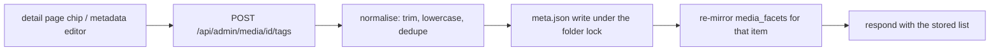
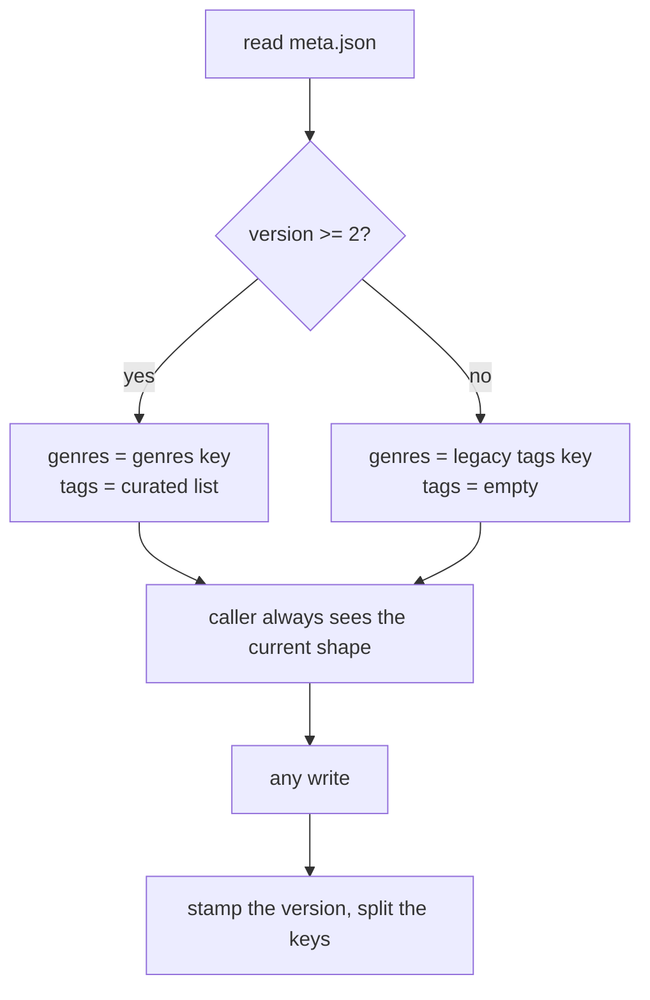

# Tags

Categories are a tree: an item lives in exactly one folder, so a category can never say
"this is also a rewatch favourite" or "watched with the kids". **Tags** are the orthogonal
axis - many per item, free-form, no folder move. They are hand-curated, and no agent ever
writes them, which is exactly what separates them from genres.

## Tags vs. genres

The two look alike and are stored alike, but they differ in who owns them:

| | genres | tags |
|---|--------|------|
| written by | the metadata source (OMDb, Plex, Jellyfin) and re-enrichment | a human, through the UI |
| lifetime | replaced wholesale on every re-match | only ever changed by hand |
| meta.json key | `genres` | `tags` |
| facet kind | `genre` | `tag` |
| search scope | `genre` | `tag` |

Both are lowercased, so `Sci-Fi` and `sci-fi` are one value. Tags are additionally trimmed,
deduplicated, capped in count and length, and blanks are dropped - one normaliser sits behind
every write path, so the vocabulary cannot fork on whitespace or case.

Tags are **global**: everyone browsing the library sees and can filter by the same set. Only
an admin adds or removes one, exactly as with the rest of the metadata (see
[`metaedit.md`](metaedit.md)). They are deliberately *not* part of the per-user state block
that holds watched/favourite/rating (see [`playback-state.md`](playback-state.md)).

## meta.json is the source of truth

A tag lives in its media folder's `meta.json`, like every other descriptive field, and the
`media_facets` rows are the usual rebuildable mirror (see [`library.md`](library.md)). Delete
the cache and rebuild, and every tag comes back off disk.

Writes go through the same per-folder lock as the rest of `meta.json`, so tagging an item can
never drop its genres, technical block, or anyone's playback state - and an enrich landing at
the same moment can never drop the tags.

## The meta.json version fold

Before version 2 of `meta.json`, the key `tags` held the **genres**. Version 2 renamed that key
to `genres` and freed `tags` for the curated list, so a file must declare which it is: `meta.json`
carries a **`version`** field, and a file with no version (or below 2) is read as the old shape.

The fold happens on read, so every caller sees the current shape whatever is on disk. Any write
stamps the current version, and the cache's one-time data backfill - which already walks every
folder - rewrites the stragglers, so a library settles on the new shape without a manual step.

## Browsing and searching by tag

The library sidebar groups its two browse axes into accordions: **Categories** (the tree) and
**Tags** (the whole vocabulary, each with the number of items carrying it, strongest first).
Which accordions are open is remembered across reloads.

Selecting a tag is not a separate view - it navigates into a **tag-scoped search**, so one
results grid renders every way of browsing (see [`library.md`](library.md#search)). The search
bar carries a matching `Tags` scope, and the default `all` scope covers tags too, so a tag is
found without choosing a scope at all. On a media detail page the tags render as their own chip
row beneath the genres, each chip pivoting back into a tag search.

## Curating the vocabulary

A vocabulary nobody can prune rots, so tags are editable from three places:

- **The detail page** - an inline chip editor: add with type-ahead over the existing vocabulary
  (a new tag is always allowed), remove with the chip's `x`. This is the fast path while browsing.
- **The metadata editor** - a comma-separated field beside genres, for bulk edits (see
  [`metaedit.md`](metaedit.md)).
- **The admin Tags page** - the library-wide operations: **rename** and **delete**. Renaming a
  tag onto one that already exists is how two are **merged**, because each item's list is
  deduplicated on the way in. Both rewrite every item carrying the tag, one independent
  `meta.json` write per folder, and report how many items changed.

The admin **Statistics** page shows the head of the tag distribution beside the container and
codec breakdowns; the long tail of one-item tags lives on the Tags page instead.

## Endpoints

| method + path                          | purpose                                                   |
|----------------------------------------|-----------------------------------------------------------|
| `GET /api/tags`                        | the vocabulary with per-tag item counts (any signed-in user) |
| `POST /api/admin/media/{id}/tags`      | replace one item's tags; returns the normalised list      |
| `GET /api/admin/tags`                  | the vocabulary by name, for the admin Tags page           |
| `PUT /api/admin/tags/{tag}`            | rename across the library (merges onto an existing tag)   |
| `DELETE /api/admin/tags/{tag}`         | strip the tag from every item carrying it                 |
